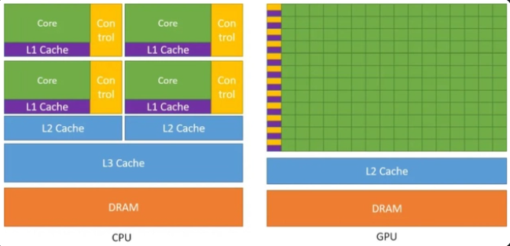
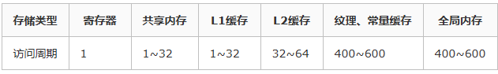
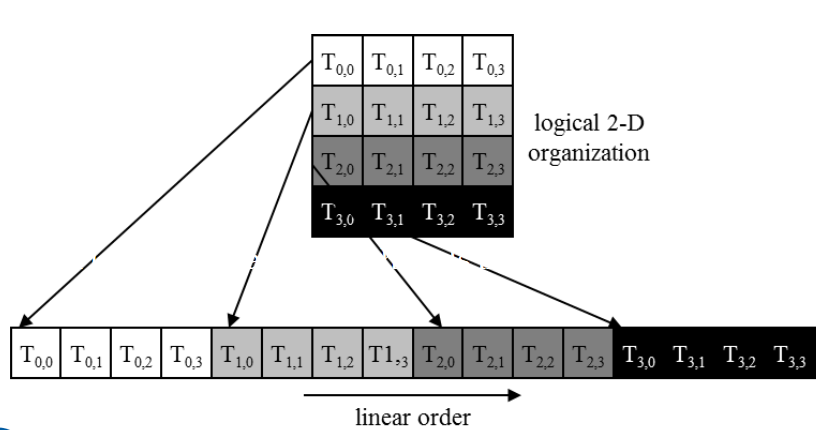
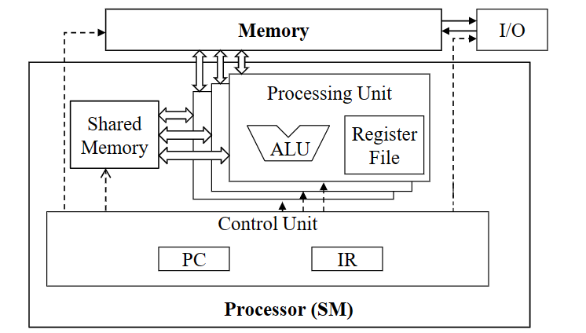
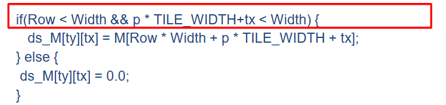
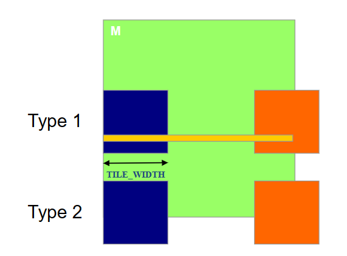
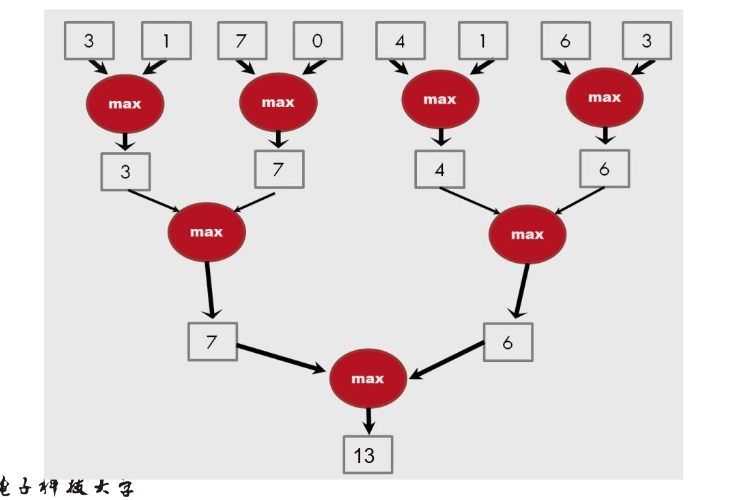

# 性能

Owner: -QVQ-

- GPU**设备信息查询**
    
    C:\Program Files\NVIDIA GPU Computing Toolkit\CUDA\v12.1\extras\demo_suite\deviceQuery.exe
    
    ```c
    Detected 1 CUDA Capable device(s)
    
    Device 0: "NVIDIA GeForce RTX 3060 Ti"
      CUDA Driver Version / Runtime Version          12.1 / 12.1
      CUDA Capability Major/Minor version number:    8.6
      Total amount of global memory:                 8192 MBytes (8589410304 bytes)
      (38) Multiprocessors, (128) CUDA Cores/MP:     4864 CUDA Cores
      GPU Max Clock rate:                            1665 MHz (1.66 GHz)
      Memory Clock rate:                             7001 Mhz
      Memory Bus Width:                              256-bit
      L2 Cache Size:                                 3145728 bytes
      Maximum Texture Dimension Size (x,y,z)         1D=(131072), 2D=(131072, 65536), 3D=(16384, 16384, 16384)
      Maximum Layered 1D Texture Size, (num) layers  1D=(32768), 2048 layers
      Maximum Layered 2D Texture Size, (num) layers  2D=(32768, 32768), 2048 layers
      Total amount of constant memory:               zu bytes
      Total amount of shared memory per block:       zu bytes
      Total number of registers available per block: 65536
      Warp size:                                     32
      Maximum number of threads per multiprocessor:  1536
      Maximum number of threads per block:           1024
      Max dimension size of a thread block (x,y,z): (1024, 1024, 64)
      Max dimension size of a grid size    (x,y,z): (2147483647, 65535, 65535)
      Maximum memory pitch:                          zu bytes
      Texture alignment:                             zu bytes
      Concurrent copy and kernel execution:          Yes with 1 copy engine(s)
      Run time limit on kernels:                     Yes
      Integrated GPU sharing Host Memory:            No
      Support host page-locked memory mapping:       Yes
      Alignment requirement for Surfaces:            Yes
      Device has ECC support:                        Disabled
      CUDA Device Driver Mode (TCC or WDDM):         WDDM (Windows Display Driver Model)
      Device supports Unified Addressing (UVA):      Yes
      Device supports Compute Preemption:            Yes
      Supports Cooperative Kernel Launch:            Yes
      Supports MultiDevice Co-op Kernel Launch:      No
      Device PCI Domain ID / Bus ID / location ID:   0 / 1 / 0
      Compute Mode:
         < Default (multiple host threads can use ::cudaSetDevice() with device simultaneously) >
    
    deviceQuery, CUDA Driver = CUDART, CUDA Driver Version = 12.1, CUDA Runtime Version = 12.1, NumDevs = 1, Device0 = NVIDIA GeForce RTX 3060 Ti
    Result = PASS
    ```
    

**SIMD（Single Instruction Multiple Data）一种技术模式，单指令流多数据流**

**SISD（Single instruction, Single data）单指令流单数据流**


Device（物理上的GPU设备） = Grid（逻辑上的一个硬件文件）

**SM**（Stream Multiprocessor, 流多处理器）=内核=逻辑架构里的CORE = （MP）Multiprocessor（硬件）= Thread Block 

- Warp
- 加载存储单元（LD/ST）
- 特殊函数单元（SFU）

**Warp**（线程束）：基本调度单元

- Core Warp编排器（Warp Scheduler）
- 分发单元（Dispatch Unit）
- sp在一个warp中执行SIMD

**SP**（Streaming Processor，流处理器）=CUDA Core=ALU= 线程

- 1个FPU（浮点数单元）
- 1个ALU（逻辑运算单元）


对于我的GPU，一个SM有32warp，一个warp有32个sp

多个SM组成的整体位SMs

GPU的 缓存结构：


对应英文register、shared memory、L1 cache、L2 cache、Texture memory 与C-Cache（常量缓存）、global memory

每个线程块按照x、y、z的一维线性的存储


SMs的运行模式


control divergence（控制分支）:

因为wrap是基本调度单元，在执行if（）语句的时候会创造两个不同的路径，但所有的wrap必须执行同一个路径，因此会产生两倍的耗时

处理控制分支带来的影响需要关注：

1边界检查（这些检查会导致显著的性能下降）


会产生如下两种类型的耗时影响


> 例如：
设处理100*100的矩阵数据
设每个SM有8个warp，每个warp有32个sp，共256个sp（16*16 tiles）
则，每行每列各需要7次才能遍历完，即第7次因为if（）会产生控制分支
对于type 1，有6（行）*7（列）*8（warp）=336个warp，共有336*7=2352（每个warp会经历7个阶段)个warp阶段，共有6个矩阵（橙色部分）会产生一倍的控制分支即336
对于type 2，有1（行）*7（列）*8（warp）=56个warp，共有56*7=392（每个warp会经历7个阶段)个warp阶段，仅有最后一个块会产生一部分控制分支2*7=14个控制分支
所有性能影响为（336+14）/（2352+14）12%
> 

可以将边界检查变为数据的计算

```c
//原代码
if(a > 10) a=a+1;
//优化后
a = (a/10) * 1 + a;//a如果小于10，a = 0 + a, 如果大于10小于20, a = 1 + a
```

2所处理的数据本身

并行规约（parallel reduction）：一种线程并行计算的重要方法

在处理没有关联的数据时，将数据划分成更小的块，每个线程分别计算这些块，再将结果汇总到一起

规约树


对于N个数据，如果有足够的资源，平均并行度为(N-1)/log（N）

当N足够大时需要大量的资源，这是低效的

故大多数并行算法并不一定有效，在设计并行算法时要考虑处理的数据规模量