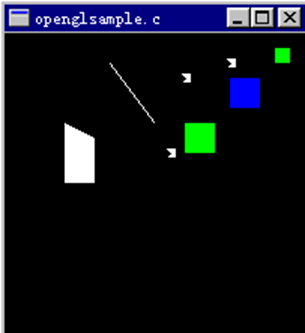
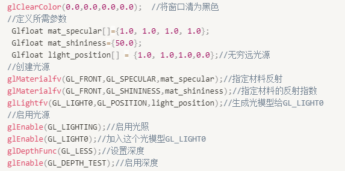

# OpenGL

Owner: -QVQ-

例子：简单图形绘制

```cpp
void CALLBACK display(void)
  {
	 glClear(GL_COLOR_BUFFER_BIT);
	//将颜色缓存清为glClearColor命令所设置的颜色，即背景色
	 glColor4f(1.0,1.0,1.0,1.0); //选颜色(R,G,B)
	 glPointSize(6.0); //设置点的大小

	 glBegin(GL_POINTS); //在屏幕上绘制三个点
	   glVertex3f(0.1,0.2,0.0);
	   glVertex3f(0.2,0.7,0.0);
	   glVertex3f(0.5,0.8,0.0);
	 glEnd();

	 glBegin(GL_LINES);  //在屏幕上绘制一条线段
	   glVertex2f(0.0,0.4);
	   glVertex2f(-0.3,0.8);
	 glEnd();

	 glBegin(GL_POLYGON); //在屏幕上绘制一个四边形
	   glVertex2f(-0.6,0.0);
	   glVertex2f(-0.4,0.0);   
	   glVertex2f(-0.4,0.3);                         
	   glVertex2f(-0.6,0.4);
	 glEnd();

	 glColor3f(1.0,0.0,0.0);   //设置当前颜色为红色
	 glColor3f(0.0,0.0,1.0);   //设置当前颜色为蓝色
	 glRectf(0.5,0.5,0.7,0.7);  //绘制一个矩形

	 glColor3f(0.0,1.0,0.0);   //设置当前颜色为绿色
	 glRectf(0.8,0.8,0.9,0.9);  //绘制一个矩形
	 glRectf(0.2,0.2,0.4,0.4);  //绘制一个矩形 
 
	 glFlush();  //强制绘图，不驻留缓存
}
```


例子：简单光线场景的设置


```cpp
#include <windows.h>
#include <GL/gl.h>
#include <GL/glu.h>
#include <GL/glaux.h>

void myinit(void);
void CALLBACK myReshape(int w, int h);
void CALLBACK display(void);

void myinit(void)  //初始化
{
	glClearColor(0.0,0.0,0.0,0.0);  //将窗口清为黑色
	//定义所需参数
   Glfloat mat_specular[]={1.0, 1.0, 1.0, 1.0};
   Glfloat mat_shininess={50.0};
   Glfloat light_position[] = {1.0, 1.0,1.0,0.0};//无穷远光源
	//创建光源
  glMaterialfv(GL_FRONT,GL_SPECULAR,mat_specular);//指定材料反射
  glMaterialfv(GL_FRONT,GL_SHININESS,mat_shininess);//指定材料的反射指数
  glLightfv(GL_LIGHT0,GL_POSITION,light_position);//生成光模型给GL_LIGHT0
	//启用光源
  glEnable(GL_LIGHTING);//启用光照
  glEnable(GL_LIGHT0);//加入这个光模型GL_LIGHT0
  glDepthFunc(GL_LESS);//设置深度
  glEnable(GL_DEPTH_TEST);//启用深度
}

void CALLBACK display(void)
{
	glClear(GL_COLOR_BUFFER_BIT|GL_DEPTH_BUFFER_BIT);
	//将颜色缓存清为glClearColor命令所设置的颜色，即背景色
	glColor4f(0.2,0.8,1.0,1.0); //选颜色(R,G,B)
	auxSolidSphere(1.0);  
	glFlush();  //强制绘图，不驻留缓存
}

void CALLBACK myReshape (int w, int h) //定义视口变换和投影变换
{
	glViewport(0,0,w,h);
	glMatrixMode(GL_PROJECTION);
	glLoadIdentity();
	if(w<=h)
	glOrtho(-1.5, 1.5, -1.5*(GLfoalt)h/(GLfloat)w, 1.5*(GLfoalt)h/(GLfloat)w,-10.0,10.0);
	else
	glOrtho(-1.5*(GLfoalt)h/(GLfloat)w, 1.5*(GLfoalt)h/(GLfloat)w, -1.5, 1.5,-10.0,10.0);
	glMatrixMode(GL_MODELVIEW);
	glIdentity();
}
/* Mainp Loop
  * Open window with initial window size, title bar,
  * RGBA display mode, and handle input events.
 */
void main(void)
{
auxInitDisplayMode(AUX_SINGLE|AUX_RGBA|AUX_DEPTH);
auxInitPosition(0,0,500,500); 
auxInitWindow(“Lighting”); 
myinit();
auxReshapeFunc(myReshape);
auxMainLoop(display);
}
```