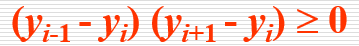
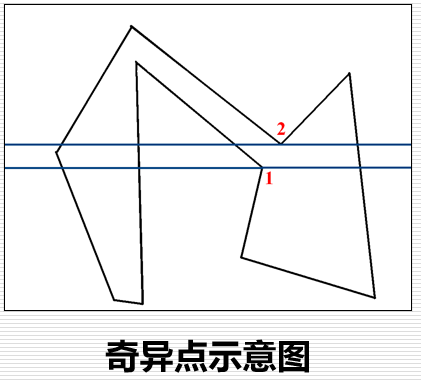

# 光栅化（设备变换中）

Owner: -QVQ-

图形学中多边形的两种表示方式

- 顶点表示：用多边形的有序顶点序列表示多边形
    
    优：直观，几何意义明显，储存量小
    
    缺：难判断哪些像素位于多边形内部、不能直接用于多边形着色
    
- 点阵表示：用位于多边形内部的像素集合来表示多边形
    
    优：便于用帧缓冲器表示图形、面着色方便
    
    缺：丢失了几何信息，占用空间多
    

多边形的扫描转换：把顶点表示转换为点阵表示。

- **区域填充**
    
    **区域的表示：**
    
    内部表示：给定区域内的像素枚举出来
    
    边界表示：把区域边界上的像素枚举出来
    
    **填充的类型：**
    
    四连通邻域、八连通邻域

    
    - **种子填充算法：**
        
        **内部表示区域（左上右下）：**
        
        算法需要提供一个种子点（在连通区域的内部)和它的颜色G0
        
        ```c
        Flood_Fill_4(x, y, G0, G1)
        {
        	if(GetPixel(x,y) ==G0 ) // 若这个点的颜色还是原来的颜色G0没有变
        	{
        				SetPixel(x, y, G1);  //将(x,y)的添上颜色G1
        	    	Flood_Fill_4(x-1, y, G0, G1);//左
        				Flood_Fill_4(x, y+1, G0, G1);//上
        				Flood_Fill_4(x+1, y, G0, G1);//右
        				Flood_Fill_4(x, y-1, G0, G1);//下
        	}
        }//四连通邻域
        ```
        
        **边界表示（上下左右）：**
        
        ```c
        Fill_Boundary_4_Connnected(x, y, BoundaryColor, InteriorColor)
        // (x,y) 种子像素的坐标；
        // BoundaryColor 边界像素颜色； InteriorColor 需要填充的内部像素颜色
        {
        	if(GetPixel(x,y) != BoundaryColor && GetPixel(x,y)!= InteriorColor )
           	 //不是边界又还没有被填充过的点
        	{
        				SetPixel(x, y, InteriorColor); // 将像素(x, y)置成填充颜色
            		Fill_Boundary_4Connnected(x, y+1, BoundaryColor, InteriorColor)；
        				Fill_Boundary_4Connnected(x, y-1, BoundaryColor, InteriorColor)；
        				Fill_Boundary_4Connnected(x-1, y, BoundaryColor, InteriorColor)；
        				Fill_Boundary_4Connnected(x+1, y, BoundaryColor, InteriorColor)；
        	}
        }
        ```
        
- 判断点是否在面内
    - 逐点判断法
        
        > **射线法**：
        > 
        > 
        > 从当前像素发射一条不经过顶点的射线，计算射线与多边形的交点个数
        > 内部：奇数个交点
        > 外部：偶数个交点
        > 
        
        速度慢、没有考虑像素之间的联系
        
    - 扫描线算法
        
        **概念：**
        
        交点序列：扫描线与多边形的交点个数为偶数(1, 2, 3, 4, 5, 6)
        **红色区间**(1, 2)、(3, 4)、(5, 6)位于多边形**内部**
        其余**绿色**区间位于多边形**外部**
        两类区间一定**相间排列**
        
        如果上述交点区间属于多边形内(外)，那么该区间内所有点均属于多边形内
        
        **快的原因：逐点判断**——>**区间判断**
        
        **边的连贯性：**当知道扫描线与一条边的一个**交点**之后，通过上述公式可以通过**增量算法**迅速**求出其他交点**
        
        **扫描线连贯性＋边的连贯性＝区域连贯性**


        
        **奇异点的分类**：
        
        1.  扫描线2，又称**极值点**：相邻三个顶点的y坐标满足如下条件：

            
            即**相邻三个顶点**位于扫描线的**同一侧**
            
        2.  扫描线1，又称**非极值点：**即相邻三个顶点的y坐标满足如下条件：

            
            即**相邻三个顶点**位于扫描线的**两侧**

        
        **奇异点的处理：**
        
        1. 在**极值点**处，按**两个交点**计算
        在**非极值点**处，按**一个交点**计算
        2. 实际计算前，奇异点(非极值点)的**预处理**：将扫描线上方线段**截断一个单位**，这样扫描线就只与多边形有一个交点
            
            扫描线y通过非极值点点Pi时，剪裁掉边e1在Pi处的一个像素

        
        **多边形扫描转化算法：**
        
        1. 计算扫描线和多边形的交点（通常是顶点）
        2. 根据多边形**边的连贯性**，**从下到上**的顺序求得各条扫描线的**交点序列**
        3. **区域和扫描线的连贯性**判断位于多边形内部的区段
        4. 对位于多边形内的直线段进行**着色**
        
        **所需的数据结构：**
        
        - 分类的边表ET：记录多边形信息
            
            边的数据结构
            ymax：边的上端点的y坐标
            x：边的下端点x坐标，在活化边链表中，表示扫描线与边的交点的x坐标
            dx：边的**斜率的倒数**
            next：指向下一条边的指针

            
            按下端点纵坐标y分类为2、5、6、7

            
            通过斜率可以求出边两端的点的x、y坐标
            
            **分类**：
            
            是按边的**下端点的纵坐标y**，分类的指针数组，下端点的纵坐标y值等于i的边，归入第i类
            **同一类**中，各边按**x值**( x值相等时，按dx的值)**递增**的顺序**排成行**
            **水平边不加入**分类边表中
            
        - 活化边链表AEL：记录当前扫描线信息
            1. 活化链表由与当前扫描线相交的边组成:记录了多边形的边沿扫描线的交点序列根据边的连贯性不断刷新交点序列
            2. 分基本单元是边(与扫描线相交的边)
            3. 与分类边表不同：类边表记录初始状态、活化边表随扫描线的移动而动态更新

            
            分类边表第二参数是定值，这里是当前扫描线扫到的点所在的x坐标
