# 光照模型

Owner: -QVQ-

- 泛光模型
    
    
    可以用于刻画周围**环境反射光**对物体表面**照明贡献**
    
    环境反射光沿任何方向对任何物体表面入射的光亮度都相等
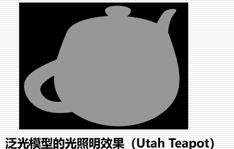
    
    光照模型：
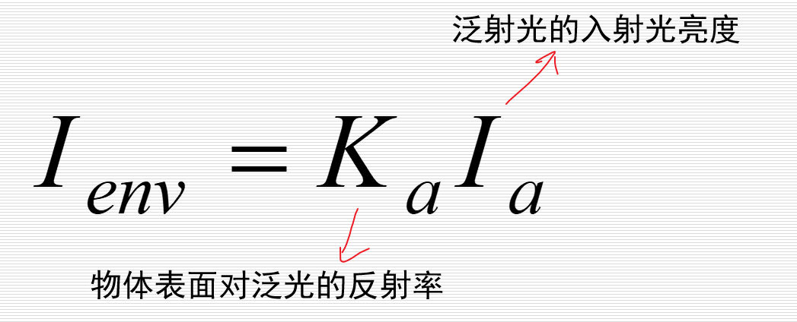
    
- Lambert漫反射模型
    
    物体表明反射光分为：
    
    漫反射光定义：物体表明对入射的光线朝所有方向都均匀反射（大小与光亮度和入射方向有关）
    
    漫反射光亮度：
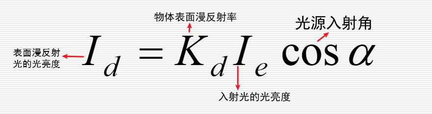
    
    角度越大越暗
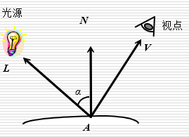
    
    Lambert光照模型：
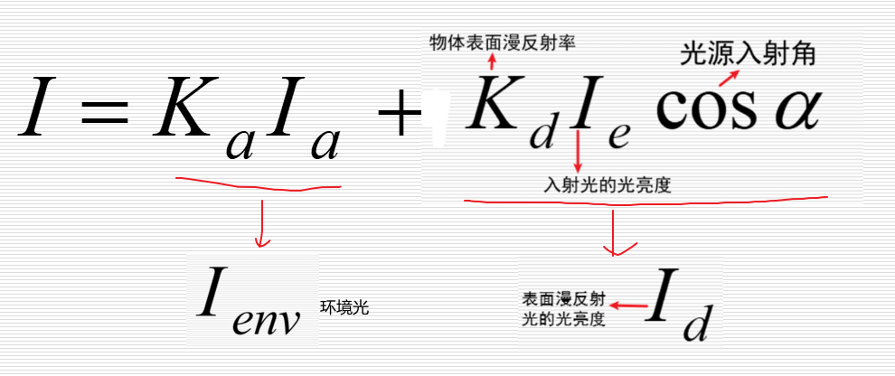
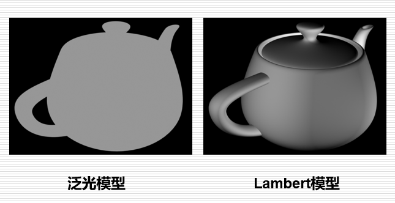
    
- Phong镜面反射模型
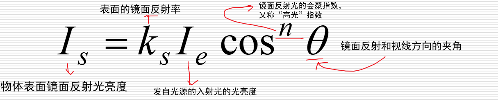
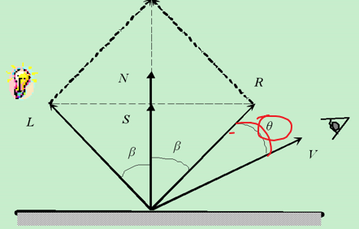
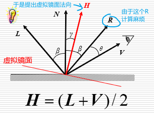
    
    由于左边计算R麻烦，从而计算这个夹角麻烦。
    
    用下述方法产生新的夹角，
    
    从而产生了Blinn-Phong模型的
    
    物体表明镜面反射光亮度Is的计算：
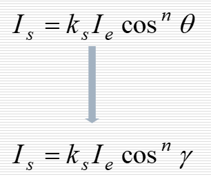
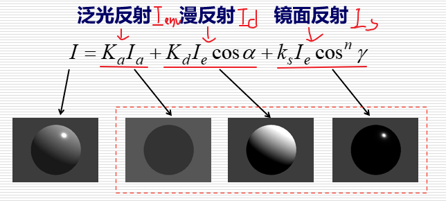
    

以上均为局部光照明模型，具有如下局限：

**仅考虑**从**光源直接发出的光线**对物体表面光亮度的贡献
**没有考虑**光线在**物体**之间的相互**反射和透射**

- Whitted整体光照模型
    
    可模拟现实世界中景物表面之间的镜面反射和透射现象
    
    Whitted光照模型
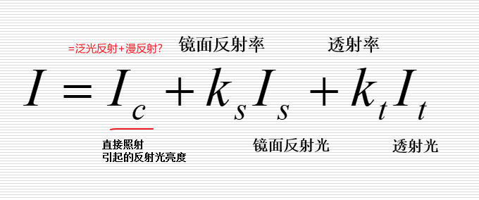