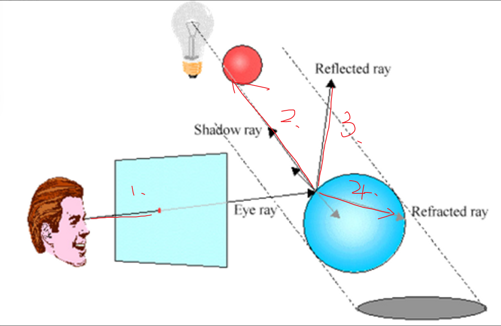

# 光线跟踪

Owner: -QVQ-

- **算法步骤**
    
    对平面上每一个像素，执行如下操作：
    
    第一步：
    
    1. 从**视点**出发通过该**像素中心**向场景发出一条**光线**，并**求**出该条光线与场景中**物体**的全部**交点**
    2. 将各**交点**沿**光线方向排序**，**获得**离视点**最近交点**
    3. 依据**局部光照明模型计算**该交点处的**光亮度Ic**，并**赋值**
    
    第二步：
    
    在P处**沿**着R**镜面反射方向**和**透射方向**各**衍生一条光线**（非镜面或不透明体，则无需这一步）
    
    第三步：
    
    分别对衍生出的光线**递归地执行**前面步骤，**计算**来自镜面反射和透射方向上周围环境对点P光亮度的**贡献Is（镜面反射光）和It（投射光）**
    
    第四步：
    
    依据**Whitted光照明模型**即可**计算**出点P处的**光亮度**，并**赋值**该像素
    
- **光线树**
    
    
    **定义：**
    
    **树的结点：**代表**物体**表面与**跟踪线**的**交点**。
    
    **结点连线：**代表**跟踪线**。
    
    **左儿子：**代表**反射产生**的跟踪**线**（r），
    
    **右儿子：**代表**透射产生**的跟踪**线**（t）。
    
    **空箭头：**表示跟踪线**射出场景**。

    
    **遍历**：**该像素的光强**是父节点加上所有孩子节点的合成，**后序遍历**调用**光照模型**访问光线树，**算出**跟踪射线方向的**光强**，并**按**两表面交点之间的**距离**进行**衰减**后，**传递给父结点**。
    
- **终止条件**
    1. **光线**与环境中任何**物体**均**不相交**，或交于**纯漫射面**
    2. 被跟踪光线返回的**光亮度值**对像素颜色的贡献**很小**
    3. 已**递归**到**给定深度**
- 伪代码
    
    ```cpp
    RayTrace(R, ratio, depth, color) //说明：光线跟踪子函数 
    { 
    
    	//1. 终止条件
    	if(终止条件2 || 终止条件3 || 终止条件1){
    		return;
    	}
    
    	用局**部光照明模型**计算交点P处的**颜色值**，并将其存入local_color；
    
    	//2. 计算反射光线 并递归 
    	if(交点P所在的表面为光滑镜面) {
    		计算反射光线Rr;
    		//递归调用！
    		RayTrace(Rr, ks*ratio, depth+1, reflected_color);
    	}
    
    	//3. 计算透射光线 并递归 
    	if(交点P所在的表面为透明表面) {
    		计算透射光线Rt;
          //递归调用！
    		RayTrace(Rt, kt*ratio, depth+1,transmitted_color);
    	}
    
      //4. 依照Whitted模型合成最终的颜色值
    	color = local_color + ks*reflected_color +  kt*transmitted_color；
    
    	return;
    }  // 光线跟踪子函数RayTrace( )结束
    ```
    
- **光线跟踪的四类光线**
    
    
    1. 从**视点发出**的
    2. 物体表明上的点**向光源发出**
    3. 从物体表面上的点**沿镜面反射方向**发出
    4. 从物体表面上的点**沿透射方向**发出

    
- **光线跟踪的优缺点**
    
    **优点：**
    
    1. 显示它不仅考虑到光源的光照，而且考虑到场景中各物体之间彼此反射的影响，因此显示**效果逼真**。
    2. 有**消隐功能**：采用光线跟踪方法，在显示的同时，自然完成消隐功能。
    3. 有**影子效果**：光线跟踪能完成影子的显示，
    4. 该算法具有**并行**性质：每条光线的处理过程相同，结果彼此独立，因此可以大并行处理的硬件上快速实现光线跟踪算法。
    
    **缺点**：计算量非常大，速度极慢。
    
- 光线跟踪中包含阴影的phone模型
    
    从P出发向光源L发射一条阴影测试光线R。若R在到达L的途中与场景中的物体不相加，则点P受光源L直接照射。反之，如果点P被位于它与光源L之间某一物体所遮挡，若遮挡物为不透明体，则点P位于光源阴影之中。

    
- **光线跟踪的加速技术**
    - 包围盒技术
        
        将场景中的**所有表面**按其**空间位置**关系**分层次**组织成**树状结构：**
        
        **根结点：**整个场景
        **中间结点：**空间位置**较为接近**的一组**表面**
        **叶结点**：单个景物**表面**
        
        每一结点中的表面或**表面片**集合都**用**一形状简单的**包围盒**包裹起来，
        
        当**光线与包围盒有交时**，才进行光线与其中所含的景物面片**求交运算**

        
        常用的包围盒：

        
    - 空间分割技术
        
        将景物**空间分割**成一个个小的空间**单元**
        被跟踪的**光线仅**与它所穿过**空间单元**中**所含**物体**表面**进行**求交**测试
        
        利用相邻空间单元的空间连贯性，使光线**快速跨越空单元**，求得光线与景物的第一个交点
