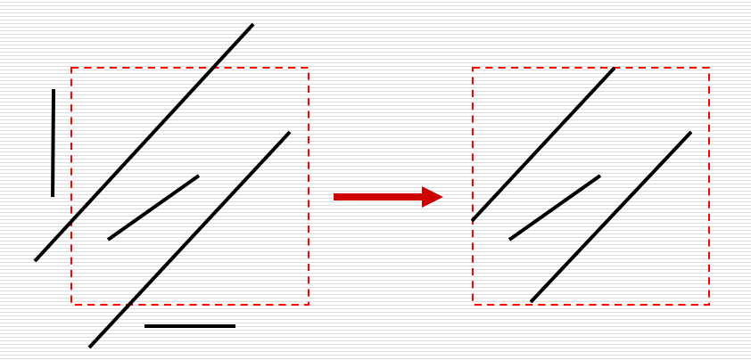

# 剪裁

Owner: -QVQ-

## 剪裁在pipeline中的位置：

**三维剪裁**：局部坐标系中**造型变换**（立体造型上通过布尔运算产生一些剪裁）、**取景变换**中（去掉镜头看不到的）

**二维剪裁：投影变换**（去掉看不到的）、**视窗变换**

## 二维线剪裁：

决定哪些点、线段或部分线段留在剪裁窗口内，效率很重要

- **Sutherland-Cohen 裁剪**：编码
    - **基本思想：**
    ◆若P1P2完全在窗口内，则显示该线段
    ◆若P1P2,完全在窗口外，则丢弃该线段
    ◆若线段不满足上述条件
        
               则求线段与窗口边界的交点，在交点处把线段分为两段
        
               其中一段完全在窗口外，可舍弃之，然后对另一段重复上述处理
        
    - 如何快速排除完全在窗口内或完全在窗口外的直线
        
        对所有点编码
        
        > 编码规则:
        将平面分为9个区域对应四位编码
        > 
        > 
        > 第一位为1：端点处于上边界的上方
        > 第二位为1：端点处于下边界的下方
        > 第三位为1：端点处于右边界的右方
        > 第四位为1：端点处于左边界的左方
        > 否则，相应位为0
        > 

        
        舍弃（全不在区域内）：对边的两端点作与运算，结果不全为0。。
        
        保留（全在区域内）：两个点的四位二进制全等于0，
        
        剪裁（不属于上面的情况）：找到线段与窗口边线的交点，舍弃窗口外的部分，窗口内的部分递归

        
        求交按照固定的顺序来进行（左右下上或上下右左）
        一条线段与窗口最多求交4次
        
    
    特点：简单，易实现。快速判断线段的完全可见和显然不可见
    
- **中点分割裁剪**：除以2，移位运算
    
    
    剪裁：通过线段P1P2求中点P，若P1与P同侧（编码里同一个位置为1或0），令P1=P，若P2与P同侧，p2=p。
    
    将中点分割到底，直到P1P2相差一个单位
    
    若此时**中点不在区域内**，则**舍弃**这条线段。**若在**区域内进行**剪裁**

    
    特点：求交点的次数n与线段长度L有关，L=2^n
    
    求出来的交点是边界上的有效交点，而非其延长线上的交点（**Sutherland-Cohen 裁剪**）
    
    求中点所需的加法和除法硬件易实现
    

**参数化裁剪**（高效率的裁剪）

**梁友栋-Barsky 裁剪**（高效率的裁剪）
**Nicholl-Lee-Nicholl**裁剪（精细的判断）
……