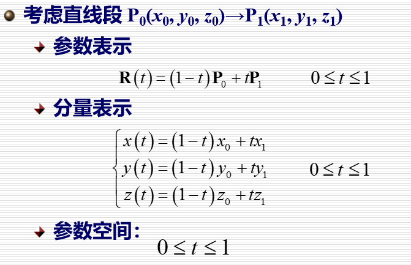
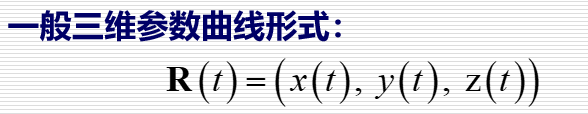
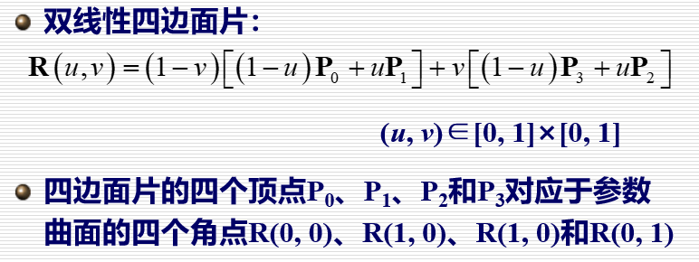
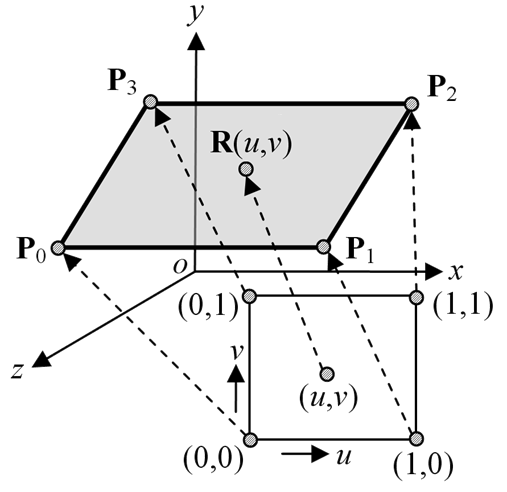
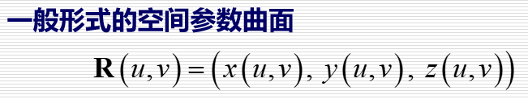
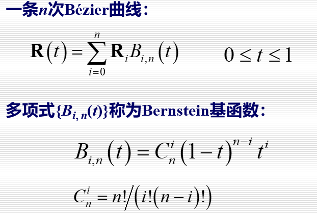

# 参数曲面

Owner: -QVQ-

- 数学原理
    - 直线段

        
    - 曲线段

        
        参数空间中每一个t对应于曲线上一个点R(t)
        
        图形学中，参数空间通常是有限区间，此时参数曲线称为参数曲线段
        图形学中，参数函数通常为分段多项式或有理多项式曲线
        
    - 平面

        
    - 曲面

        
        参数空间中每一点(u, v)对应于曲面上一点R(u, v)
        如果曲面的参数空间是一个有限的定义域(如矩形)，则对应的参数曲面称为**参数曲面片**
        图形学中常用的参数曲面为**张量积分片多项式**或**有理多项式参数曲面**
        
    - 参数表示的优势
        
        参数表示是显式的，对每一个参数值，可以直接计算曲面上的对应点
        
        参数表示的物体可以方便地转化为多边形逼近表示
        
        曲面上的几何量计算简便(微分几何)：法向、曲率、测地线、曲率线等
        
        特殊形式的参数表示的外形控制十分直观
        
- 参数曲线
    - Bézier曲线

        
    - B-样条曲线
    - NURBS曲线