# 变换

Owner: -QVQ-

- 齐次坐标（投影坐标）
    
    **作用：**用于**投影几何**里的坐标系统，可让包括**无穷远点**的点坐标以有限坐标表示，进行**仿射变换**，通常其**投影变换**能简单地使用**矩阵**来**表示**。
    
    与笛卡尔坐标相比：齐次坐标公式表示通常更简单且对称，
    
    **定义：**
    
    在齐次坐标里，需要两个值来表示在投影线上的一点，需要三个值来表示投影平面上的一点
    
    例：( X , Y ) (X, Y)(X,Y) 在齐次坐标里面变成了 ( x , y , w )  ，并且有 X = x / w , Y = y / w 
    (1，2) 的齐次坐标可以表示为 ( 1 , 2 , 1 ) ，如果点 ( 1 , 2 ) (1, 2)(1,2) 移动到无限远处，
    
    然后它的齐次坐标表示为 ( 1 , 2 , 0 ) (1, 2, 0)(1,2,0) ，因为 ( 1/0 , 2/0 ) = ( ∞ , ∞ ) 
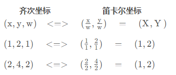
    
- 变换矩阵（记住坐标变换矩阵）
    
    **刚体变换**：形状没变化，位置和方位改变
    
    **平移T**
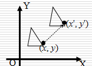
    
    **绕原点逆时针旋转R**
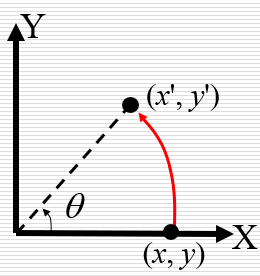
    
    笛卡尔坐标
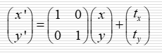
    
    （非线性变换）
    
    笛卡尔坐标
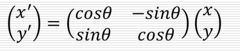
    
    （线性变换）
    
    齐次坐标变换
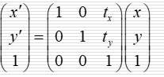
    
    齐次坐标变换
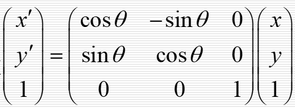
    
    - 上诉是变换矩阵在坐标点的左侧，如果变换矩阵在坐标点的右侧
        
        例：将下面的多边形围绕点P逆时针旋转90
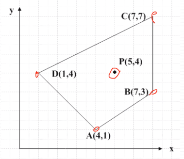
        
        以下两个方法一样：
        
        1. X1为新的坐标点，X为旧的x,y,z坐标
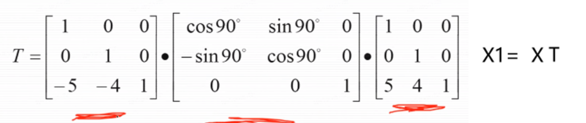
        
        1. 
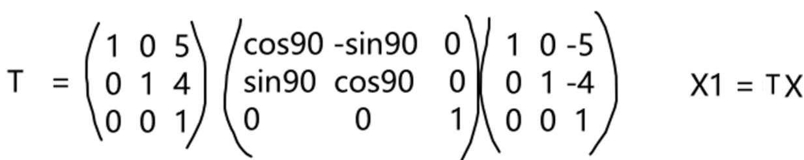
        
    - 证明
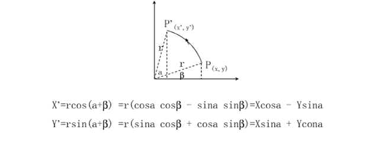
        
    
    **仿射变换：**
    
    **放缩S**
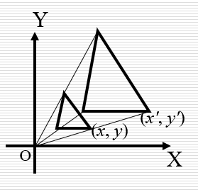
    
    笛卡尔坐标
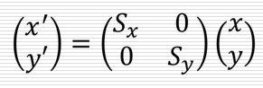
    
    （线性变换）sx和sy为x和y分量的放缩比例
    
    齐次坐标
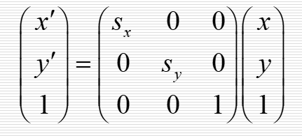
    
    二维变换具有结合性：(AB)C=A(BC)、不具有交换性
    
    线性变换：笛卡尔坐标中可以通过一个矩阵实现
    
    非线性变换：笛卡尔坐标中不可以通过一个矩阵实现
    

**变换流程：**
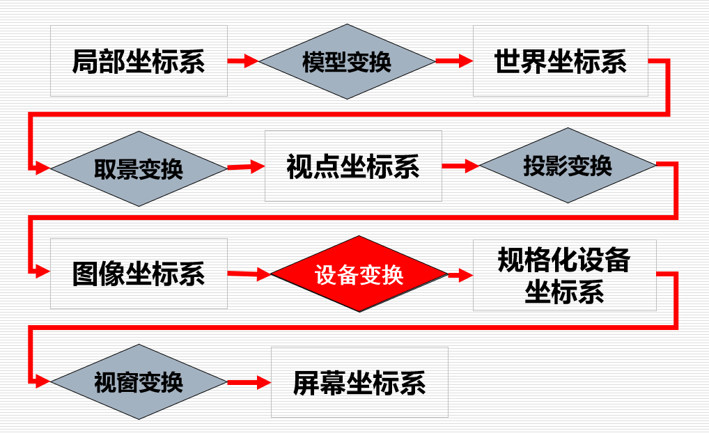

三维变换流程图

- 模型变换（在场景坐标系下）
    
    物体从**建模坐标系到世界坐标系**的变换（包括三维线性和非线性变换）
    
- 取景变换（**生成视点坐标系**）
    
    视点坐标系定义于世界坐标系中
    
    需要确定：
    
    1. 相机的位置C：坐标原点C=(Cx, Cy, Cz)
    2. 镜头的朝向N：单位向量N=(Nx, Ny, Nz)
    3. 计算V：（计算后单位化）（代表镜头朝向与UP向量的夹角）
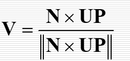
        
        UP：与镜头朝向不平行的向量
        
    4. 计算U：（计算后单位化）
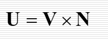
        
    
    以上四个矢量C、U、V、N组成视点坐标系，从而得到世界坐标系到视点坐标系的变换
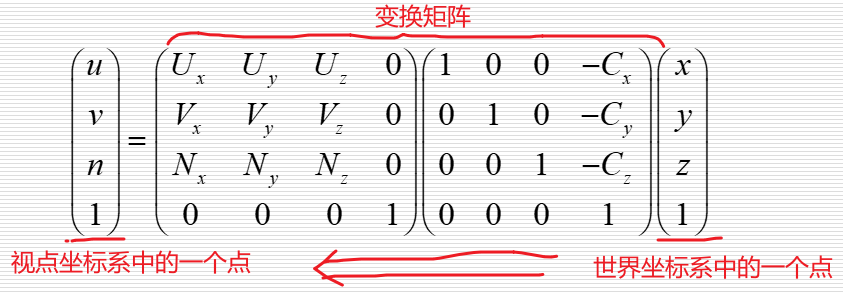
    
- 投影变换（在视点坐标系中，将**三维场景变为二维图像（**二维齐次坐标**），**生成**图像坐标系**）
    - 透视投影：符合人类的视觉特点，产生的投影效果更为真实
        
        投影点：通常取视点坐标系中(0, 0, 0)点
        投影平面：取作与视线方向(N方向)垂直的平面n = d。假设在视点坐标系中的点为(u, v, n)，那么在投影面上的对应点坐标(up, vp)为
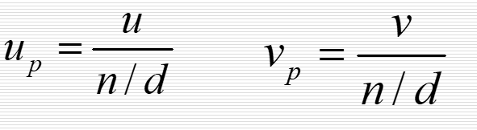
        
    
    平行投影：物体的相对度量保持不变，适用于建筑和机械设计
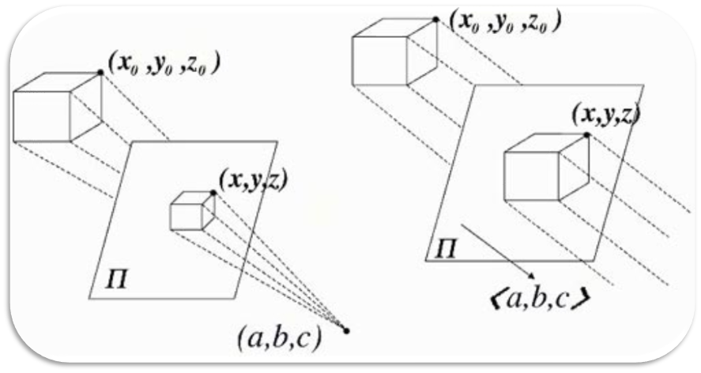
    
    - 剪裁
        
        位于视域四棱锥内部的几何物体被投影在投影平面上，位于外部剔除。部分位于内部，需裁剪
        
- 设备变换（生成**规格化坐标系**）
    
    投影后二维齐次坐标除以最后一个坐标分量W，便得到了规格化设备坐标
    
- 视窗变换（生成屏幕坐标系）
    
    屏幕坐标系：通常以像素为单位
    视窗变换：
    **二维变换：**将定义在视窗中的**规格化设备坐标**转换到以**像素**为单位的**屏幕坐标**
    **扫描转换：**将连续的几何物体转换为离散的光栅表示