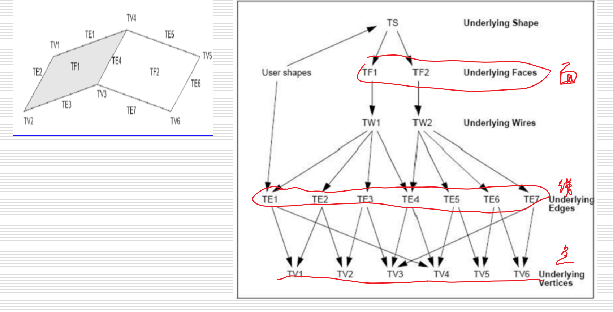
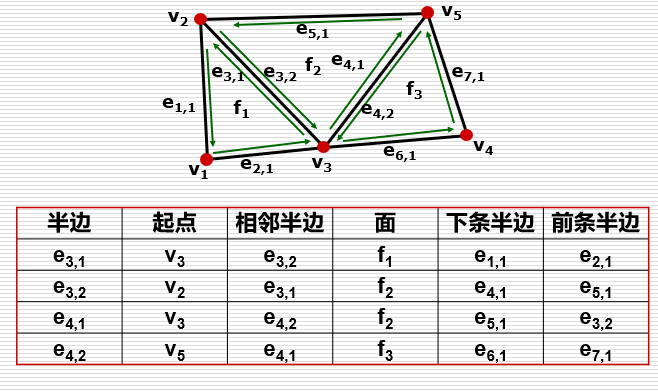

# 多边形

Owner: -QVQ-

- 多边形表示物体的主要来源
    
    三维测量与扫描
    
    断层扫描重建
    
    解析数学公式的逼近
    

- 多边形表示方法
    - **OBJ格式**（3D模型文件）
        
        组成：
        
        1. **顶点坐标表**(x, y, z) ：每个顶点处可能有多个平面片，一般情况下顶点数小于面片数。
        2. **纹理坐标表**(u, v)：控制纹理映射时纹理在表面上的位置。
        3. **法向表** (nx, ny, nz) ：控制物体绘制时的着色光滑程度
        如果顶点法向为取作该面片的法向，绘制出来的多边形物体棱角分明
        如果顶点法向是周围面片法向的某种平均，则绘制结果是光滑的

            
        4. **面表**：由指向顶点、纹理坐标以及法向的指针组成。
        
        特性：
        
        (1)3D模型文件，因此不包含动画、材质特性、贴图路径、动力学、粒子等信息。
        
        (2)主要是多边形模型。虽然OBJ文件也支持曲线(Curves)、表面(Surfaces)、点组材质(Point Group Materials)，但Maya导出的OBJ文件并不包括这些信息。
        
        (3)OBJ文件支持三个点以上的面。（如果只支持三个点的面，导入模型会被三角化）
        
        (4)OBJ文件支持法线和贴图坐标。贴图坐标信息可以存入OBJ文件中。
        

- 三角形网格表示的数据结构
    
    边界表示（BRep表示），它是几何造型中最成熟、无二义的表示法。
    
    如下：

    
    其中

    
    拓扑信息是指：

    
    点线面的拓扑结构
    
    - 半边表示的数据结构包括：
        - 半边结构(Half-Edge Structure)：可定向的二维流形及其子集
            
            表示方法略微复杂的边
            
            大多操作都可以在常数时间完成。
            
            数据结构的大小是固定的（没有使用动态数组）且紧凑的。
            
            - 数据结构(每条边被记为两条半边，记录每条半边)
                
                **边：**
                
                起始顶点的指针
                
                邻接面的指针(如果为边界，指针为NULL )
                
                下一条半边(逆时针方向)
                
                相邻的半边
                
                前一条半边(可选)
                
                **面：**
                
                边界上的任意一条半边
                **顶点：**
                
                xyz的坐标值
                
                此顶点为起点的所有半边
                
                ```cpp
                struct HE_edge
                {
                	HE_vert* vert; // 起始顶点的指针
                	HE_edge* pair; // 相邻的半边 
                	HE_face* face; // 邻接面的指针
                	HE_edge* next; // 下一条半边
                };
                ```
                
                一个例子:


                
                面存放了边，边存放了点
                
            
            优势：
            
            查询时间 O(1)， 操作时间 (通常) O(1)
            缺点：
            
            只能表示可定向流形（T-型接合、内部多边形、网格中的空缺，不能使用）
            
            信息冗余
            
        
        翼边数据结构
        
        辐射边数据结构
        
    - 多边形表示的优点
        
        表示简单
        可以**表示具有任意拓扑的物**体
        可以表示具有**丰富细节**的物体
        大部分图形硬件**支持**多边形物体的**加速绘制**
        
    - 多边形表示的缺点
        
        逼近表示，**难以**满足交互时**放大**要求
        **难以**用传统方法**修改**(编辑)物体外形
        缺乏解析表达式，**几何属性计算困难**
        在表示复杂拓扑和具有丰富细节的物体时，**数据量庞大**，建模、编辑、绘制、存储的负担重