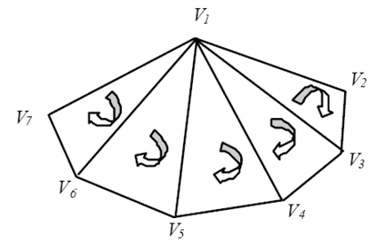

# 实时绘制加速技术

Owner: -QVQ-

- LOD技术（细节层次Levels of Detail）
    
    为了支持当**物体远离观察者**或者**物体的重要程度不同**，**位置不同，速度不同**或者**视角相关**的参数不同需要**减少渲染**3D模型**的复杂度**。(简单来说，物体近细节多，物体远细节少)
    
    LOD技术增加渲染效率的本质是通过**增加图形管线**的工作量，主要是通过**顶点数据进行交换**的。大部分情况下，**被减少的视角效果不会被注意到**，因为对于非常远的物体或者快速移动的物体的影响是非常小的
    
    LOD技术主要广泛用于**沙盒游戏**或大世界地图游戏。
    
- 网格压缩传输技术
    
    **意义：**场景**绘制三角形**时，需将三个顶点的信息传送到图形硬件，为**避免同一顶点**信息的**重复传送**，大多数图形API均采用三角形带和三角形扇等**复合三角形结构**进行**传输**，以充分利用图形硬件的有限带宽
    
    - 三角形带方法

        
        n个顶点的顺序三角形定义为顶点序列：{v1,v2,…vn},其中三角形i为Δvi vi＋1 vi＋2
        
    - 三角形扇方法

        
        n个顶点的顺序三角形定义为顶点序列：{v1,v2,…vn},其中三角形i为Δv1 vi＋1vi＋2
        
    
    通过上述方法将传输m个三角形的代价从3m个顶点降到（m＋2）个顶点
    

三、遮挡剔除技术

四、IBR技术