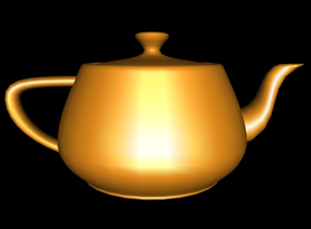
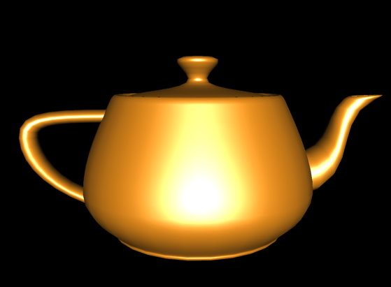

# 明暗处理模型

Owner: -QVQ-

- **Flat Shading（平面着色）**
    
    
    **方法：**
    
    依据局部光照明模型按**每一个多边形的法向**计算出一个**颜色值C**
    
    将**C赋**给**该多边形**在屏幕上的投影所覆盖的**全体像素**
    
    **优缺点：**
    
    处理简单，**计算量小**
    
    景物表面上**相邻**的**多边形**之间**颜色差异较大**，存在马赫带效应

    
- **Gouraud Shading（光亮度插值明暗处理）**
    
    
    **方法**
    
    多边形物体的**每一个顶点**赋一个**法向量。**
    用**局部光照明模型**计算**每一顶点**处的**光亮度**
    多边形**内部**各点处的**光亮度值**通过对多边形**顶点**处的**光亮度**的**双线性插值**得到
    
    **优缺点：**
    
    **简单**快速，**真实感**较大的提高
    **马赫带效应**依然存在
    **不能**正确模拟**高光**

    
- **Phong Shading(补色渲染)**
    
    
    **方法**
    
    为多边形物体的**每一个顶点**赋一个**法向量**
    多边形**内部各点**处的**法向量**则通过对多边形顶点处**法向量的双线性插值**得到
    
    利用**Phong模型**计算每一点的**光亮度**
