# 曲面消隐

Owner: -QVQ-

位置：造型变换后、取景变换后、投影变换后都会发生

意义：减少视觉歧义、增加真实感

常用的消隐算法：

**Z-buffer算法（深度缓存器算法）、区间扫描线算法、区域子分割算法**(Area Subdivision)、**画家算法（深度排序算法）、光纤投射算法、BSP树**

- 图像空间算法
    
    算法大纲：
    
    ```cpp
    for(每一个像素点){
    	对于每一个像素点找到离视窗最近的多边形；
    	计算这个像素的的颜色；
    }
    ```
    
    特点：
    
    1. 图像受到输出设备的分辨率限制
    2. 复杂度高（O（像素点数量*物体数量）），每个像素都需要对物体排序
    
    算法有：z-buffer算法、扫描线算法
    
    - Z-buffer算法
        
        对于2D：
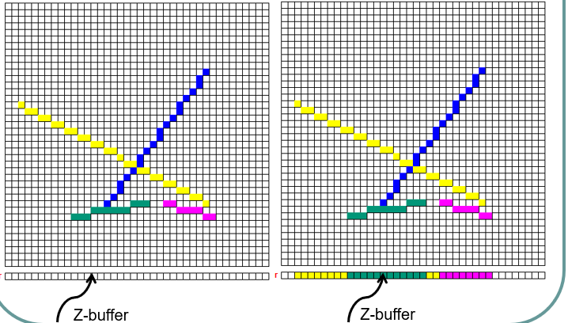
        
        算法：
        
        ```cpp
        初始化(背景色c-buffer);
        初始化(一个视点最远的z值);
        for(对于多边形的每一个面){
        	for(对于这个面的每一个像素）{
        		计算其深度值z(x,y)；
        		if（z(x,y)>z-buffer(x,y)）{
        			c-buffer = 计算光亮值属性；
        			z-buffer(x,y)=z(x,y)；
        		}
        	}
        }
        ```
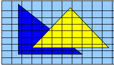
        
        优点：
        
        1. 复杂度为O（像素点数量*物体数量）
        2. 不需要对物体排序
        3. 对于任意几何形状都可以
        4. 可以用硬件加速
        
        缺点：
        
        1. 占显存
        2. 可能出现走样
        3. 不好处理透明物体
    - **区域子分算法(Area Subdivision)**
        
        
        **原理：**采用了**分而治之**的思想，利用了**堆栈**的数据结构.
        
        把物体投影到全屏幕窗口上，然后递归分割窗口，直到窗口内目标【足够简单】，可以显示为止。
        
        **足够简单**是指:
        
        窗口仅与一个多变形存在一下关系中的一个：包含、相交、包围、相离
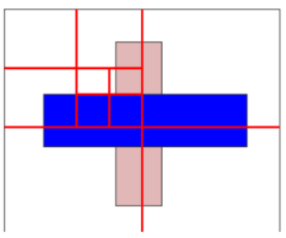
        
        **算法：**
        
        1. 若窗口内**没有物体**则按照**背景色**显示：
        2. 若窗口内只有**一个面**，则把该面**显示**出来：
        3. 若窗口内含有**两个以上的面**。则把窗口等**分成四个子窗口**，对每个小窗口再做上述同样的处理。
        4. 若到【窗口**仅有象素**那么大】，而窗口内仍有两个以上的面，这时该象素取窗口内【**最近的**】可见面的颜色或【**平均颜色**】.
- 对象空间算法
    
    HS框架：
    
    ```cpp
    for(对于在空间中的每一个物体）{
    	确定未被遮挡的部分；
    	扫描转换算法查找像素；
    	计算像素颜色；
    }
    ```
    
    特点：
    
    1. 适用于精密的CAD工程领域
    2. 时间复杂度为O（物体数量^2）
    3. 后向面剔除
    4. 不能处理相互贯穿或循环遮挡的物体
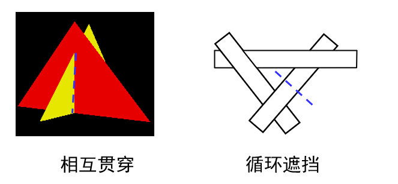
    
    - 背面剔除
        
        原理：
        
        在定义多边形时记录了边的朝向，从而有面的法向量，当法向量和视点的夹角>90°时为背面去除。
        
        缺点：
        
        1. 只适用于凸多面体
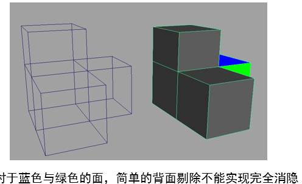
        
        1. 不能处理遮挡
    - **排序算法（画家算法）**
        
        原理：先绘制远处的物体，再绘制近处的物体
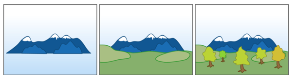
        
        条件：场景中物体在z方向上没有相互重叠
        
        排序算法（Depth-SortingMethod）是介于**图像空间消隐算法**和**景物空间消隐算法**之间的一种算法，
        
        排序算法**：**
        
        1. 预先计算物体上各多边形可见性的优先级，
        2. 然后再在图像空间中产生消隐图。
    - **深度排序算法**：（排序算法中，优先级以深度为标准）
        - 对于遮挡的处理
            
            **第一步：**当物体z值范围重叠时，判断多边形Q是否遮挡P，需要：
            
            1. 多边形P和Q的x坐标范围不重叠
            2. 多边形P和Q的y坐标范围不重叠
            3. 从视点看去，多边形Q没有完全挡住P
            4. 从视点看去，多边形Q没有完全位于P的同一侧
            5. 多边形P和Q在xy平面上的投影不重叠（从上往下看，PQ不重叠）
            
            上面的只要有一种成立，P优先级低于Q
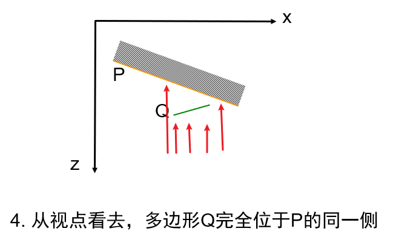
            
            **第二步：**如果上诉都不成立，则P有可能遮挡Q，将P和Q**交换重新判断**条件3和条件4
            
            **第三步：**如果仍不能判断，则：
            
            1. 标记P（避免循环判断）
            2. 将P沿Q**剖分**
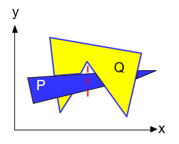
            
            （深度排序算法有时可能将具有正确深度顺序的多边形进行剖分，多余的剖分会增加计算量）
            
        
        **特点：**
        
        1. 适合于固定视点的消隐
        2. 可以实现透明效果
        3. 视点变化的场合中(如飞行模拟)，难以满足实时性
        4. 算法复杂度O(nlogn)
    - **二叉空间剖分树（BSP）**
        
        深度排序算法中剖分多变形的分割过程可以用一个二叉树的数据结构表示（适用于视点不变的场景绘制）
        
        BSP树并不是唯一的
        
        **原理**：
        
        1. 加入一个平面将空间分成前后两部分
        2. 这两个部分又分别被另外的平面分割成更小的空间……直到最后
        3. 确定每一个平面相对于眼睛的遮挡顺序
        
        其中，判断遮挡顺序：
        
        从树根开始判断前后关系
        
        右子树放背后的东西，左子树放平面正面的东西
        
        - **例子1：**
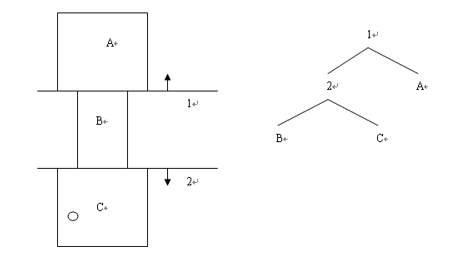
            
            这个图里，右子树放正面，左子树放背面。平面1先将空间分成A和B、C，对于平面1来说A在前面，应该放在剖分树的右边，平面2再将空间分成B和C，对于平面2来说，C在前面，应该放在剖分树的左边。
            
            如果人在c房间，判断所有房间的遮挡顺序：
            
            1. 从树根开始，由于人处于2里面，所以另一边A入栈
            2. 由于人处于分割平面2的“前”面，所以另一边B入栈
            3. 最后C入栈
            4. 这样，整个房间离人由近到远的顺序就可以确定了：C－B－A
        - **例子2：**
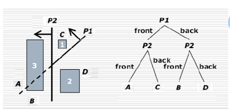
            
            这个图展示了物体是可以分割的，这里是左子树放平面正面的东西，右子树放背后的东西
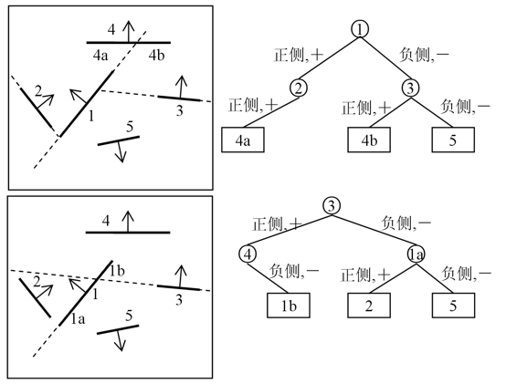
            
        - **遍历：**
            
            
            从后往前遍历：
            
            1. 视点位于分割平面的正侧，遍历顺序：
                
                负侧分支→根结点多边形→正侧分支
                
            2. 视点位于分割平面的负侧，遍历顺序：
                
                正侧分支→根结点多边形→负侧分支
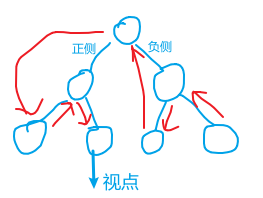
            
            **总之，视点是最后遍历的。视点这边的遍历顺序和另一边的遍历顺序相反**
            
            ```cpp
            void showBSP(结点T){
            	if(T是空结点)return；
            	P = T;
            	if（视点在P前面）{
            		showBSP（T的负侧）；
            		绘制点P；
            		showBSP（T的正侧）；
            	}
            	else{
            		showBSP（T的正侧）；
            		绘制点P；
            		showBSP（T的负侧）；
            	}
            }
            ```