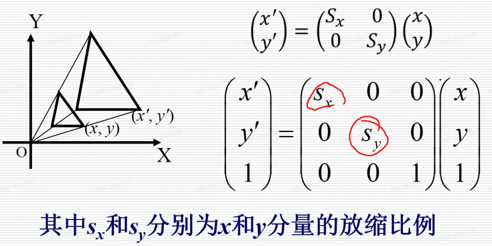
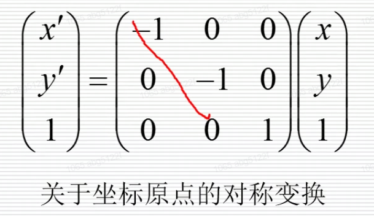

# 渲染通道、三维变换

Owner: -QVQ-

<aside>
🌟 渲染需要处理的问题：
坐标变换、光源、光照、消隐、裁剪、光栅化、平面化……

> Transform、Illuminate、Transform、Clip、Project、Rasterize
> 
</aside>

三维变换流程图

- 照相机模型
    - 模型：
        
        小孔成像模型（通用）：
        
        所有捕捉到的光线都沿着指向焦点的路径到达，没有镜头变形（所有物体都处于焦点位置）
        传感器响应与射线成比例
        
        其他模型包括：
        Depth of field
        Motion blur
        Lens distortion
        
    - 外参
        
        相机的位置、朝向：
        
        求外参矩阵：把XwyW,Zw转换为以相机为中心的世界中的坐标xc,yC,zc
        
        小孔成像问题：
        
        将转换为相机为中心世界的Xc,yC,ZC,利用相机内参转换为图片中的点的位置，在将
        图片中的点转换为是哪个像素（像素坐标）
        
    - 内参
        
        光圈、视平面
        
- 变换pipeline
    
    已知变换：平移，旋转，缩放，他们被用于三个作用：
    
    渲染通道：
    
    1. 模型变换
        
        大小缩放，平移，旋转物体
        建模坐标系->世界坐标系
        
    2. 光照计算
        
        光源发散、表面反射、大气衰减、相机感应
        
        间接光照、全局光照
        
    3. 视窗变换
    4. 剪裁
    5. 投影变换
        
        透视投影，平行投影
        
- 光栅化
    
    转换图像坐标系为像素和颜色，这里也可以处理消隐

    
    走样
    
- 二维变换
    
    基本变换：平移、旋转、放缩
    其它变换：剪切、对称、复合
    
    - 齐次坐标
        
        用n+1维向量表示一个n维向量
        
        ◆二维点（x, y),用（X, Y, Z）表示(X=X/Z, Y=Y/Z)
        (2,3)的齐次坐标表示可以是(4,6,2)、(3,4.5,1.5)
        
        优势：防止浮点数溢出、矩阵变换的统一表示
        
    - 二维平移
        
        二维点P（x, y)移动（tx，ty)后，得到点P'（x', y'）

        
        将矩阵的加法转变为矩阵的乘法
        
    - 二维旋转
        
        将点P（x,y)绕坐标原点按逆时针旋转角

        
    - 二维缩放

        
    - 剪切变换
        
        变换过程中，坐标保持不变，x坐标值发生线性变化
        平行于X轴的线段变换后仍平行于X轴，平行于Y轴的线段变换后错切成与Y轴成固定角α的直线

        
    - 对称变换

        
    - 复合二维变换
        
        平移、旋转和放缩矩阵通常记为T、R和S，TSA表示对A先T变换再S变换
        二维变换具有结合性：(AB)C=A(BC)
        二维变换不具有交换性A8 C
        
        > **刚体变换**：
        可以分解为：平移和旋转的组合
        物体的形状没变化，位置和方位有变化
        > 
        
        **仿射变换**：
        可以分解为：平移、旋转和**放缩**的组合
        保持点的共线性、长度的比例=>平行线
        
- 三维变换
    
    是：三维变换可以看作是对照相过程的模拟，即如何将场景中的三维几何物体变换到二维屏幕上
    
    变换内容包括：世界坐标系和造型变换、视点坐标系和取景变换、投影坐标系和投影变换、屏幕坐标系和设备变换（27英寸到32英寸）

    
    坐标系：视点坐标系（虚拟照相机的位置、朝向以及向上的方向）
    变换：取景变换（在视域四棱锥进行裁剪和背面剔除）

    
    三维变换流程图
    
    - 平移

        
    - 缩放

        
    - 旋转（与二维不同）

        
    - 非线性变换（扭曲）

        
- 视点坐标系和取景变换
    
    视点坐标系定义于世界坐标系中
    定义了照相机镜头的朝向：视线方向
    照相机的位置
    UP方向
    
- 投影变换
    
    投影点：通常取视点坐标系中(0,0,0)点
    投影平面：取作与视线方向N方向）垂直的平面n坐标=d。假设在视点坐标系中的点为(u,y,n),
    那么在投影面上的对应点坐标(u,')为

    
    一维透视
    
    二维：投影加上一个变换矩阵，即做一次旋转
    
    三维：先使立体绕Z轴旋转一个角度，再绕X轴旋转个角度中（类似于轴测变换），这样使得立体上原平行于三个坐标平面的表面均与投影面XOZ产生一定的倾斜角；向XOZ投影面作透视投影。

    
- 视域四棱锥裁剪

    
    平行投影的视域四棱锥一般为长方体
    
    视野范围在视域四棱内、“前面”“后面”之间的部分四棱锥
    
- 规格化设备坐标和设备变换
    
    在投影平面上，有一个矩形区域称为视窗
    
    “视域四棱锥” 图中的矩形
    物体投影后：二维齐次坐标表示
    
    设备变换：投影后二维齐次坐标除以最后一个坐标分量，便得到了规格化设备坐标
    
- 屏幕坐标系和视窗变换
    
    屏幕坐标系：通常以像素为单位
    视窗变换
    
    二维变换：将定义在视窗中的规格化设备坐标转换到以像素为单位的屏幕坐标
    扫描转换：将连续的几何物体转换为离散的光栅表示