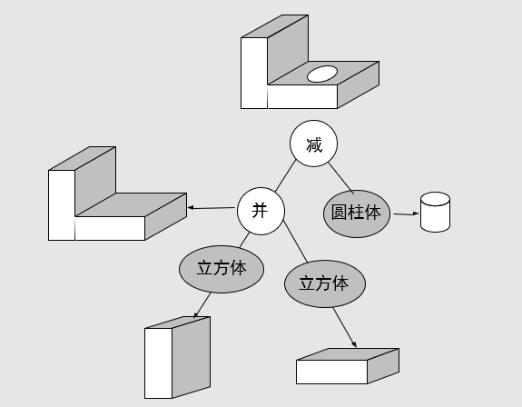

# 物体的CSG树表示

Owner: -QVQ-

CSG（构造表示，将两个物体拼接到一起）：Constructive Solid Geometry
表示实体：即有边界，也包含内部
表示边界：多边形、参数曲面、隐式曲面、细分曲面

CSG树表示：面向浇铸、加工或拉伸等（常用于CAD/CAM过程）

**分解表示：**只关心场景由几个部分组合，不关心由哪些模型构成

# CSG树：

通过一系列**几何操作**将简单的**基本体素组合**起来

**基本体素**：立方体、球、圆柱、圆锥等

**布尔运算**：并、交、差、补等

**几何变换**：平移、旋转、放缩、剪切等

如图将模型以树形结构构造成一个复杂形状，可以看出这种方法很复杂，不是不能用来构造一棵树的模型，但**工作量大**

**缺点**：1.绘制耗时   2.限制了物体外形的修改
**改进：**混合表示将边界表示和布尔运算结合起来，形成一种界与边界表示和CSG实体表示之间的混合表示