# 物体表示

Owner: -QVQ-

- 建模坐标系和世界坐标系
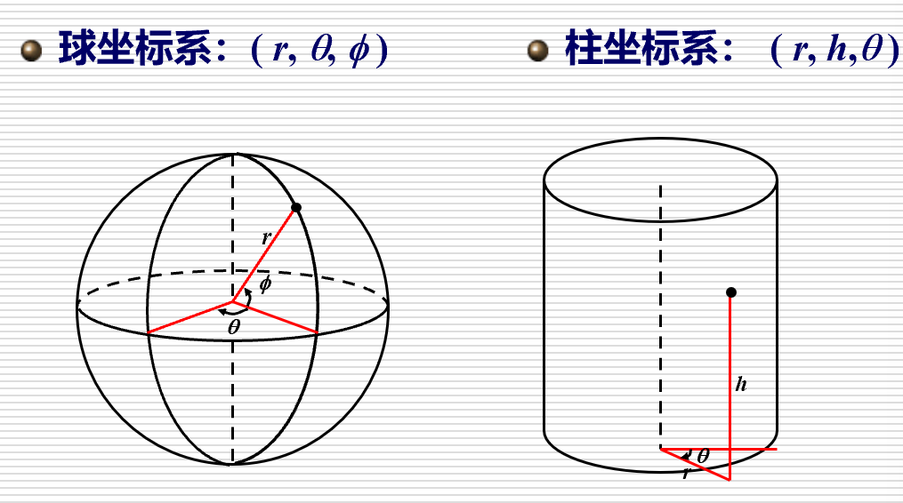
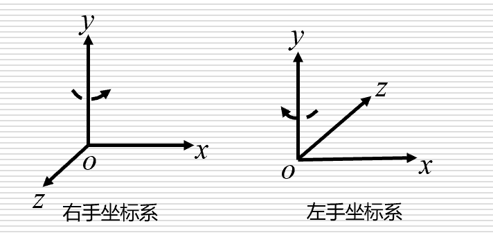
    
    几何场景：定义在一个世界坐标系中，由许多物体组成
    
    - 建模坐标系
        
        选择空间坐标系，使得几何物体的表示最简单。该坐标系称为建模坐标系
        
    
    世界坐标系
    
    - **在建模坐标系中而不是在世界坐标系中直接表示物体的优势**
        
        1**表示**形式**简洁**
        2在同一几何场景中，一个物体可能会多次出现，它们可以通过**复制**加变换的方式得到：标准体素“＋”变换“＝”新的物体
        3建模坐标系**便于**进行**几何操作**
        
    
    世界坐标系和建模坐标系之间相互转换：简单的线性变换，如平移、旋转、放缩、剪切以及这些简单变换的组合
    

**多边形表示：**

- 多边形表示物体的主要来源
    
    三维测量与扫描
    
    断层扫描重建
    
    解析数学公式的逼近
    

**参数表示：**

- 参数曲线表示
    - 参数表示的优势
        1. 参数表示是**显式**的
        对每一个**参数值**，可以**直接计算**曲面上的**对应点**
        参数表示的物体可以**方便地转化**为**多边形逼近表示**
        2. 曲面上的**几何量计算简便**(微分几何)：法向、曲率、测地线、曲率线等
        3. 特殊形式的参数表示的**外形控制**十分**直观**
        Bézier、B-样条、NURBS (Non-Uniform Rational B-Spline, 非均匀有理B-样条)曲线/曲面
    
    参数曲线：
    
    - Bézier曲线
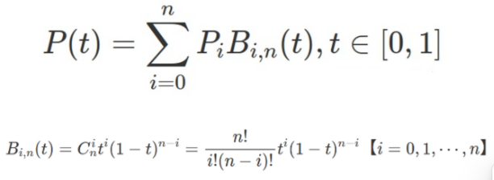
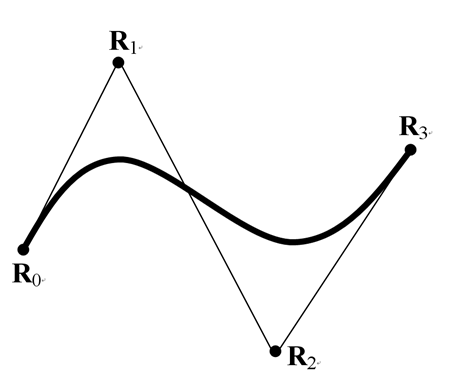
        
        三次 Bézier曲线，由这些点连接形的直线所围成的形状为特征多边形
        
        - 原理
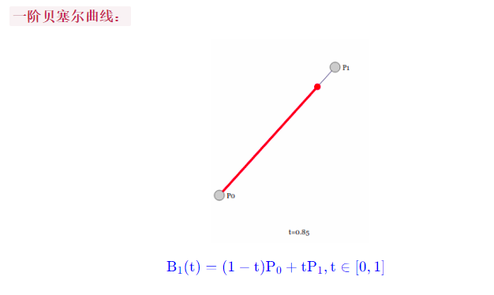
            
            一次贝塞尔曲线很好理解, 就是根据 t来的线性插值
            
            二次贝塞尔曲线
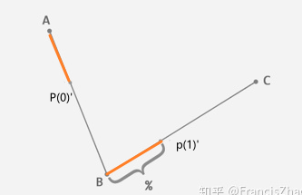
            
            选三个不共线的点ABC，AB上任选一个点P(0)’，BC上点P(1)’使得AP(0)’:AB=BP(1)’:BC
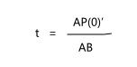
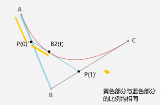
            
            此时P(0)’P(1)’就是视为一次贝塞尔曲线，B1(t)点由一阶贝塞尔曲线的公式得到
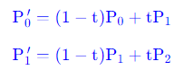
            
            当P(0)’和P(1)’随t变动时，就会动态的生成线段P(0)’P(1)’
            
            从而得到二次贝塞尔曲线公式
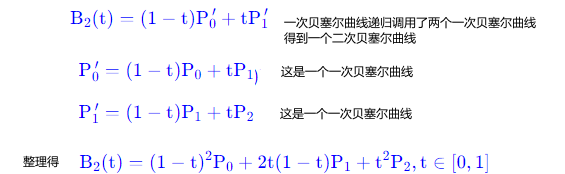
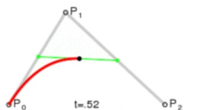
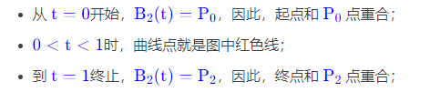
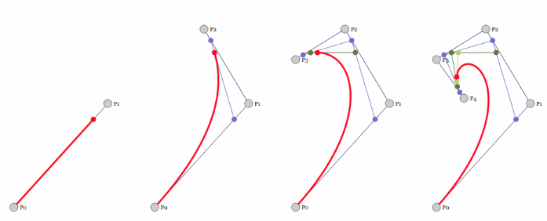
            
            可以想象到n次贝塞尔曲线就会递归调用n-1次的贝塞尔曲线
            
        - 曲线性质：（点插对几递整凸）
            
            **端点插值**：第一个控制点和最后一个控制点，恰好是曲线的起始点和终点
            
            **端点切向：**曲线在ｔ＝０时的导数是和Ｐ０Ｐ１的斜率（导数）是相同，ｔ＝１时的导数是和Ｐ３Ｐ４的斜率（导数）是相同
            
            **对称性**：曲线的控制顶点的几何地位是对称的
            
            **递归性**：
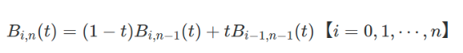
            
            **凸包性**：曲线始终会在包含了所有控制点的**最小凸多边形**中
            
            **几何不变性：**Bézier曲线的形状仅与控制多边形有关，与坐标系无关
            
            **整体性质**：当移动曲线的一个控制顶点时，整条曲线的形状都会发生改变
            
            表示复杂形状时，需要将多条曲线光滑拼接起来。
            
    - B-样条曲线
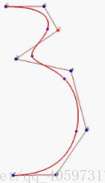
        
        将多个贝塞尔曲线连接就可以得到B样条
        
        这里有8个控制点，依次用线段连接，B样条曲线由一系列5条3次的贝塞尔曲线连接形成。
        
        一般次数越低（即p越小），那么B样条曲线就更容易逼近他的控制折线
        
        是分段函数，将多个Bézier曲线连接就可以得到B样条曲线
        
        - 性质
            
            **凸包性**：曲线始终会在包含了所有控制点的**最小凸多边形**中
            
            **几何不变性：**Bézier曲线的形状仅与控制多边形有关，与坐标系无关
            
            **端点插值**：第一个控制点和最后一个控制点，恰好是曲线的起始点和终点
            
            **局部性：**当移动一个控制顶点只影响曲线的一部分不是整条曲线
            
            一般不经过控制点
            
        - 优点
            
            对于分段Bezier曲线，不同的曲线段相互独立，移动控制点只会影响其所在的Bezier曲线段
            
            B-样条允许局部控制曲线或曲面
            
        - 缺点
            
            B-样条比Bezier样条更复杂
            
            不能精确表示二次曲面与平面的交线
            
    - NURBS曲线
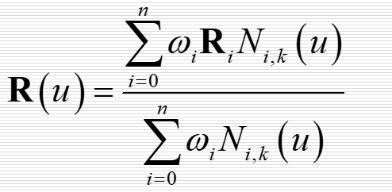
        
        - 定义
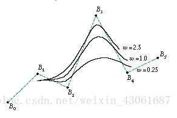
            
            控制点：确定曲线的位置，通常不足曲线上，形成控制多边形
            
            权因子：确定控制点的权值，值越大曲线就越接近控制点
            
            节点矢量u：NURBS曲线随着参数u的变化而变化
            
        - 特点
            
            非均匀：指节点向量的值与间距可以为任意值。更自由控制曲线形状。
            
        
        当所有的权因子Wi=1时，就是B-样条曲线，权因子Wi=0时，对应的控制顶点对曲线没有影响，权值越大，越靠近控制点。
        
    

**几何表示：**

- 细分曲面
    - 作用
        
        原型设计：主要特点是上手简单且表现力也很丰富（工业设计软件）
        
        在显卡上：游戏场景中
        
        适合于网络传输、用于几何处理、有限元计算（因为面片分布非常的规则、具有计算稳定性）
        
    - 原理
        
        设计师先勾划出物体的大致轮廓线，然后不断的细化割角。
        
        细分曲面的核心就一个点：细分规则。
        
    
    **常见的细分规则：**
    
    - 1.Catmull-Clark subdivision
        
        是**四边形网格的**细分法则
        
        - 细分新的曲面，先求出新的曲面的顶点：
            1. Face point（**面 → 新顶点（面点）**）
                
                新的点为：一个面的所有顶点的平均值
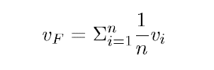
                
            2. Edge point（**边 → 新顶点（边点）**）
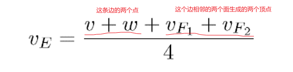
                
                - 例子
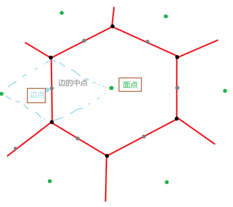
                    
            3. New vertex point（**原始点 → 更新点）**
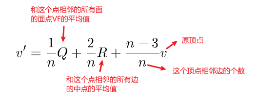
                
    1. **循环细分法（Loop细分）**：以半边数据结构为基础的
    2. **Doo-Sabin细分**：二次均匀B样条曲面二分技术的推广
    3. ***butterfly* subdivision（蝴蝶细分）**
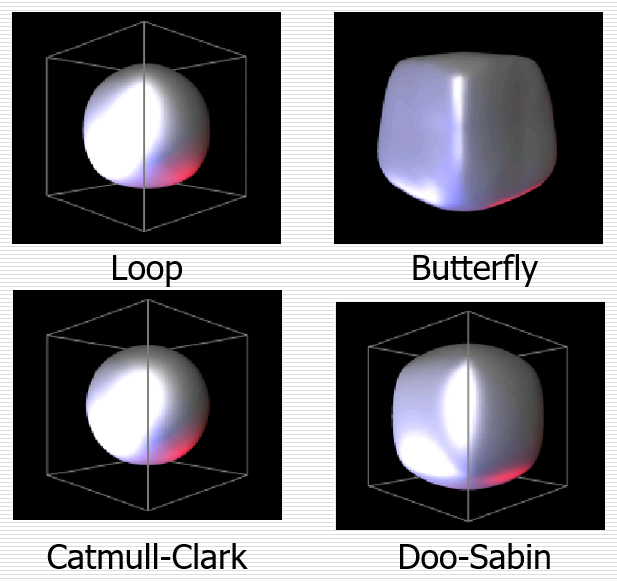
    
    - 细分曲面的翼边储存
        
        
        | Edge  | 点 |  | 面 |  | 左边循环 |  | 右边循环 |  |
        | --- | --- | --- | --- | --- | --- | --- | --- | --- |
        | Name  | 起始点 | 结束点 | 左边面 | 右边面 | 前循环 | 后循环 | 前循环 | 后循环 |
        |   a  |   X  |   Y  |   1  |   2  |   b  |   d   |   e  |  c  |
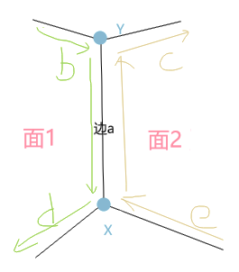
        
    
    半边数据结构是翼边数据结构的变形，
    
    主要出发点是要改进翼边数据结构，使其在边的数据结构的构造和使用方面更加高效
    
- 隐式曲面
- 物体的CSG树表示
    
    
    **分解表示：**只关心场景由几个部分组合，不关心由哪些模型构成
    
    # CSG树：
    
    通过一系列**几何操作**将简单的**基本体素组合**起来
    
    **基本体素**：立方体、球、圆柱、圆锥等
    
    **布尔运算**：并、交、差、补等
    
    **几何变换**：平移、旋转、放缩、剪切等
    
    如图将模型以树形结构构造成一个复杂形状，可以看出这种方法很复杂，不是不能用来构造一棵树的模型，但**工作量大**
    
    **缺点**：1.绘制耗时   2.限制了物体外形的修改
    **改进：**混合表示将边界表示和布尔运算结合起来，形成一种界与边界表示和CSG实体表示之间的混合表示
    

**自然景物表示:**

- 分形几何
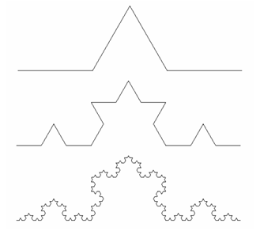
    
    - 相似性维数
        
        原图**缩小为1/a**的相似**的b个图**形所组成，有：a^D=b,**D=logb/loga**的关系成立，则指数**D**称为**相似性维数**
        
- L-系统
    
    **L文法**的**语法规则**：根据**语法规则**对所给**字符**进行**迭代**生成**新字符串**，每次迭代结果称为**一代**
    
    **字符解释**：将字符串中的**字符解释**为适当的**几何体素**，就可以得到一个基于语法规则生成的物体
    
    > 字符集：{A, B, [, ], (, )}
    语法规则：A→AA;  B→A[B]AA(B)
    其中：“A”表示一个主干，“B”表示一个分支，“[ ]”表示分支向左45°，“( )”表示分支向右45°
    > 
    
    例子：
    
    B
    A[B]AA(B)
    AA[A[B]AA(B)]AAAA(A[B]AA(B))
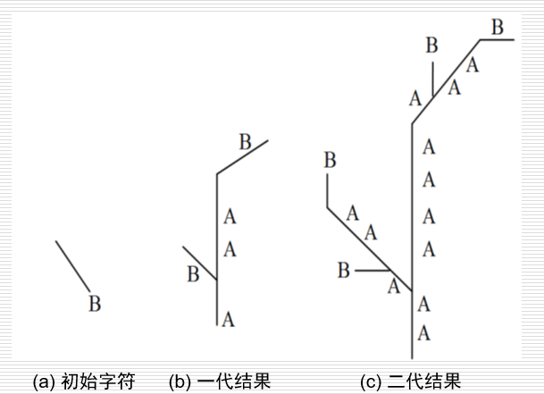