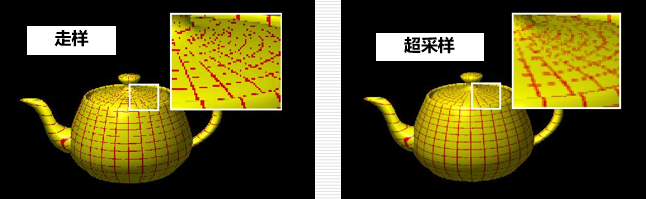

# 纹理

Owner: -QVQ-

基于纹理的表现形式，纹理可分为：**颜色纹理**、**几何纹理**和**过程纹理**

需要关注的：

纹理坐标系(s,t)
物体表面的表示在(u,v)坐标系
投影平面上的像素显示在(x,y)笛卡儿坐标系

**纹理映射方法：**

- **纹理扫描**
    
    **过程：**将**纹理模式**映射至**物体表面**，再投影变换映射至**投影平面**
    
    **特点：**
    
    用**线性函数**进行纹理映射变换
    
    选中的**纹理表面**常常与**像素边界不匹配**，需要进行像素**分割**计算
    
    **最常用**的纹理映射方法
    
- **像素次序扫描**
    
    **过程：**将**投影平面**的像素区域映射至**物体表面**，再映射至**纹理空间**

    
- 纹理反走样方法
    - 前置滤波方法
        
        
        1. 确定屏幕像素P上**可见**的景物表面**区域A**
        2. 将区域A直接**映射**到**纹理**空间**区域T**
        3. **区域A**的**平均纹理颜色 = 区域T**内的所有**纹理像素颜色值**的**平均**
        4. 代入**光照明模型**，**计算**出**像素P**应显示的光**亮度值**

        
    - 超采样方法
        
        
        1. 将屏幕**像素**P的**四个角点**分别**映射**到**纹理空间**，**得到**四个纹理**像素值**
        2. **像素**P所对应的可见表面区域的**纹理颜色 =** 上述四个纹理颜色值**取平均**

        
    - Mipmap方法(应用最广之一)
        
        
        通过**预先计算并存贮**原始纹理图像的一组**多分辨率版本**
        
        **预处理：**
        
        生成一个由**不同分辨率图像**构成的**纹理图像序列**（**新版本**中的**每一个像素值**取为原始图像中相对应的**四个像素颜色值的平均**）

        
        **映射阶段：**
        
        屏幕上的**每一像素**内的可见表面区域被**映射到原始纹理图像**上的一块区域
        
        **估计**该**区域所覆盖**的原始纹理图像中**像素**的**个数**并以此作为**选取适当**分辨度的**纹理图像版本**的一种测度
        
        如右图，选取**相近**的**两个原始纹理图**像，实时**生成一个**所需的**纹理图像**

        
- 三维纹理
    - **凹凸映射（bump mapping）**
        
        
        **作用：**在不改变物体宏观几何的前提下，**模拟**物体表面**粗糙的、褶皱的、凹凸不平的光照效果**
        
        **基本思想：**用**纹理**去**修改**物体的**法向（**物体**表面的几何法向**保持**不变**，我们仅仅**改变光照明**模型计算中的**法向**）

        
        **仅仅是修改已有的法向，让表面产生凹凸效果**

        
    - **法向映射（normal mapping）**
        
        原理：高精度**法向纹理（事先计算**高精度**模型的法向保存）**映射到**低精度模型 =** 高精度模型的**绘制效果**

        
        **完全用已经保存的新的法向，让模型光照更有细节**
        
    - **位移映射（displacement mapping）**
        
        依据与表面上点所对应的**纹理值**，沿表面法向**偏移**该**点**的**几何位置**
        
        **优**：能产生很强的**深度感**：自遮挡、自阴影、轮廓
        
        **缺**：**计算代价大**（与凹凸映射、法向映射相比）
