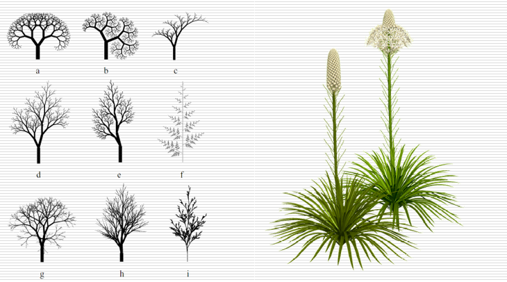

# 自然景物表示方法（图形学中最具挑战性的问题之一）

Owner: -QVQ-

例如：静态（山、树木、花草）动态（火焰、云、烟、流体）等

目前三种常用方法

### 分形几何（静态）

还原真实的自然（分形图案的复杂性来自简单数学关系的反复迭代）
冬天的雪花、窗花，天上的云、植物的叶子、树木等，都具有分形的特征，这些特征，用古典的欧氏几何是没法表示的，从而被称作“怪物”，但是运用分形的原理，却可以得到与自然真实相似的效果。

对基本几何体的操作

- 主要特征
    1. **自相似**性质：客观事物具有自相似的层次结构，局部与整体在形态、功能、信息、时间、空间等方面具有统计意义上的相似性。
    2. **无限小细节**性质：分形艺术的极小性是源自其自相似性。动态的看，分形艺术是一种具有无限极小性的艺术。
    原因：无限极小性主要取决于其几何属性即嵌套性和迭代性。
    3. **嵌套性**：不论是自然界中的个体分形形态，还是数学方法产生的分形图案，都有无穷嵌套、细分再细分的自相似的几何结构。
    4. **缠绕性**：在分形艺术中充满了分叉、缠绕、不规则的元素，她给我们一种返璞归真的感觉，而这种美学特性即为分形图案的缠绕性。
    分形艺术的美学秩序是一种无序中的秩序，这里的无序并不是混乱，而是一种几何秩序在视觉上的表现，即混沌性。
    5. **维数非整数**：现实生活中象弯弯曲曲的海岸线这些对象就不能用传统欧几里德几何学的整数维描述或者说测量了。要描述这一大类复杂无规的几何对象，就引入了分形理论，把维数视为分数维数。（普通几何学研究的对象，一般都具有整数的维数。比如，零维的点、一维的线二维的面、三维的立体、乃至四维的时空。维数（维度）：是数学中独立参数的数目，传统维度是整数，分维）

通俗一点说就是研究无限复杂但具有一定意义下的自相
似图形和结构的几何学。
分形几何学的基本思想是：客观事物具有自相似的层次结构
，局部与整体在形态、功能、信惠息、时间、空间等方面具有
统计意义王的相似性，称为自相似性
例如，一块磁铁中的每一部分都像整体一样具有南北两极，
不断分割下去，每一部分都具有和整体磁铁相同的磁场。自相似的层次结构
如果某图形是由把原图缩小为1/a的相似的b个图
形所组成，有：
a^D=b,D=logb/loga
的关系成立，则指数D称为相似性维数，D可以是
整数，也可以是分数。
Koch曲线的分形维数是
log 4/log 3约等于1.26

- 分形树的编程实现方法
    - 递归算法
      
    - 迭代函数系统算法
      
        一维情形：线段位于x-轴，将线段在中点剖分，并将中点沿y方向移动一段距离，如此不断地剖分并且移动新得到的中点
        记(xi, yi)、(xi+1, yi+1)为直线段的两个端点，则剖分后新生成的点(xnew, ynew)为：
        

        
        Random(•)为[0, 1]之间的随机数，P(•)为一个控制随机量大小的函数，例如在第s步剖分中，P(s)=2-s

        
        用一维分形方法生成山

        
        用二维分形方法生成山
        

### 基于语法规则的L-系统（静态）

LS文法

L-系统（成功地用于植物建模）
语法规则：根据语法规则对所给字符进行迭代生成新字符串，每次迭代结果称为一代
字符解释：将字符串中的字符解释为适当的几何体素，就可以得到一个基于语法规则生成的物体

- 一个实例
  
    字符集：{A, B, [, ], (, )}
    语法规则：
    A→AA;  B→A[B]AA(B)
    迭代两次
    B
    A[B]AA(B)
    AA[A[B]AA(B)]AAAA(A[B]AA(B))

    “A”表示一个主干，“B”表示一个分支，“[ ]”表示分支向左45°，“( )”表示分支向右45°

    
    在L-系统中引入更多控制
    不同“代”之中的字符的不同解释
    (n+1)代的树枝要比n-代的树枝细一些、短一些
    终止节点处赋予树叶和花朵
    （语法规则是一样的，但字符解释可以不一样，对其产生扰动）
    

### 粒子系统（动态）

定义：是一个动态变化的系统，生成其中每一瞬间画面的步骤，模拟火、雾、烟、焰火等外形随时间的变化而变动的模糊物体

由一组随时间变化的粒子组成，粒子的变化由某种随机统计规律控制
赋予每一个新粒子一定的属性：粒子有生命：产生、发展（运动）、消亡

<aside>
🌟 删除那些已经超过其生命周期的粒子

根据粒子运动属性对粒子进行移动和变换
绘制并显示出所有有生命粒子组成的画面

</aside>

缺点：粒子系统并不适于描述少量非随机的运动方式，在有些情况下，使用粒子系统并不比使用帧动画更好，那么在这种情况下，不妨使用帧动画来提高一些效率。粒子系统对游戏效率的压力是比较高的。

- 组成
    - 发射某一类粒子的发射器，Emitter
      
        Emitter用于发射Particle。事实上，Emitter就是一组配置的集合，Particle“出生”时的状态被Emitter的配置所决定。因此这组配置经常是一个Min（最小值）加一个Var(变化范围）
        
        最基本的，Emitter的功能是按照**发射速率**（Emission,一般单位是“个/秒”）和**发射位置**发射粒子。
        
        为了更好更准确描述发射方向和发射速率，就有**发射角**(Spread)的问题了c发射角必须与**Direction**相关，粒子发射即是按照Direction,呈一定角度散开发射。但这还无法决定发射的强度和速度，因此还需要有一个**速率(Speed),**决定每十个粒子的速率。
        
    - 被发射的粒子，Particle
      
        Particle里记录了哪些数据，就意味着粒子系统能实现哪些功能
        例如一个Particle记录了生命、大小、位置、速度，那么这个粒子系统就只能是大小恒定的。
        
        粒子的**生命期**，诚如雪花和烟火，过一段时间就会消失，粒子也有生命，生命完结了，这个粒子就完结了
        粒子的位置、大小等与**外观相关**的属性，这是不同的粒子的最外在体现。
        粒子的**变化属性**，包括粒子速度（对位置的响）、大小变化速度（对大小影响）等等。
        
    
    以上两者是最核心的部分，
    
    - 还有为了方便扩展而设置的影响器Affector（动力系统，重力等）
      
        emitter过于臃肿对于扩展是很不利的，因此有些人想出了Affector的方法，以使得扩展性得到满足
        Affector是一类附加修缮配置的统称，主要包括粒子生成和运行的因素。

Particle的这些数据每一帧都应被处理，所幸大部分情况下，粒子系统的数据只是简单算法。