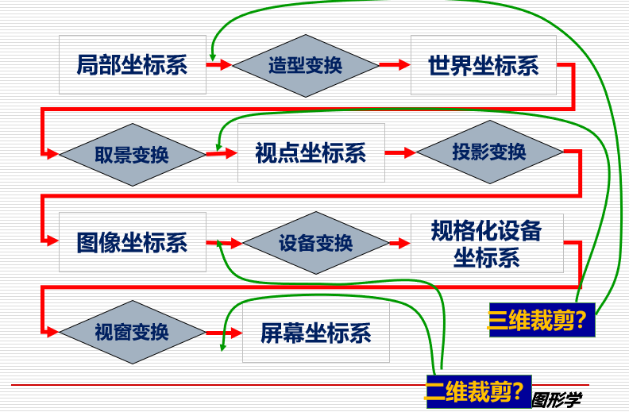
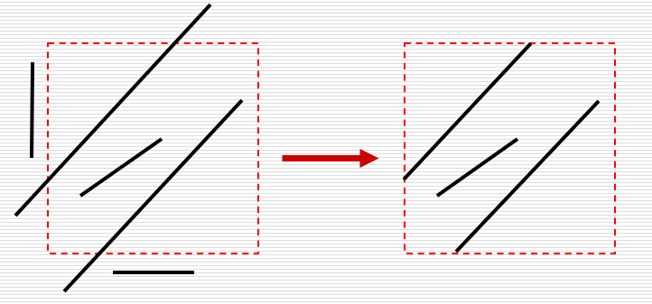
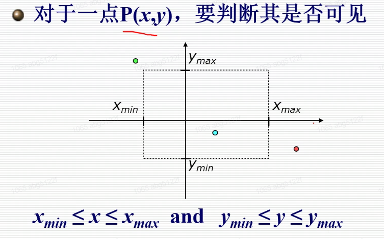
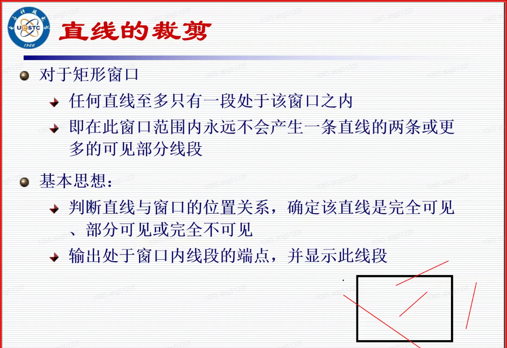

# 裁剪

Owner: -QVQ-

- 裁剪
  
    裁剪是确定场景或画面中位于给定区域(2D或3D裁剪窗口)之内的部分（去掉看不见的地方）
    裁剪**还可用于**图形反走样、隐藏线、隐藏面、阴影、纹理等**算法**中
    裁剪推广应用：
    多面体对多面体的裁剪，实体造型系统中执行**布尔运算**
    在窗口系统中**复制、移动或删除**画面中某一部分(Cut-Copy-Paste)

    
    在变换的部分发生剪裁
    
    图形裁剪的策略：
    
    ❌先变换后裁剪
    
    将图形经过扫描转换后变成像素的集合（丢失几何关系），然后对图形中的每一个像素进行裁剪
    
    ✔️先裁剪后变换（才是合理的，可以省去不必要的扫描转换工作）
    
    将原始图形进行裁剪，保留窗口内的可见部分，舍弃窗口外的不可见部分。然后对窗口
    内保留的这部分图形进行扫描转换
    
- 二维线裁剪
  
    图形裁剪就是决定画面中哪些点、线段或部分线段位于裁剪窗口之内。
    位于**窗口内的**点、线段或部分线段被**保留**用于显示，而其它的则被抛弃。
    在一个典型的场景之中，需要对大量的点、线段进行裁剪，因此裁剪算法的效率十分重要(如何快速拒绝和接受)

    
    - 主要方法
      
        [计算机图形学裁剪算法详解 - 百度文库](http://wenku.baidu.com/link?url=HAGSH89qmSNdtVkuhJaXvLb_BhwfX46Aw7FDADRTXxWHPh35n243aMc6aOEnPQKlGZtNoapn9CoCeqyY2KS4FQfzmU1rdMl84rHkavcp0-K)

        
        - Sutherland-Cohen 裁剪：编码
          
            基本思想：对于每条待裁剪的线段P1P2分三种情况处理
            
            ◆若P1P2完全在窗口内，则显示该线段
            
            ◆若P1P2,完全在窗口外，则丢弃该线段
            
            若线段不满足上述条件
            
            则求线段与窗口边界的交点，在交点处把线段分为两段
            
            其中一段完全在窗口外，可舍弃之，然后对另一段重复上述处理
            
            如何快速排除完全在窗口内和完全在窗口外的直线：
            
        
        中点分割裁剪：除以2，移位运算
        参数化裁剪与梁友栋-Barsky 裁剪：高效率的裁剪
        Nicholl-Lee-Nicholl裁剪：更为精细的判断
    
- 二维多边形裁剪
- 文本裁剪
- 三维裁剪