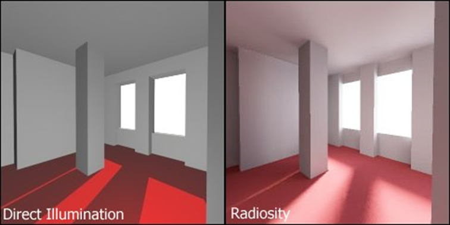
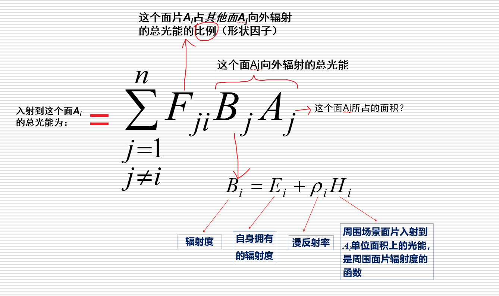
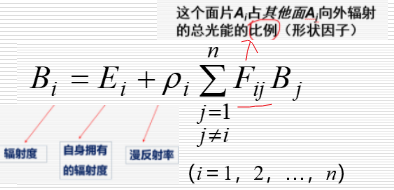
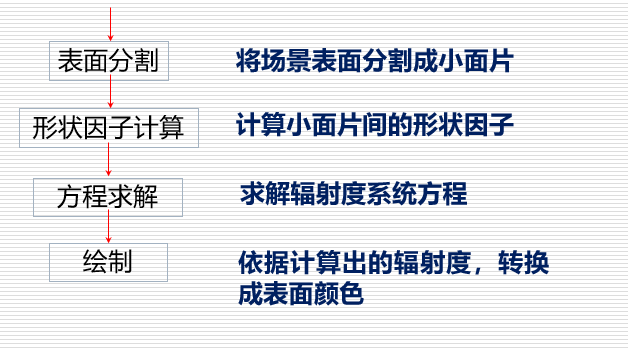
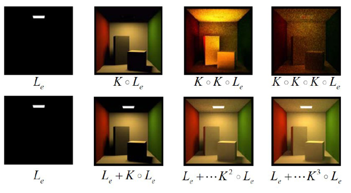

# 辐射度

Owner: -QVQ-

直接照明与辐射度效果对比：

辐射度效果

将光作为一个能力传递

- 与直接照明效果相比，主要区别在于：
    
    泛光：房间有发光效果
    
    投影有过渡：地板上软影清晰可见，房间周围可观察到细微的光效
    
    物体颜色有相互作用：地毯上的红色**辉映**到灰墙上，产生淡淡的温暖的感觉
    
- 方法
    
    把场景**细分**到很细很细的**面**片(如1个像素那么大的三角形),
    
    分别**计算它们接受**和**发出**的**光能,**然后逐次**递归,**
    
    **直到**每个面片的光能**数据不再变化**(**或**者到一定的**阀值**)为止.
    
- 优缺点
    1. 非常**真实**的漫反射表面光照
    2. **概念简单**，容易实现
    3. 能够容易地使用3D **硬件加速**计算
    
    缺点：
    
    1. **慢**
    2. **不**能很好地处理**点光源**
    3. 也**不**能处理**有光泽的表面**
    4. 总是过于复杂而且很少在书本中解释
- 辐射度系统方程
    
    入射到这个面的总光能：

    
    **辐射度系统方程：**

    
- 算法流程

    
    其中，方程求解涉及到的迭代方法：
    
    1. Gauss-Seidel迭代—Gathering：对于**每一面片**，收集场景中其它面片**对它辐射的光能**，**更新**该面片的**辐射度**

        
    2. Southwell迭代—Shooting
        
        选取**辐射源面片**（具有最大待辐射光能），将其辐射光能**发送到其他面片**，**更新**各面片的**辐射度**。
        **选取新的辐射源面片**
        
    
    逐步求精辐射度算法：
    
    **每次迭代**（相当于一次**光能传递），**采用场景中各**面片**的**当前辐射度**值**绘制整个场景**
    经过**多次迭代**后，各面片的辐射度值逐渐逼近方程组的解