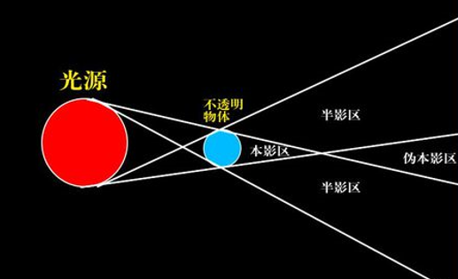

# 阴影

Owner: -QVQ-

**本影**：不被任何光源所照到的区域。

**半影：**只有部分光线到达的区域

Shadow Volume算法（阴影体积算法）

原理：

将**视点移**到**光源**的位置。

从**光源**处**向**物体所有**背光面投射**光线，

计算该**光线**与投影面（**地面**）的**交点**，

构成的阴影多边形，形成**投射阴影**。

**对于阴影的渲染算法：**

将光线减弱时创建的**对象轮廓**扩展到一个**Volume中**，然后使用一些简单的模版操作将该Volume**映射**到**模板缓冲区**中。 

关键的想法是，当一个对象在Volume内（因此在阴影中）时，Volume前面的多边形会**对对象的多边形**进行**深度测试**，并且该Volume后部的多边形将失效相同的测试，或者说不参与测试。

我们将根据称为Depth Fail的方法设置模板操作，人们经常使用更直接的方法称为Depth Pass来开始描述阴影体积技术，但是当观看者本身位于影子内并且Depth Fail修复该问题时，我们已经跳过Depth Pass，直接去Depth Fail

- **Z-pass算法(Depth Pass计算方法)  （正面+通过= +1  背面+通过=-1）**
    1. 先**关闭光源**，将整个**scence渲染**一遍**，**此时一片漆黑，但**获得了深度值**
    2. 关闭深度写，**渲染**阴影体的**正面**，**深度测试通过则模板值加1**，否则不变
    3. 然后**渲染**阴影体的**背面**，**深度测试通过则模板值减1**，否则不变
    4. 最后**模板值不为0**的面**就在阴影体**中，开启深度写
    5. 用模板手法**重新渲染**一次**加光的scence**即可，让阴影部分为黑色
    
    （简单理解步骤2、3、4：从视点向物体引一条射线，当射线进入阴影时+1，离开阴影时-1，最后为0说明物体不在阴影中）
    
    其致命缺点是当视点在阴影中时，会导致模板计数错误。同时，有可能因为Z-near clip plane过近而导致模板计数错误
    
- **Z-Fail算法(Depth Fail计算方法)  (正面+失败=-1，背面+失败=+1)**
    1. 先**关闭光源**，将整个**scence渲染**一遍，**获得深度值**
    2. 关闭深度写，**渲染**阴影体的**背面**，**深度测试失败则模板值加1(不同点)**
    3. **渲染**阴影体的**正面**，**深度测试失败则模板值减1(不同点)**
    4. 最后**模板值不为0**的面便**处于阴影体中**，开启深度写
    5. 用模板手法**重新渲染**一次**加光的scence**即可，阴影部分不渲染色度
    
    注意，该算法要求阴影体积是闭合的，即需要前后封口。该方法不是没有缺陷的，有可能因为Z-far clip plane过近而导致模板计数错误