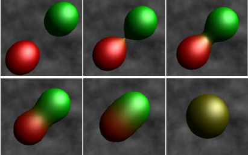
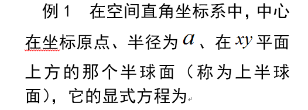
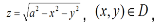
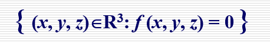
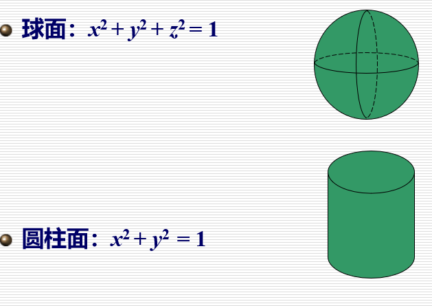
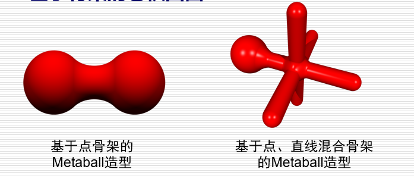
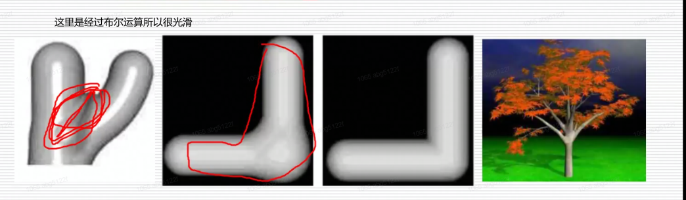
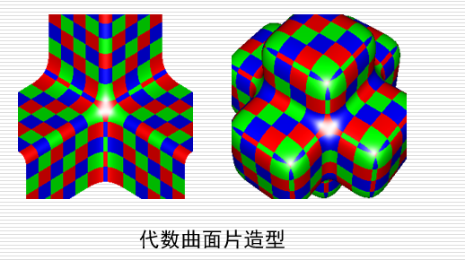
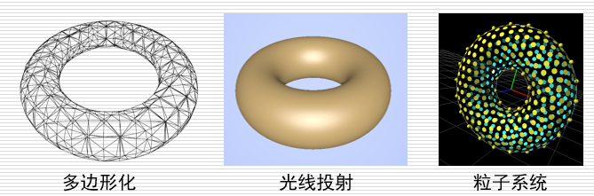

# 隐式曲面

Owner: -QVQ-

表示衔接处光滑的物体，没有面拼接是它的优点

参数曲面，如Bezier曲面、B样条曲面、NURBS曲面等。参数曲面在造型和动画设计中取得了非常大 的成功，很多造型和动画系统都是基于 NURBS曲面的。

多边形网格(Polygon Mesh)
细分曲面(Subdivision Surface)
隐式曲面(Implicit surface, level set)

元球造型技术(Metaball)

起因：参数曲面在表现人体的肌肉、器官，液体等可 变形和可变拓扑场景的造型和动画等方面比较 困难，这促使人们寻找一种新的造型工具。

元球相互靠近到一定距离产生变形，再进一步靠近时则 融合成光滑表面。

> 以两个元球为例，元球靠近时的变形过程如左图所示。
> 

以前用参数曲面做，但其交互性弱，现在人工智能让隐式曲面公式简单

很适合表示可变形和可变拓扑的物体，因而对 动画非常有用(如morphing)

像点、云

R3中的隐式曲面表示为：

三维空间中的一个二维曲面(二维流形)
f (x, y, z)称为隐式函数：数学表达式或过程定义的函数
当f (x, y, z)为多项式函数时，隐式曲面称为**代数曲面**

举例：

- 与参数曲面相比，隐式曲面的不足
    1. 隐式曲面表示**不直观**，**难以**进行外形的**交互**修改。NURBS曲面的外形控制手段非常直观
    2. 隐式曲面通常**没有边界**，而NURBS曲面具有显式的边界
    3. 隐式曲面**难以直接进行显示**(隐式曲面全是方程的解)，而NURBS曲面则可以借助于剖分算法，对逼近多边形表示进行绘制

- 与参数曲面(NURBS)相比，隐式曲面的优点
    1. （表示更多现状）隐式曲面可以**表示具有复杂拓扑的形状**，NURBS曲面只能表示拓扑等价于矩形的四边曲面
    2. （**不需要光滑拼接**）NURBS曲面表示非退化封闭光滑曲面时，需要光滑拼接
    3. (**易于运算**)隐式曲面比NURBS曲面更适合于进行布尔运算、光线跟踪、点集判断等
- 隐式曲面与参数曲面的相互转化
    
    隐式化：
    
    从参数曲面到隐式曲面
    消除NURBS曲面的两个参数(u, v)得到其隐式表示
    参数化：从隐式曲面到参数曲面
    并非所有的隐式曲面都可以参数化
    对于非退化的二次代数曲面和具有一个奇异点的三次代数曲面，可以进行有理多项式参数化
    
- 图形学中常用的隐式曲面造型技术
    
    基于骨架的隐式曲面造型
    基于点、线和面骨架的Metaball方法
    基于骨架的卷积曲面

    
    代数曲面片造型技术，包括二次代数曲面、A-Patch方法等

    
- 隐式曲面的显示
    
    多边形化：用平面多边形逼近隐式曲面（Marching Cube方法）
    
    光线跟踪：生成高质量的图像(求交点在交点上渲染，不需要像另外两个一样需要先构建3D再渲染)
    
    粒子系统：在隐式曲面上均匀布撒粒子
