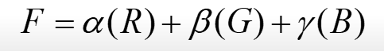
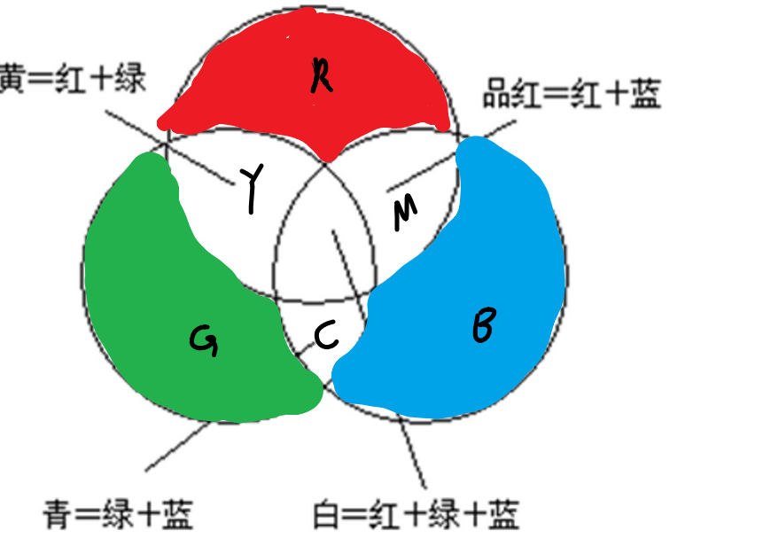
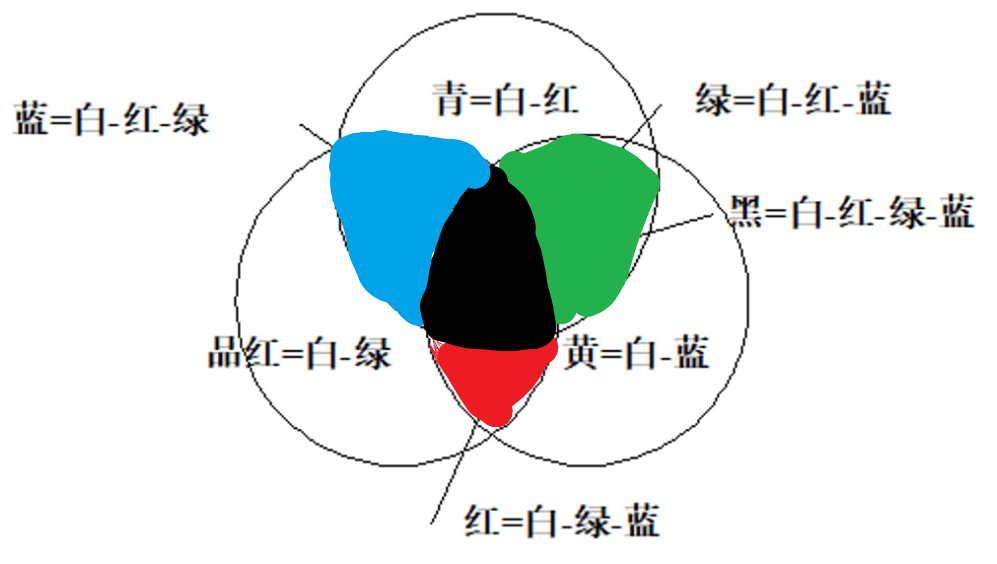
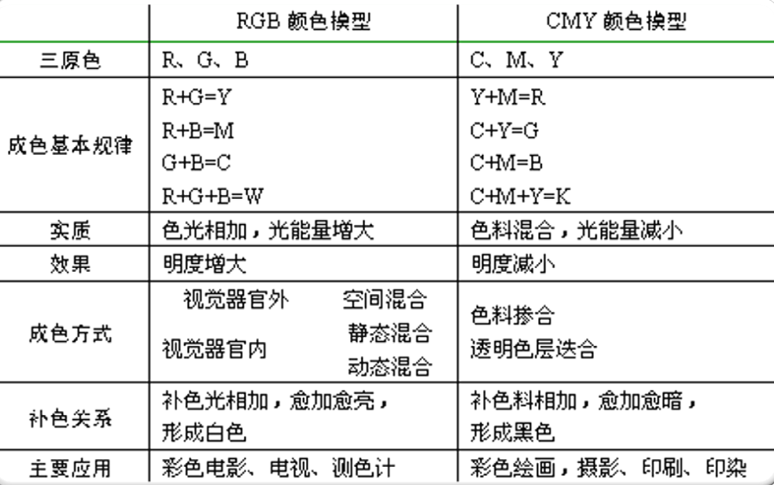
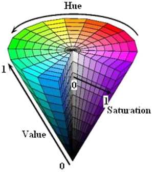
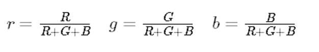
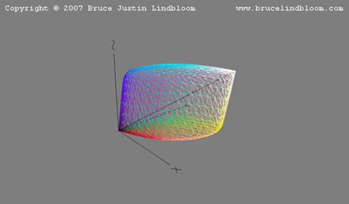

# 颜色模型

Owner: -QVQ-

- 设备无关的颜色模型
    
    基于**人眼对色彩感知**的度量建立的数学模型，这些颜色模型主要**用于计算和测量**。能**在任何设备**上产生真实的颜色
    
    包括：CIE里的所有模型（除了YUV）
    
- 设备相关的颜色模型：
    
    以最长见的RGB模型为例，一组确定的RGB数值，在一个液晶屏上 显示，最终会**作用到三色LED的电压上**。这样一组值在**不同设备**上解释时，得到的颜色可能并**不相同**。
    
    包括：RGB、CMY、YUV、HSV
    

- RGB颜色模型

    
    红R、绿G、蓝B，（0，0，0）为黑，（1，1，1）为白;
    
    α、β、γ是红、绿、蓝三色混合比例，称为三色系数
    
    RGB颜色模型构成的颜色空间是CIE原色空间的一个真子集。RGB三原色是加性原色(相加为白色)

    
    RGB颜色模型通常用于彩色阴极射线管和彩色光栅图形显示器
    

- CMY颜色模型
    
    品红M、青C、黄Y（RGB的补色）
    
    CMY颜色模型常用于从白光中滤去某种颜色，故称为减色原色空间（相加为黑色）

    
    CMY颜色模型对应的直角坐标系的子空间与RGB颜色模型对应的子空间几乎完全相同
    
- RGB和CMY比较

    
- 其他颜色模型
    - HSV

        
        色度围绕V轴旋转而定，高度对于亮度，外圈纯度高，内圈纯度低
        
        符合人眼习惯
        
        改变色调不需要像RGB一样改三个值
        
        均匀的颜色空间
        
        设备相关
        
    - CIE
        
        设备无关
        
        - XYZ
            
            颜色分为亮度和色度两部分

            
            用比例来表示三色刺激值

            
        - L*a*b
            
            克服XYZ在色度图上相等的距离色差不同的问题
            
            L：明亮度
            
            a：绿色到红色
            
            b：蓝色到黄色
            
        
        YUV
        
- 各类颜色的转换算法
    
    查表法
    
    数学公式