# 归并算法

Owner: -QVQ-
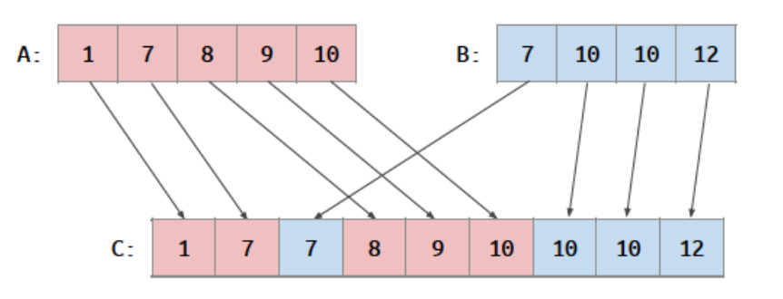

**目的：**

将两个有序数组合并成一个有序数组
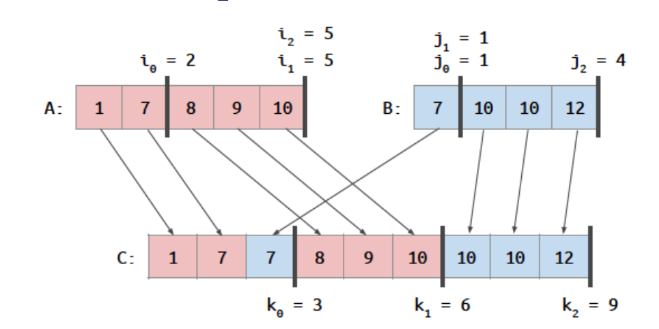

我们可以对C数组的每一个输出位置分配一个线程，然而我们并不知道哪个数字对应哪个输出位置

**算法：**

**步骤一：**确定co-rank(K,A,B)运算

若有一个方法能找道到一组数据：对于C数组每一个位置k，都已知A、B中有一个位置i、j满足

0≤k<m+n，

0≤i≤m

0≤j≤n

C[0:k-1] 由 A[0:i-1] 和 B[0:j-1]合并的结果

定义这种运算为co-rank(K,A,B) = i , j = k - i，即
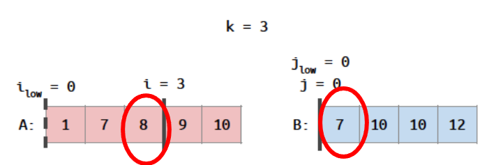

图中：co-rank(3,A,B) = 2, j = 1 co-rank(6,A,B) = 5, j = 1  co-rank(9,A,B) = 5, j = 4

一般算法要确定K是由A中的哪一个i和B中的哪一个j合成需要O(N)的时间复杂度

所以我们可以用二分查找的方式加快找到k是由哪个i，j合成的，O(logn)

```c
//输入k，数组A的长度m， 数组B的长度n
int co_rank(int k, int *A, int m, int *B，int, n){
	int i = k <m ？k : m;//initial guess for i
	int j = k - i;// corresponding j
	int i_low = 0 > (k-n） ？ 0 : k-n;//lower bound on i
	int j_low = 0 >（k-m）？ 0 : k-m；//lower bound on j
	int delta；
	while(true){
		if（i > 0 && j < n && A[i-1] > B[j]）{
		// first excluded B comes before last included A
			delta = ((i - i_low + 1)>>1）;/即除2
			j_low=j
			j = j + delta；
			i = i - delta；
		} else if(j > 0 && i < m && B[j-1] >= A[i]）{
			// first excluded A comes before last included B
			delta=（(j - j_low + 1）>>1；
			l_low = i
			i = i + delta
			j = j - delta；
		}else{
			break;
		}
	}
	return i；
}
```

对于第一个if，下面这个例子成立
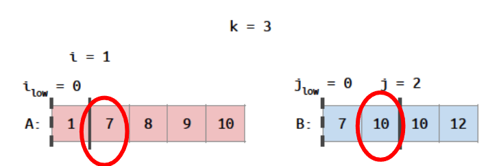

对于第二个else if，下面这个例子成立
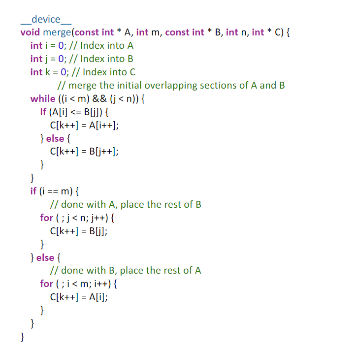

**步骤二：**

对每一个由A[i]、B[j]合成C[K]，都有O（n）的时间复杂度，代码如下
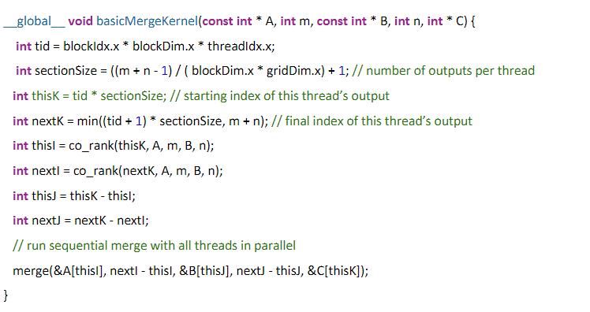

**总体的代码：**
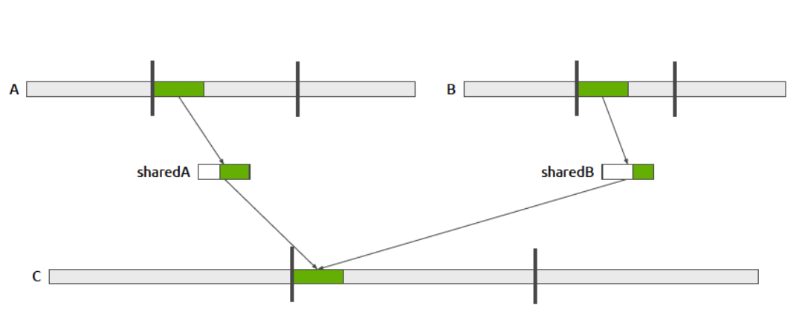

**算法存在的问题：**

没有合并内存访问

每个线程都是单独访问内存的，数据之间没有相关性，等待数据的读取回消耗大量时间

co-rank函数对全局内存的二分查找访问是不规则的访问

解决：

通过co-rank函数能查找到输入块的大小和位置，从而输入块的大小和位置也是已知的，可以线程块使用连续的输入块生成连续的输出块，
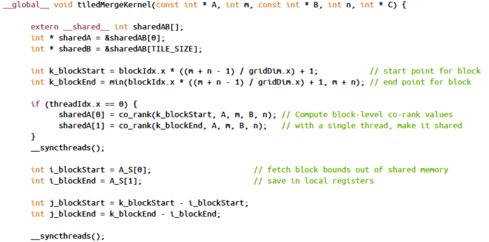

图中，A和B取出部分数据放到共享内存sharedA、sharedB上，C取出数据并排序（图中白色部分取出，组成C的绿色部分），此时sharedA、sharedB上还剩下没有用完的绿色部分的数据，可以选择丢掉重新取数据为下一次排序，这样做代码 简单但效率低（后面介绍优化方法）

与矩阵乘法的并行计算不同，这里每个块从哪里读取取决于输入值，因此内核必须跟踪每个输入数组消耗的数据量决定从哪里读取数据

> 设输出C数组有65536个值，可以使用16个块，每个块处理4096个输出元素，每个输入数组使用1024个元素（这将需要4次加载），对这1024个元素可以使用128个线程，每个线程加载8个值计算8个输出。
> 
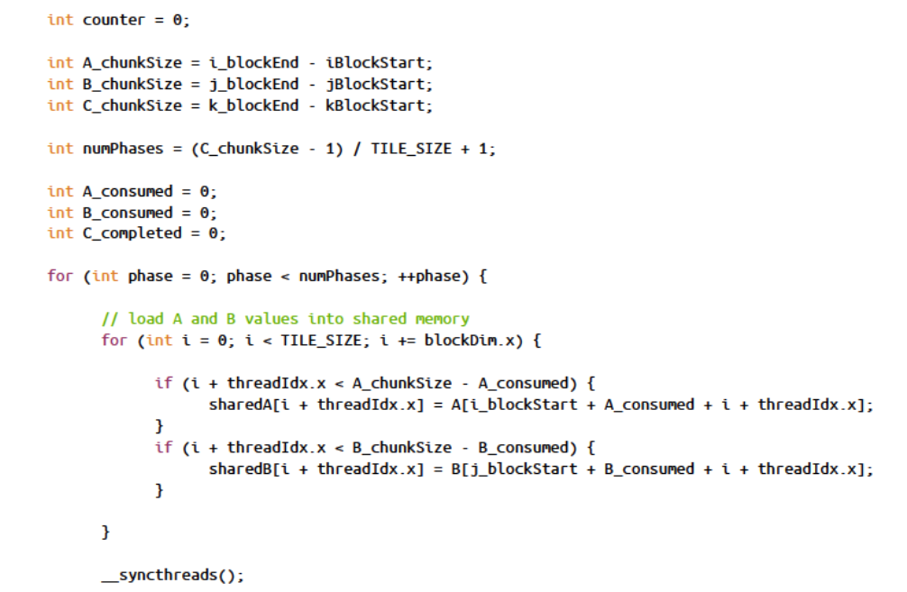
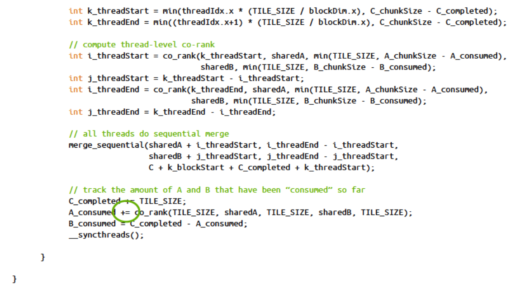
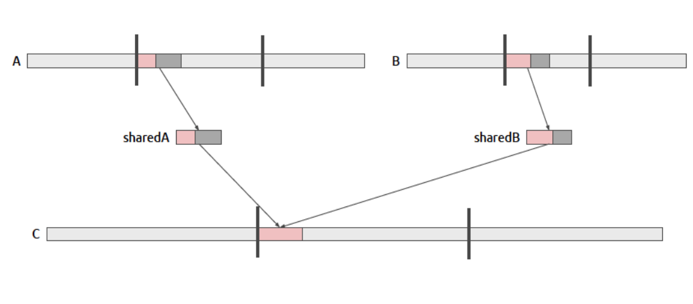

之前提到的丢弃了一部分可用的共享内存数据，现在谈优化方法
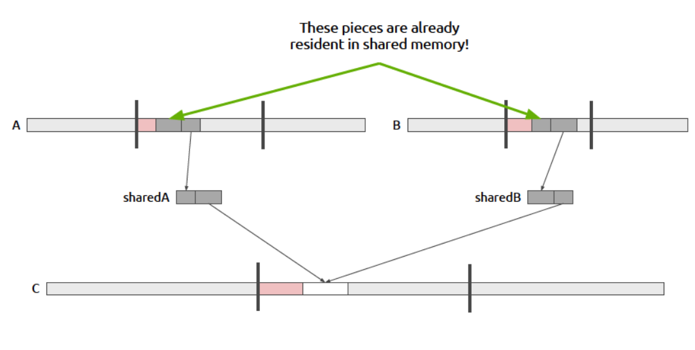

粉色部分为使用了的，灰色部分为可以利用的数据
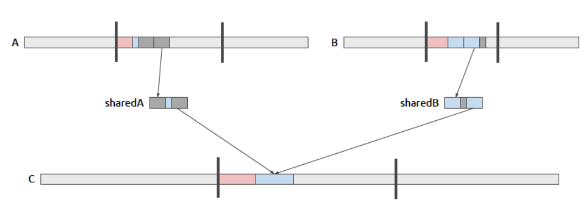

使得sharedA，sharedB，变为环形数组，需要维持一个额外的指针来指向数据的开头部分，一个额外的指针来指向数据的结尾部分
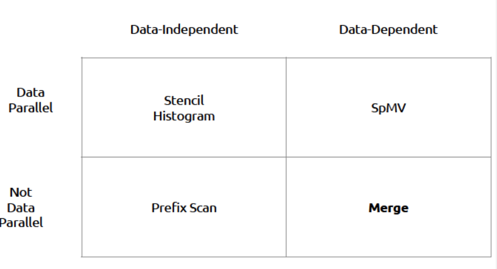

蓝色部分为第二次取数据取得的有效数据，此时灰色部分为可以利用的数据

这种方法优点是减少了2倍的全局内存读，

缺点是增加了寄存器的使用，提高代码复杂度，基本所有的位置都要重新定位，包括co_rank 和merge_sequential

**结论：**

数据相关的并行算法会复杂一些

循环缓冲区可以最大限度的利用加载到共享内存中的值

GPU架构哦更适合于固定计算图