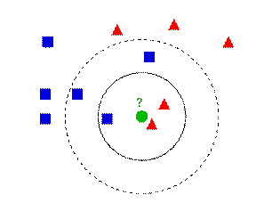
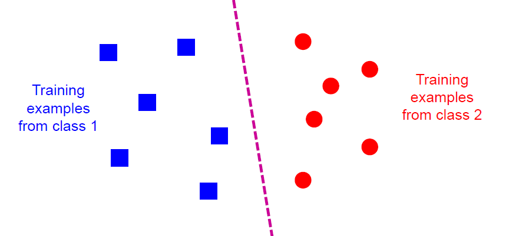
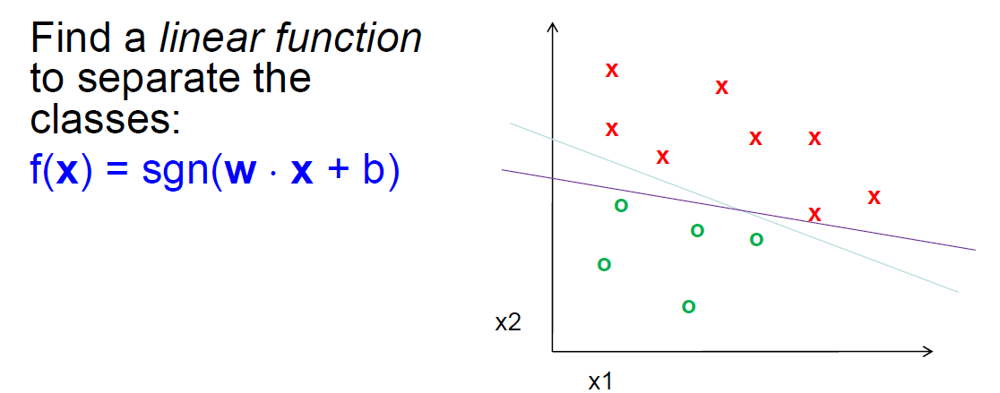
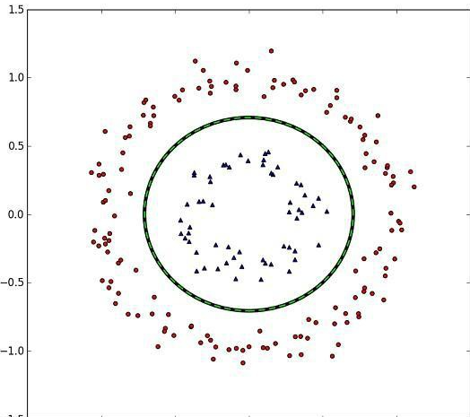
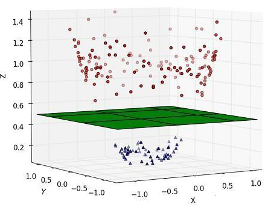
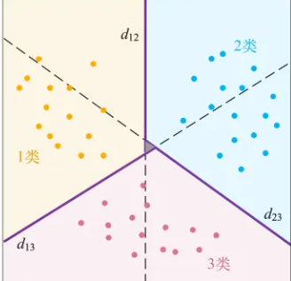
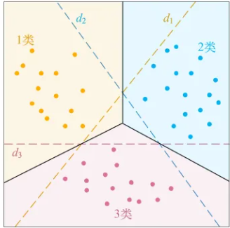
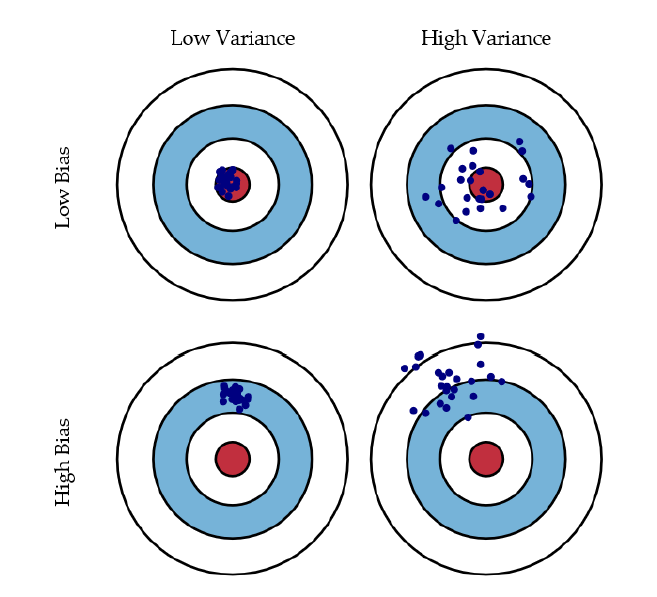
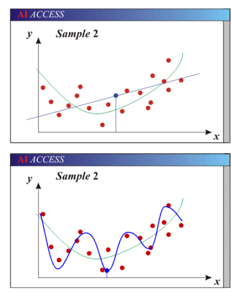

# 受监督的机器学习

Owner: -QVQ-

# 机器学习框架

f(x) = y

x为 图像特征，f为预测 函数 或分类器，y为输出值

训练：

给一个训练集的标签例子{（x1, y1),……,(xn, yn) }

通过 最小化在训练集上的预测错误来评估预测函数f

测试：

应用f到一个不可见的测试例子xu，输出预测值yu=f(xu)去分类xu

# 分类classification

指派x到多个中的一个类 

决策规则将输入空间划分为由决策边界分隔的决策区域。

## 分类器：最近邻分类器KNN

属于线性分类器

KNN(K-Nearest Neighbor)是一种分类(classification)算法，它输入基于实例的学习（instance-based learning），属于懒惰学习（lazy learning）即KNN没有显式的学习过程，也就是说没有训练阶段，数据集事先已有了分类和特征值，待收到新样本后直接进行处理

### 算法思想

该算法涉及3个主要因素：实例集、距离或相似的衡量、k的大小。

KNN算法中，有那么一堆你已经知道分类的数据，然后当一个新数据进入的时候，对其分类，分类是通过计算一个点与其他所有点之间的距离，取出与该点最近的K个点，然后统计这K个点里面所属分类比例最大的，则这个点属于该分类。

例如：

蓝色和红色代表已分好的不同两个类， 绿色为待分类

如果K=3，那么离绿色点最近的有2个红色和1个蓝色，红色居多，所以绿色点属于红色

如果K=5，那么离绿色点最近的有2个红色和3个蓝色，蓝色居多，所以绿色点属于蓝色

### k的选值问题

没有结构化的方法可以找到“K”的最佳值。我们需要通过反复试验来找出各种值

K 值越小可能会产生噪音

K 值越大，决策边界越平滑，这意味着方差越小，但偏差越大。此外，计算成本高

尽量保持 k 的值为奇数，以避免混淆两类数据

### KNN的特点包括：

- 属于**懒惰学习**（lazy learning）即没有显式的学习过程，数据集**事先已有了分类和特征值**，待收到新样本后直接进行处理。
- **简单易懂，易于实现**。
- **对异常值不敏感。**
- 可以处理**多分类**问题。
- 需要**大量的存储空间**，因为需要存储和计算所有的训练数据。
- **K值的选取**可能会影响模型效果，需要反复试验找到最佳的K值。

## 分类器：**支持向量机(Support Vector Machine, SVM)**

### 线性可分

发现一条线性函数能将图像分成两类

在高维空间上，严格的定义，是对于D0 和 D1两类来说，如果存在 n 维向量 w 和实数 b，使得所有属于 D0 的点 xi 都有 wxi+b>0，而对于所有属于 D1 的点 xj 则有 wxj+b<0。则我们称 D0 和 D1 线性可分。

### 超平面

上面提到的，将 D0 和 D1 完全正确地划分开的 wx+b=0 ，就是超平面（Hyperplane）。

**超平面**：n 维欧氏空间中维度等于 n-1 的线性子空间。

可能有多个超平面，需要找**最佳超平面**：

1. 两类样本分别分隔在该超平面的两侧；
2. 两侧距离超平面最近的样本点到超平面的距离被最大化了。

**线性可分支持向量机**就是：以找出线性可分的样本在特征空间中的最大间隔超平面为学习目的的分类模型。

### 非线性可分

理想情况样本是线性可分的，如果不可分，可以容忍少数不能被正确划分

如果类似下图这种完全不可用线性函数划分的，则在更高维度的空间里划分

把上图中那些正负类的样本映射到三维空间中，并且依据不同的类别给它们赋予不一样的高度值——z 轴取值

对于在有限维度向量空间中线性不可分的样本，我们将其映射到更高维度的向量空间里，再通过间隔最大化的方式，学习得到支持向量机，就是**非线性 SVM**。

我们将样本映射到的这个更高维度的新空间叫做**特征空间**

通常情况下，并不是直接映射到特征空间就可分，需要按照软间隔最大化，在特征空间中学习SVM

即，**非线性 SVM = 核技巧 + 线性 SVM**。

### 多类SVM

上文内容都是两类的分类，对于M类

**成对分类法**

两个类之间都构造一个SVM

d12表示1类和2类数据之间

d13表示1类和3类之间的决策边界

d23表示2类和3类之间的决策边界

**一类对余类**

对于每个类，作为一类，其余M-1类作为一类

d1划分对于黄点所示的1类，将2类和3类都当成-1类

d2划分对于蓝点所示的2类，则将1类和3类都当成-1类

d3划分对于红点所示的3类，则将1类和2类都当成-1类

### 优缺点

优点

许多公开可用的SVM软件包

基于内核的框架非常强大、灵活

支持向量机在实践中工作得非常好，即使训练样本量非常小

缺点

没有“直接”的多类支持向量机，必须结合两类支持向量机

在训练过程中，必须计算每对样本的核值矩阵

对于大规模的问题，学习可能需要很长时间

## 泛化

主要的错误：

偏差:模型的预期(或平均)预测值与正确值之间的差值。

方差:如果使用不同的训练数据，目标函数的估计会发生变化的量。

带来的影响：

欠拟合:模型过于“简单”，无法代表所有相关的类特征

即，高偏差(自由度少)和低方差

过拟合:模型过于“复杂”，拟合数据中有不相关的特征(噪声)

即，低偏差(许多自由度)和高方差

绿色为正确的线，黑色为结果，红色为样本

参数太少的模型由于偏差大而不准确。

灵活性不够

太多的假设

有太多参数的模型由于方差大而不准确。

对样品太敏感。

稍微不同的数据->非常不同的函数