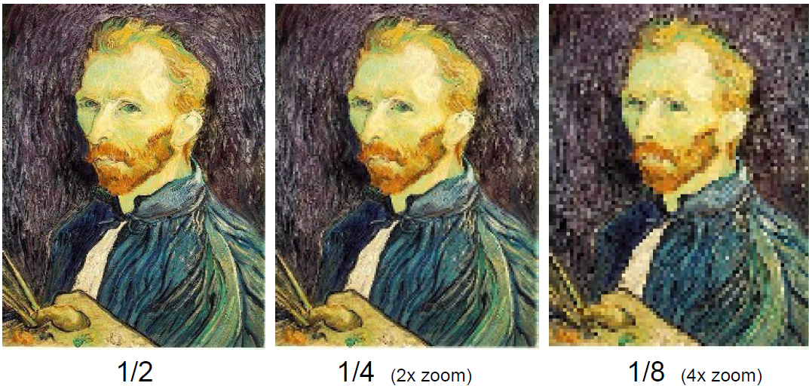

# 图像频谱

Owner: -QVQ-

# **图像频域滤波**

**spatial domain(空间域):** 数字图像f(x,y)=color为一个定义在二维空间中的矩形区域上的离散函数**。**

**frequency domain(频域):** 可以将一幅图像的像素值在空间上的变化分解为具有不同的振幅、空间频率和相位的简振函数的线性叠加。图像中各种空间频率成分的组成和分布称为 **图像频谱**。在频域一些特性比较突出，容易处理

可以通过某些变换手段如（傅里叶变换，离散余弦变换，小波变换等）在频域下对图像进行处理可以将图像由空间域转换到频域。

**空间域滤波：** 用各种模板直接与图像进行卷积运算

**频域滤波：** 将空间域上的数字图像变换为频域滤波，进行处理，反变换回空间域

图像的**频率**：灰度值变化剧烈程度的指标，是灰度在平面空间上的梯度。

图像的**高低频：**灰度缓慢地变化的一块区域。除去高频的就是低频了

高频显示图像边缘、图像的细节、、噪声（即噪点）

## 采样和混叠Sampling and aliasing

采样因子为：扔掉每隔一行和一列来创建1/2大小的图像

出现的问题：在一维频谱的例子中，会丢失频率的变化信息

对于具体的图像而言，即丢失纹理信息，产生混叠问题

## 反混叠Anti-aliasing

### Nyquist-Shannon sampling theorem• 奈奎斯特-香农抽样定理

采集离散的信号时，采样频率必须≥ 2 * 最大输入信号频率，这使得我们能完美的重构原始的信号

### 去除新采样频率中大于一半的频率

这将丢失一些信息，但比器混叠会更好，可以再结合平滑滤波器

## **缩减像素采样(**downsampling)**因子为2的算法**

以下为matlab伪代码

1. `image = im2double(imread('luke.jpg'))#将图像转为浮点型数据结构`
2. 应用低频滤波器
    1. `im_blur = imfilter(image,fspecial('gaussian',7,1))`
    
    即对图像使用7*7大小的，方差因子为1的高斯滤波
    
3. 对每一个点采样
    
    `im_small = im_blur(1:2:end,1:2:end )`
    
    扔掉每隔一行和一列来创建1/2大小的图像
    

不使用滤波器直接采样：

使用高斯滤波器后采样

# 混合图像Hybrid Images

对于下图，从远处看是人，近处看是猫，为什么我们会对混合图像有依赖于距离的不同理解

从坎贝尔-罗布森对比灵敏度曲线可以得到，中高频的知觉线索主导知觉。

# 傅里叶

## Rolling Shutter: 果冻效应

当使用电子快门来拍摄高速移动的物件时，原本垂直的物件拍摄出的画面却为倾斜甚至变形。

## 傅里叶级数Fourier series

任何函数都能由正弦函数和余弦函数组成

对于图像信号
–图片是二维，公式是一维
–图片数据有限且离散，公式无限且连续
–二维矩阵中每一列（或者每一行）数据都可以单独看作一个波，对一个MxN的矩阵，可以看作N个Mx1的波

**二维的分解**
–在二维傅立叶变换里，先分别对每一列（行）做傅立叶变换，会得到同样大小的傅立叶系数向量
–再在另一个维度（上面是行这里就是列，上面是列这里就是行）对这些系数做傅立叶变换

## 图像的傅里叶变换

特征：

•距离原点越远=频率越高=原图中灰度值的变化越频繁。
•灰度值越大=幅值越大=原图中灰度值变化的范围越大。

变换：

对于图像信号：将二维矩阵中的每一列数据看成一个波，M*N个矩阵看成N个M*1的波

二维的分解：先对每一列作傅里叶变换，得到同样大小的傅里叶系数向量，再对每一行作变换

图片的 像素值：

ω是所有频率波的单位频率，决定了波叠加的效果

f(x)可以看成是P个频率的正弦和余弦波的叠加

对一个图片，其中一列数据( N x 1的向量)，把这列数据看作是周期为N的周期数据

求出𝑎𝑛和𝑏𝑛的值，即求出这些振幅的具体数值，就完成了图像的离散傅里叶变换

一列图像大小为N*1，则未知数有2P+1个

通过傅里叶变换转为时域图，对其统计频率的高点得到频谱图

Spatial domain时域图像：反应了不同时间的频率，在图中黑色部分为所有频率累加后得到的图像

Frequency domain频域图像：频率方向总是从左到右为从高频到低频的，反应了图像在各列变化的最大值。横轴为频率，纵轴为振幅。

相位图：

## 频谱图Amplitude

> –用来代表这个频率波的振幅大小
–一个N x 1的信号，其由𝑵−𝟏𝟐个频率的波叠加，计算所得数据左右上下对称
> 

频谱图上每一个点均代表一个固定频率、幅值、相位的正弦波图像，那么抛开频谱图上幅值为0 的点外，其他的所有点都映射着一张正弦图。

将图像转化为时域再转化为频域图

当n=1,2,…N时，c𝐧和𝒄𝑵−𝒏共轭对称

越靠近坐标角落，频率越低

便于观察，互换角落和图片中心位置的数值

我们看到频谱图中心代表的是低频，往四面八方扩展后逐渐变为高频，并且左上-右下、右上-左下完全对称。其中黑色部分即表明该图像不含有该部分的频率，相反颜色越亮，该频率的幅值越高。通常中心处是最亮的，即低频信号是最多的，这也和原时域图的信息是匹配的。

把所有的正弦图(F(w))叠加在一起，便能够恢复出原始的时域图，进一步得到原图

右边这张图，假设频谱图中有1000个值不为0 的亮点，那么它们会生成1000张固定频率、幅值和相位的正弦图像，把这一千张图像加在一起（包括基底的图），我们就能得到左边的原图。

下面举几个例子来理解频谱图：

纯黑图是一样的，其他纯色图只有中心有一个白点

1. 只有2个点（对称关系，实则即1个点）
2. 靠近中心，频率低，靠近边缘频率高
3. 亮点在频谱图的x方向上，与时域图正弦分布的方向一致
4. 基底为0，对应于时域图的平均亮度也为0

如果频谱图上的点相对于中心点有一定角度，对应的时域正弦图像也有一定的角度

平移不改变频谱

## 频谱图Amplitude的意义

下图为原图得到频谱图

下图为我们将低频信号的幅值变为0后的时域-频域图

下图为保留低频信息，滤除高频信息的图。

一些滤波器也能起到同样的效果。滤波器本质上也是去掉高频或者低频的信息。但在频域里得到这样的图片，比在时域里去对图像做变换要简单的多

对于上图的匹配。

图1高频没有，只有低频出现，即变换趋势很小，图D符合

图2各个方向低频高频都很平均，和图5的区别就是图5斜方向的低频少，所以对应图B

图3是对称的，因此实际上只有一个点，即低频没有，中频居多

图4垂直方向有高频，水平方向高频少，对应图E水纹垂直方向亮度变换大，水平方向变换小

图5正水平和正垂直方向有高频，其他方向高频少，对应图C

# 其他

相位是指一个波的起始点在其周期内的位置。相位信息是指在信号中各个频率分量所占的相位差异。在傅里叶变换中，相位信息是指每个频率分量上的相位角度，可以用相位图表示。

相位信息对于恢复原始信号非常重要，因为在傅里叶变换中，振幅和相位是分开计算的，振幅信息存储在频谱图中，而相位信息存储在相位图Phase中。因此，只有同时获取到振幅和相位信息，才能完全恢复原始信号。

人眼对于图像的识别，相位图的信息起了注意作用。

反卷积是很难的，即使已知用的是哪一个滤波器