# 场景的实例识别

Owner: -QVQ-

# 类别识别和实例识别的区别

## 类别识别：

找出图片中所有的人或物体

通常在一张图片里找

通常用滑动窗口的方法

## 实例识别：

在多个图片中找到具体的某个人或某个标志性建筑

通常只在数据库里的图片内找

# 需要解决的问题

## 如何总结整张图片的内容?

词袋向量的方法总结出图片的内容

比较词袋
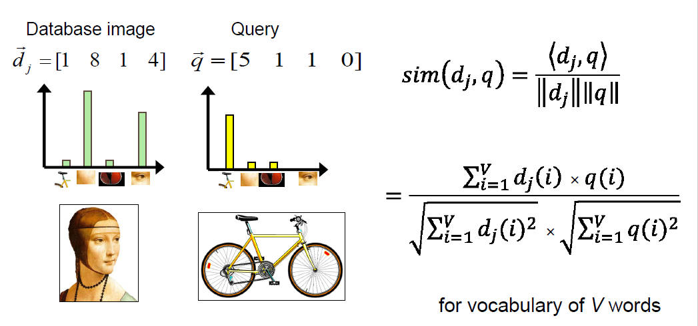

## 如何衡量整体相似度?

在不同分辨率的图片上进行比较
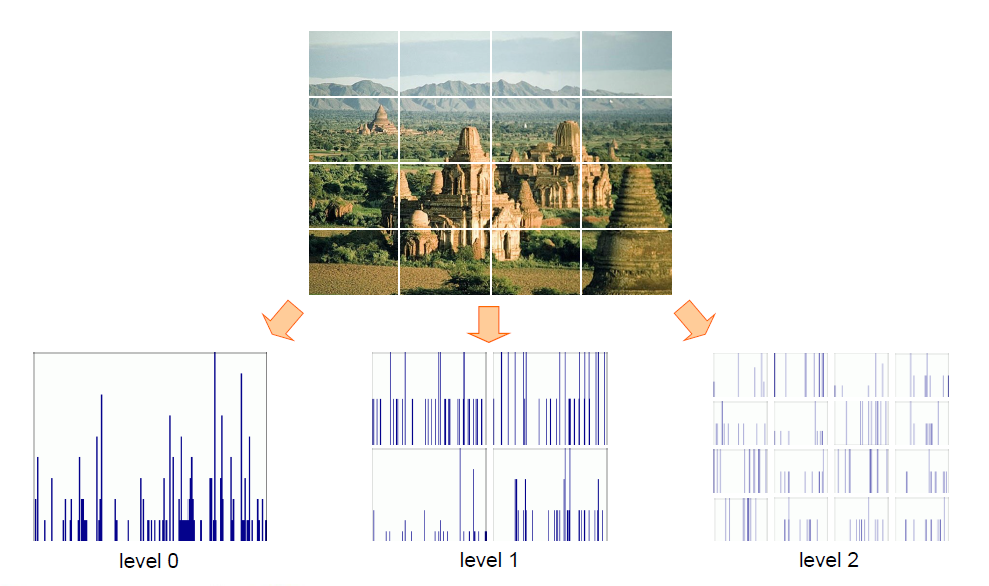

如果是简单的每个特征点逐一匹配对比，这个过程很慢。

当我们观察特征空间中相近的特征点时，每个特征点都要有相似的描述符，则表明这些特征点代表了相似的局部特征
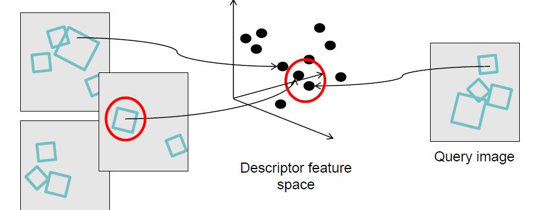

通过量化特征空间的方式讲高维的描述符映射到具体的词汇上。聚类中心为视觉词汇，将空间上的每个词汇分配给最近的聚类中心
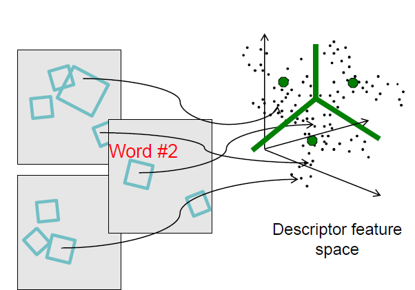

从而形成了多组，每一组都是相似的视觉词汇
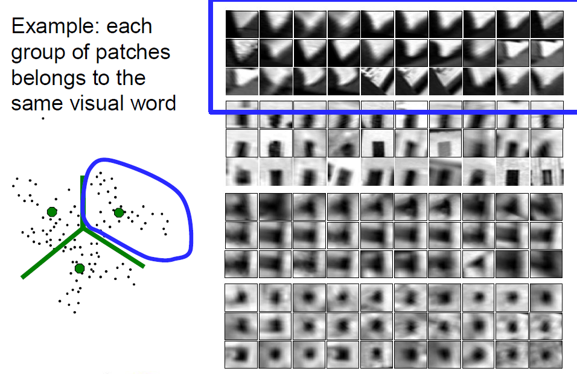

### 采样的策略

1 在特征点处松散的采样

通常对于有着明确纹理的物体能有很好的效果

2 统一的密集采样

3 自由的

4 多个特征点操作采样

时常有更全面的覆盖
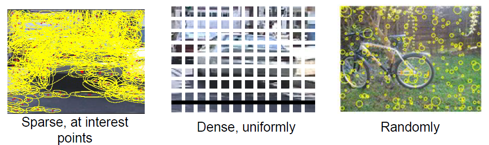
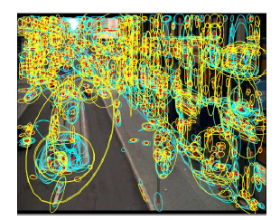

对于文本内容来说，检索的最好方式是用索引，对于图像也是

### 反向索引：从数据库建立颠倒的索引
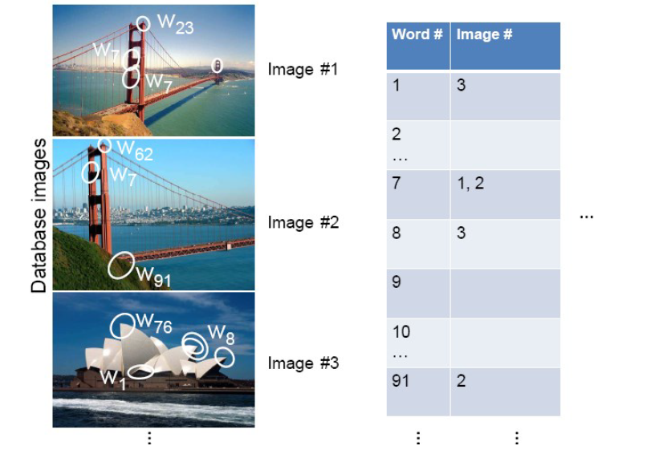

### 反向索引：查询索引

对于一张新图片，从中提取的特征点到数据库检索出对应有哪些图片包含这个特征点，排序匹配次数多的数据库里的图像
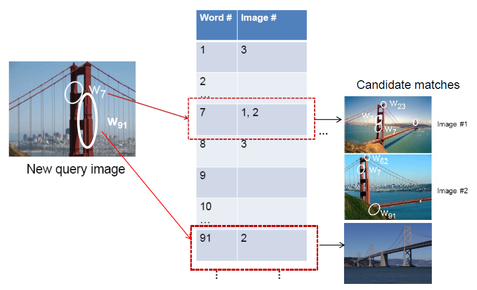

### 反向索引：优缺

适用于图片特征点比较稀疏、独特

如果数据库中很多图片中都有这些特征点，效率并不会比穷举法效率高多少

## 词汇量应该有多大?
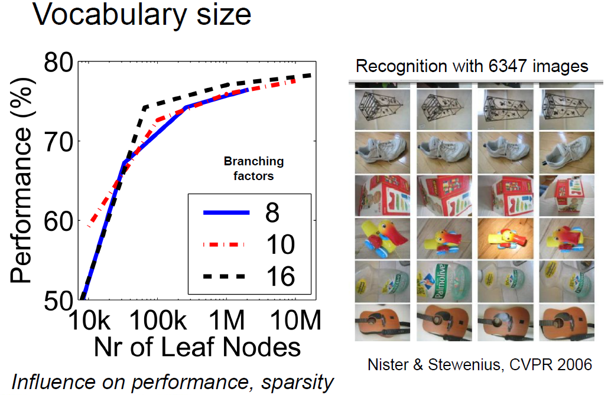

更多的分支树会产生更好的匹配效果，但会更影响性能
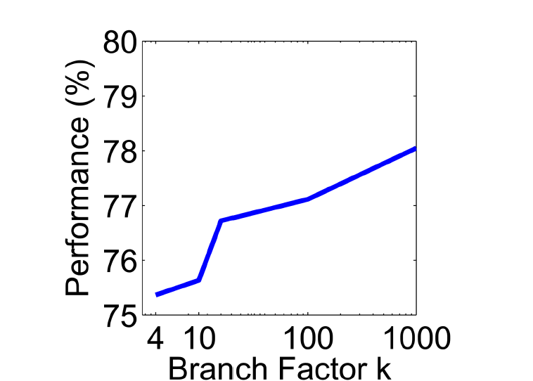

## 如何有效地进行量化?

+灵活的几何/变形/视点

+图像内容的紧凑总结

+为集合提供了固定维度的向量表示

+实践中效果好

-当袋子覆盖整个图像时，背景和前景混合->这真的是实例识别吗?

-最佳词汇形成方式尚不清楚

-基本模型忽略几何-必须事后验证，或通过特征编码

## 如何对检索结果进行评分?

### Precision和Recall

True positive (tp)：正确的接收了正确的点

True negative (tn)：正确的拒绝了错误的点

False positive (fp)：错误的接收了正确的点

False negative (fn)：错误的拒绝了错误的点
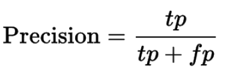
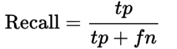

Precision：所有接收了的点中有多少是正确的

Recall：所有正确的点（tp+fn）中有多少是接收了的

下图为具体的10张图生成的图表
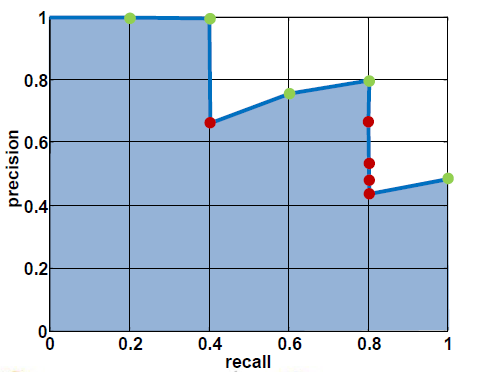

### ft-idf宽度

**Term frequency inverse document frequency**

根据图像中每个单词的出现频率来描述图像，降低数据库中经常出现的单词的权重

（文本检索的标准加权）
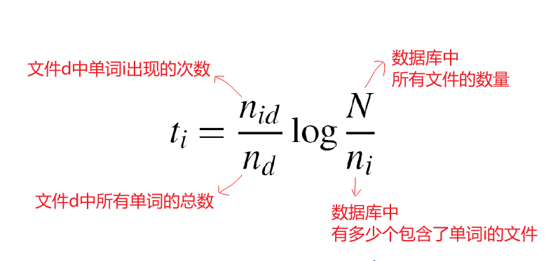

**查询golf green问题:**

基于原有图像检索到的图像再进行查询时，会出现不相关的内容
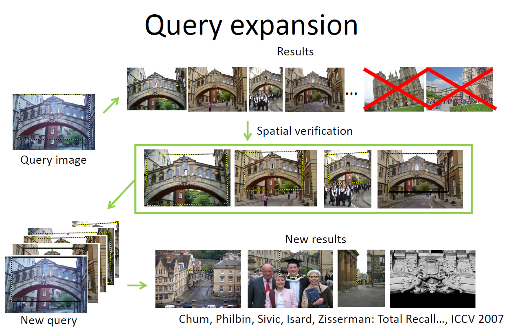

## 我们如何添加更多的空间验证?

到目前为止，我们对待每一个图像都对应一个 词汇包，没有空间信息。而真实的物体有一致的几何信息
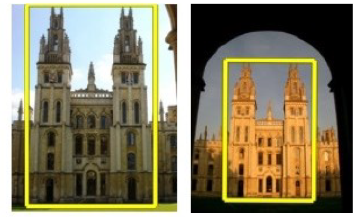

**多视角的匹配**

### RANSAC

先用Bow相似度排序

通过检查对可能的转换的支持(内线)来验证（例如：如果一个转换是＞N个线条都匹配上了，则成功）

### Generalized Hough Transform

让每个匹配的特征对模型对象的位置、比例和方向进行投票-

用足够的选票验证参数

优点：

匹配准确度高

即使是杂乱的场景 也有好的匹配

缺点

性能差

不适用于类别的识别

### Gabor滤波器

由高斯内核调制的正余弦波
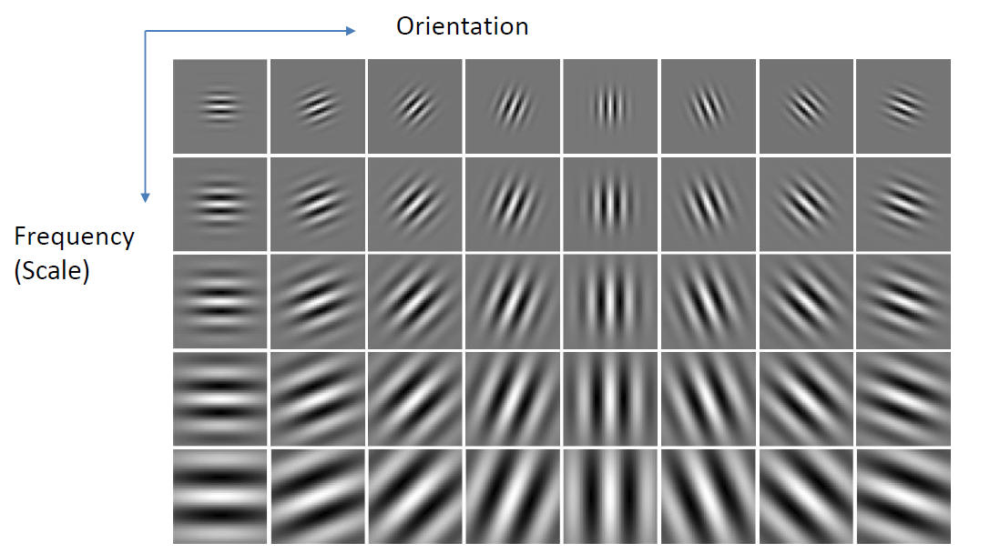

### GIST描述器

8个方向*4个不同分辨率*16个箱子=512个维度
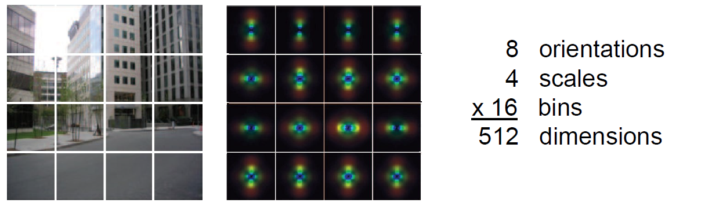
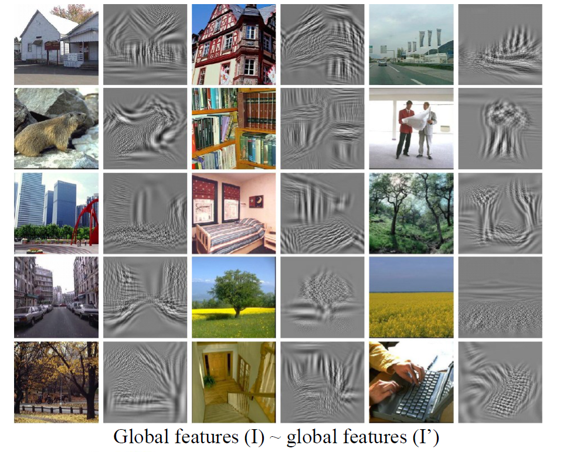