# 场景的类别识别-词袋向量（Recognition and Bag of Words）

Owner: -QVQ-

问题：

1. 物体类别多
2. 同一物体不同视角成像问题
3. 光照、尺度、形变等

# 起源

### 纹理表示

统计其中出现最多的点
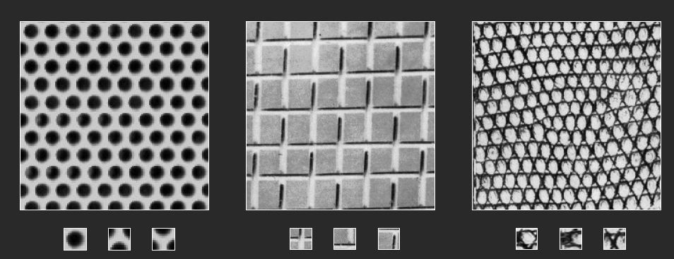
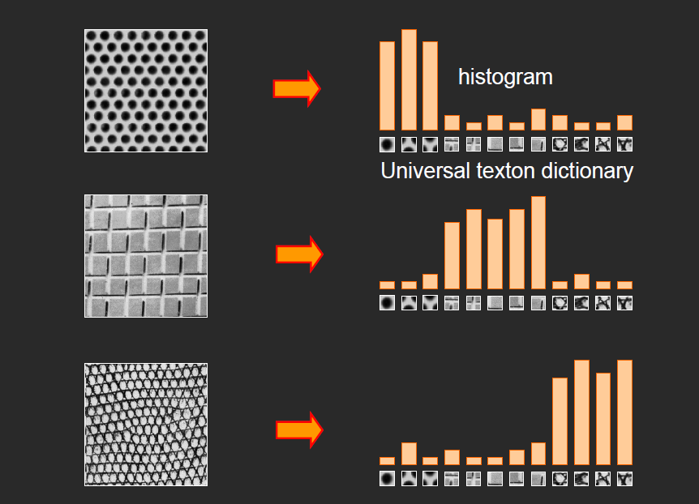

### 统计词频

从而将 一篇文档变成了用向量表示
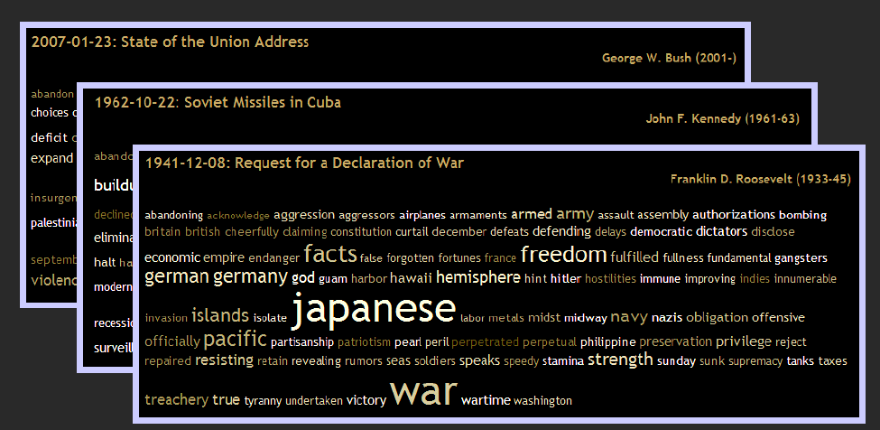

# 图像识别的基本问题

## 表达：如何表示图像

- 用区域、局部特征表达图像
    - 特征点……
- 词袋
- 纹理

## 分类策略

### 判别式模型

**近邻分类：**

**K-近邻算法概述**：同上，找出最近的1个变成找出最近的K个，并取这K个中类别最多的那个类视为预测样本的类。

- **优缺点：**
    - **优点**：①易于理解和实现。②分类器不需要花时间进行训练，因为所需要的只是存储和索引训练数据。
    - **缺点**：①测试时计算成本大，进行分类时需要与每一个单独的训练样本进行比较。
- **适用领域**：近邻分类器在实践中已经很少使用，基于L1和L2距离的近邻算法在CIFAR-10上精度只有40%。

**产生式模型：**

# 词袋模型（BOW相似度）bag-of-words model

## 构建步骤

### 1 提取特征（特征提取，可以使用规则区域，或者SIFT方法。）

例如用SIFT提取出图片的所有特征点，每个特征点128个维度向量
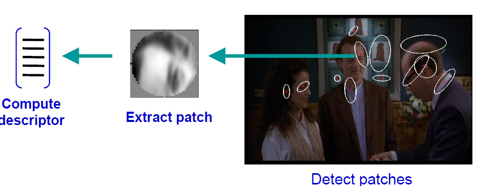
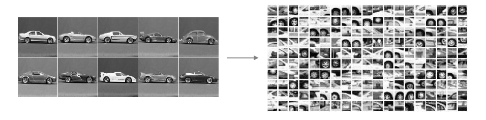

### 2 学习可视化词汇

对这128维度的特征点向量用聚类进行分类
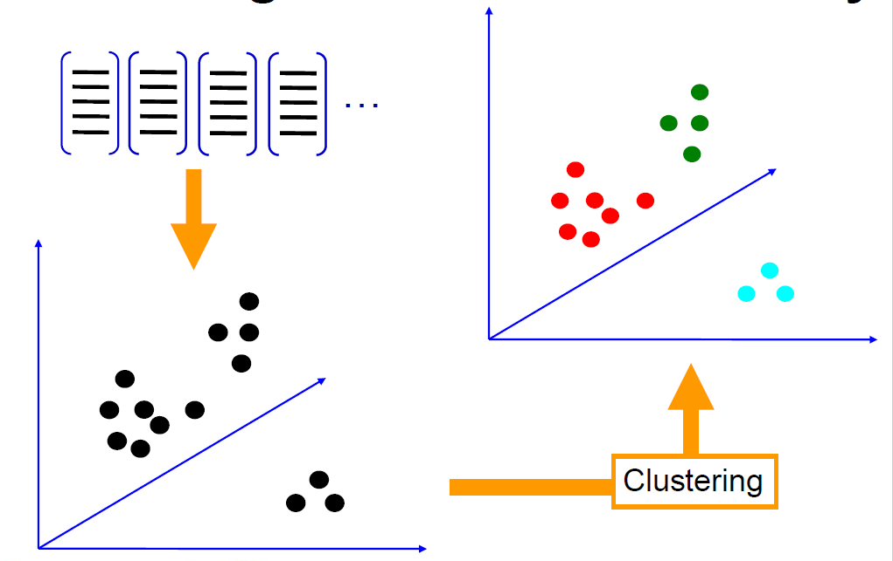

上诉图片提取出的特征点分类后：
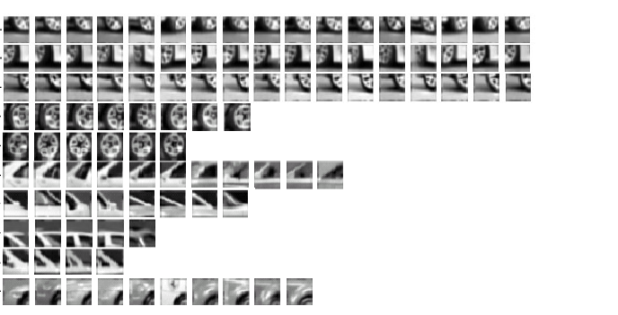

### 3  构建“视觉词典”

量化视觉词汇，从而 形成视觉词典
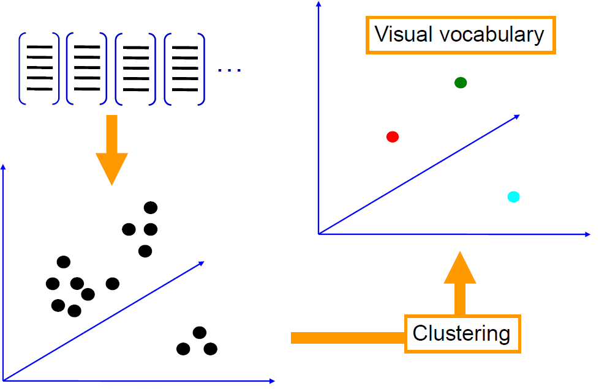
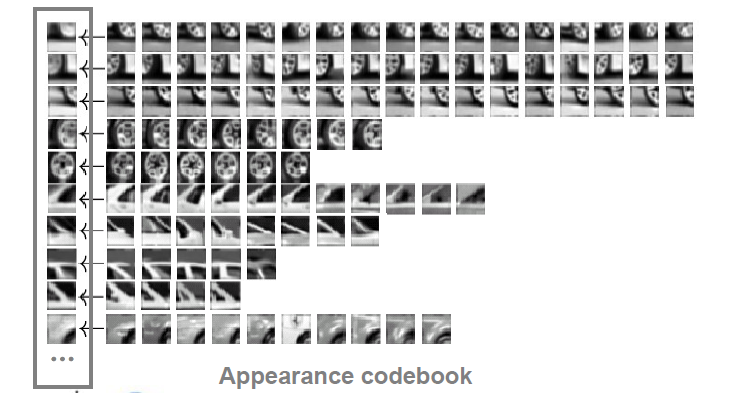

### 4 用“视觉词汇”的频率来（向量化）表示图像

例如，聚类完后，每个聚类中心作为一个“视觉词汇”，聚类结果的个数就是“单词”的总个数。

后续就可以用这个“视觉词汇”去对每一张图像进行向量化表达

## 视觉词汇的问题

### 1 怎么去选择词汇的大小

太大：量化的结果过拟合

太小：可视化词汇并不能代表所有块

### 2 计算的效率上，可以用词汇树

K-means聚类很慢

### 3 顺序、位置问题

如下的图，都有一样的视觉词汇直方图 
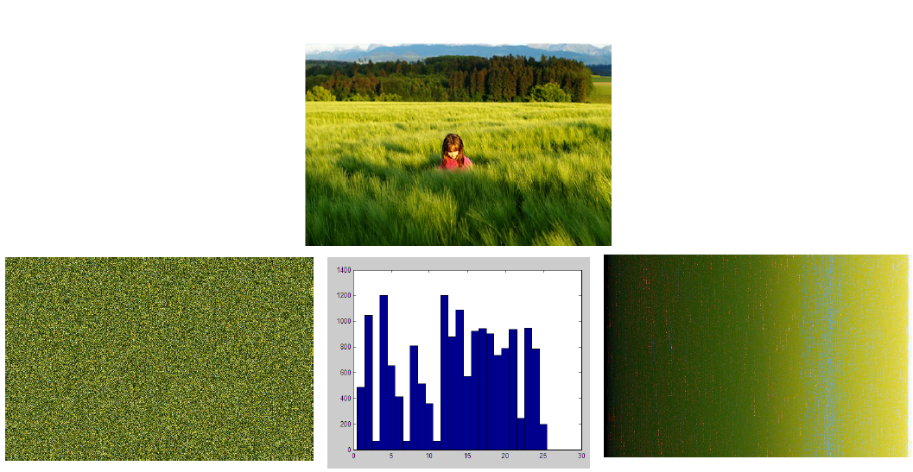

解决办法：使用空间金字塔

## 空间金字塔（Spatial pyramid）

在用“词汇”频率直方图描述图像时，选择3种尺度。
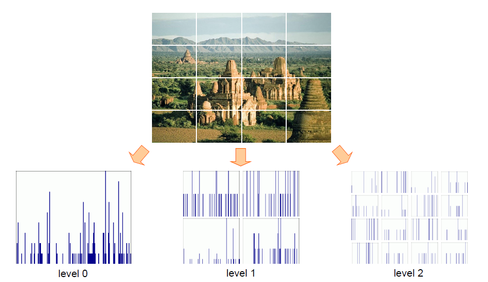

假设上图有100个特征，level0就是100维，共100个值。

level1是把图像4等分切，单独计算每一块直方图，这就有4个直返图，共400个值，

level2是16等分切原图，得到16个直方图，共1600个值。

最后，用100+400+1600=2100个值来表示这个图像。

这种图像向量化方法，能够稍微提升图像分类时的精度。