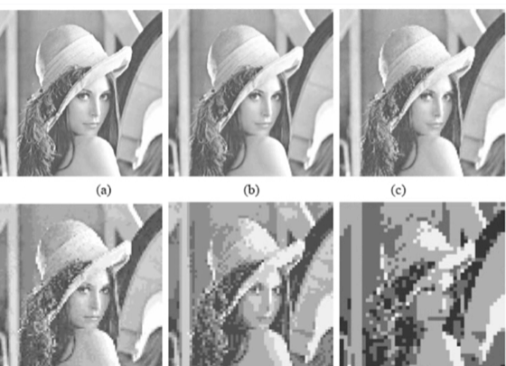
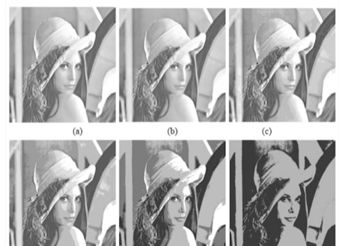
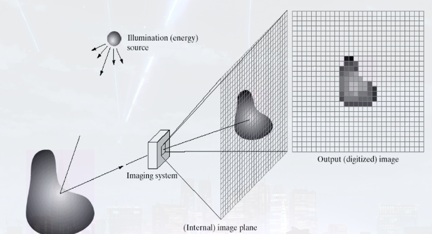
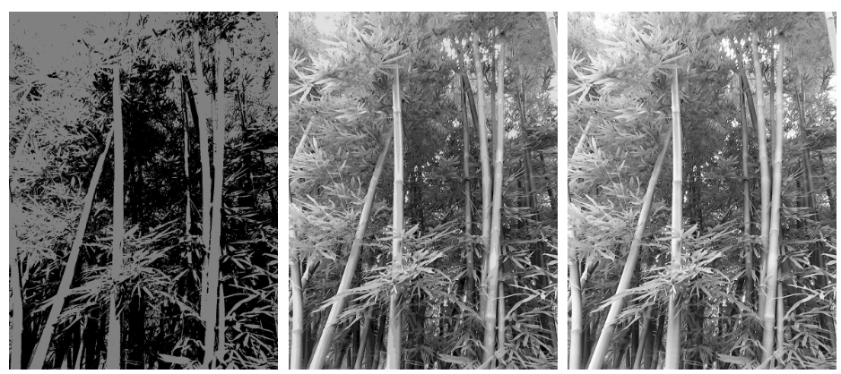

# 基础

Owner: -QVQ-

# 分辨率

图像其总数据量是：每行像素（M）X 每列像素数（N）X 灰度值所占用位数（Bits）。

- **空间分辨率**：每英寸图像内有多少个像素点，分辨率的单位为PPI

    
- **几何分辨率：**图像的像素点的个数
- **幅度分辨率：**指传感器探测元件在接收光谱信号时所能分辨的最小辐射度差。即量化能力，量化级越多，图像层次越丰富，辐射分辨率越高

    
    - **灰度分辨率(量化分辨率)**:在灰度级中可分辨的最小变化，灰度级数通常是2的整数次幂。是幅度分辨率的一部分，只区分灰度级。
- **密度分辨率**，即在低对比度时能够分辨最小尺寸的能力
- **时间分辨率**：指对同一区域进行重复观测的最小时间间隔

# 图像类型

- **二值图像（Binary Image）**
    
    一幅二值图像的二维矩阵仅由0、1两个值构成，“0”代表黑色，“1”代白色
    
- **灰度图像（Gray Image）**
    
    灰度图像矩阵元素的取值范围通常为[0，255]。因此其数据类型一般为8位无符号整数的（int8），这就是人们经常提到的256灰度图像。“0”表示纯黑色，“255”表示纯白色
    
- **RGB彩色图像（Color Image）**

# 图像的取样和量化

## 采样

是把一幅连续图像在空间上分割成M×N个网格，每个网格用一值来表示。一个网格称为一个像素。

## 量化Quantization

量化是把像素的**灰度**（浓淡）变换成离散的整数值的操作。计算机中一般用8bit(256级)来量化，这意味着像素的灰度（浓淡）是0—255之间的数值。所有原始图像采样得到的数值都要分配到这256个值中。以下是量化级2，8，64级的效果
