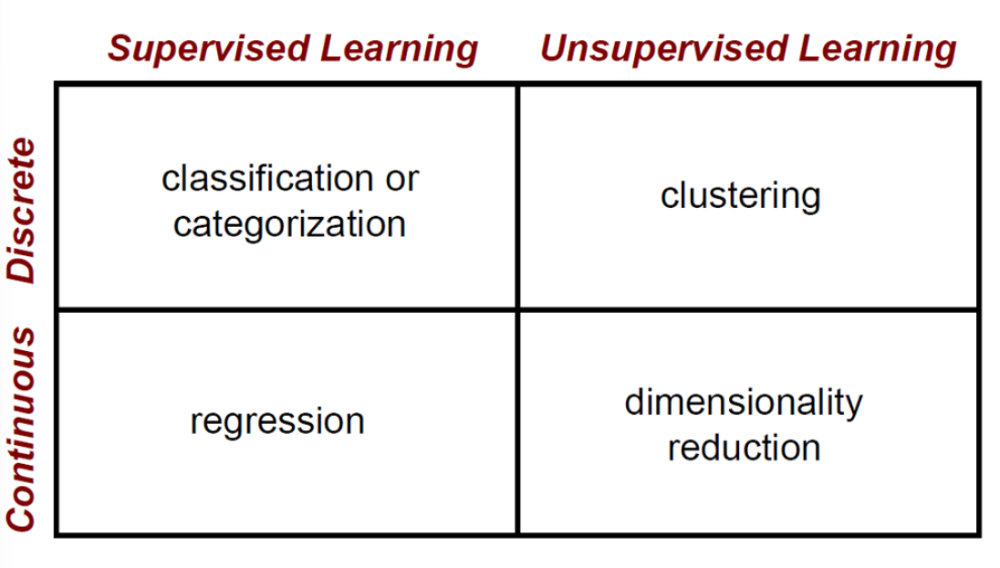
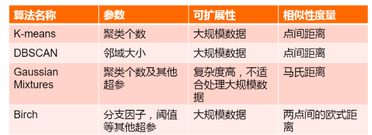
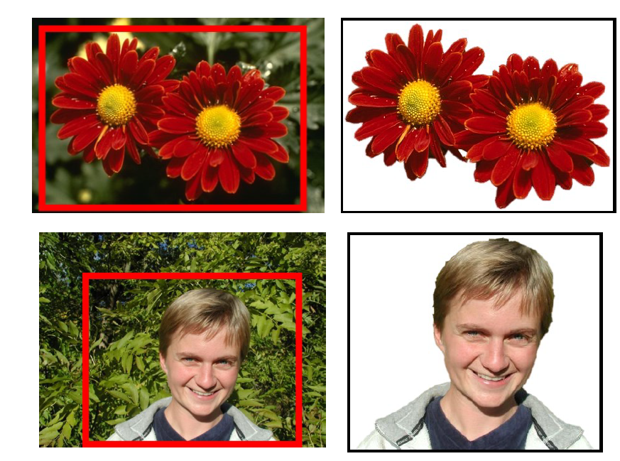
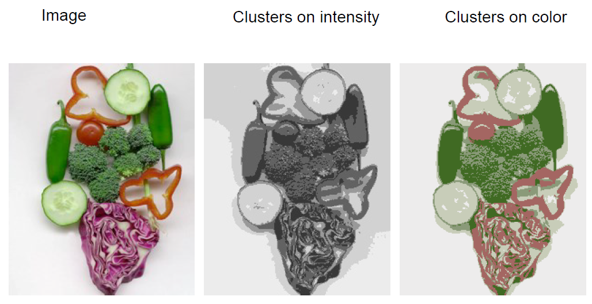
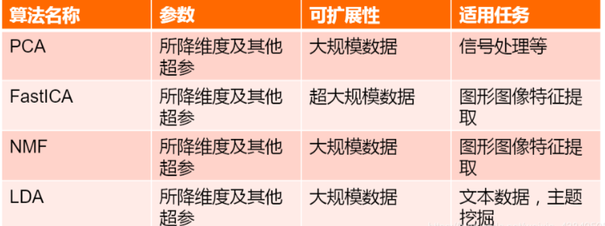

# 无监督机器学习

Owner: -QVQ-

有监督学习和无监督学习的区别就在于学习的数据是不是带标签，也就是我们是否知道学习的数据是什么。

利用无标签的数据学习数据的分布或者数据之间的关系

# **聚类(clustering)：**

就是将一堆零散的数据根据某些标准分为几个类别，一般来说最常使用的标准是距离，

距离也分为好几类，比如欧式距离（空间中两点的直线距离）、曼哈顿距离（城市街区距离）、马氏距离（数据的协方差距离）和夹角余弦。

## K-means聚类算法

### 目标：

划分图像为几个有意义的相似的区域

或者将部分作为一个结果

将相似的点归类到一起，并用一个记号表示他们

### 基本步骤

1 随意选择k个中心

2 将每个点划分给最近的一个中心

3  为每一聚计算新的中心

当标准为密度或颜色时：

### 如何选择聚类的个数

验证设置-

尝试不同数量的集群并观察性能

在构建字典(稍后讨论)时，集群越多通常效果越好。

### 优缺

优点:

属于无监督学习，无须准备训练集
原理简单，实现起来较为容易
结果可解释性较好

缺点:

需**手动设置k值**。 在算法开始预测之前，我们需要手动设置k值，即估计数据大概的类别个数，**不合理的k值**会使结果**缺乏解释性**
可能收敛到局部最小值, 在**大规模数据集上收敛较慢**
对于**异常点、离群点**敏感

可能会很慢

# **降维（dimensionality reduction）：**

指的是在保证数据所具有的代表性特性或者分布的情况下，将高维数据转化为低维数据的过程，这个过程包括数据的可视化和数据的精简。

简单来说，去除一些对于结果没有意义或者意义极小的数据，从而方便计算分析

## PCA算法

PCA主要就是选择样本协方差矩阵的前k个特征值对应的特征向量作为简化后的内容