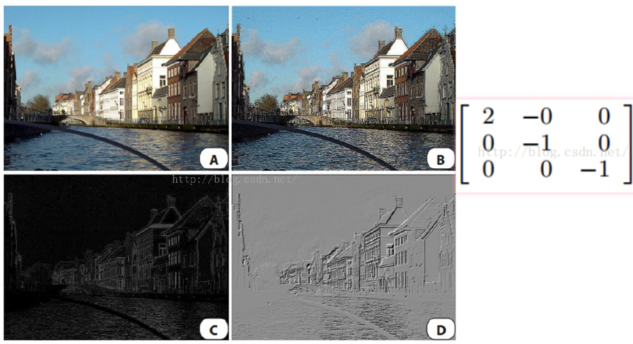

# 滤波器（卷积核）

Owner: -QVQ-

# 定义

# 功能

整体上说

- spatial domain (空域）
    
    图像数字矩阵的算术操作，例如：平滑、锐化
    
- frequency domain （频域）
    
    修改图像的频域，例如：降噪、采用、压缩
    
- Image pyramids （图像金字塔）
    - 图像金字塔是什么
        
        
        以[多分辨率](https://baike.baidu.com/item/%E5%A4%9A%E5%88%86%E8%BE%A8%E7%8E%87/2272644?fromModule=lemma_inlink)来解释图像的结构，是自下而上分辨率逐步降低，且来源于同一张原始图的图像集合。其通过梯次向下采样获得，直到达到某个终止条件才停止采样得到。

        
    
    实现图像金字塔向下拓展，即从低分辨率生成高分辨率的图像
    

具体而言：

- 图像增强：变形、去噪、增加对比度
- 提取信息：纹理、边缘、特征点
- 图像识别

# 常见的滤波器（卷积核）

## box filter平滑滤波器

它用邻近的像素点的平均值代替当前像素点的值，实现了平滑的效果

下面左图通过box filter计算后为右图

## **单位脉冲核**

## linear filters

保留并加强了垂直方向的线条，舍弃了方向模糊的点

保留并加强了水平方向的线条，舍弃了方向模糊的点

## 锐化滤波器Sharpening fileter

加强了点与周围平均值的差异

锐化滤波器所有元素之和是1

## Edge detection Filter边缘检测滤波器

边缘提取滤波器所有元素之和是0

## Embossing Fileter

滤波器是不对称的，有方向的

## Motion Blur Filter动态模糊滤波器

滤波器是有方向的

对称滤波器通常用于平滑和模糊处理，而反对称滤波器通常用于边缘检测和锐化处理。

## 高斯模糊滤波器

下面提及

## 滤波器的一些规范

•滤波器的大小应该是奇数，这样它才有一个中心，例如3x3，5x5或者7x7。5x5大小的核的半径就是2。

•滤波器矩阵所有的元素之和等于1，则图像的亮度保持不变

•滤波器矩阵所有的元素之和大于1，更亮，小于1，变暗。和为0，图像不会变黑

•对于滤波后的结构，可能会出现负数或者大于255的数值。对这种情况，我们将他们直接截断到0和255之间即可。对于负数，也可以取绝对值。

# 卷积和协相关Convolution and Correlation

这代表了图像和卷积核或者滤波器作交互的操作方式

2d Correlation

2d Convolution

卷积，即在对图像进行卷积操作时要对滤波器先水平翻转，再进行竖直翻转

两者都要具有线性和平移不变形的特性：即对两张图先求和再卷积和先卷积再求和结果是一样的

## 卷积的三种模式

- full   从filter和image刚相交开始做卷积，白色部分为填0。

- same   当filter的中心(K)与image的边角重合时，开始做卷积运算，可以保证输入输出图尺寸一样（步长为1）

- valid     当filter全部在image里面的时候，进行卷积运算

# 噪声的分类

- 椒盐噪声：就是黑点，白点。处理方式：中值滤波
- 脉冲噪声，只有白点
- 高斯噪声，由于采集器附加的噪声，另一个是由于光学问题带来的噪声。对于高斯噪声就有了这样的假设：首先噪声的产生是相互独立的，而且服从均值为0的正态分布。高斯滤波是一个解决方法

# 高斯卷积

平滑卷积核中权重都是1/9是不合理的，会损失图像的高频信息产生**振铃效应（**产生了一些水平和竖直方向的条状）**。**图像处理中，对一幅图像进行滤波处理，若选用的**滤波器具有陡峭的变化**，则会使滤波图像**产生“振铃”**，所谓“振铃”，就是指输出图像的灰度剧烈变化处产生的震荡，就好像钟被敲击后产生的空气震荡。

因此需要将卷积核调整的更平滑

二维的**高斯函数公式**

高斯核里的参数包括：

1窗口大小，

2 б 即方差，决定了周围图像对这个点的影响权重。方差约大，越扁平

得到下面的**高斯核**

高斯核总值的和为1

1. 当方差固定时，因为最高点是固定的，所以窗口越小，平滑效果越不明显。因此窗口的大小选择是个经验性的问题，通常为6б +1
2. 两个小高斯核的连续卷积可以用一个大的高斯核代替。
    
    高斯卷积的另外一个特性就是对一副图像进行连续两次б=1的高斯卷积输出结果等价于使用2б的高斯卷积一次的输出结果。
    
    这个满足勾股定理的，比如连续的两次高斯卷积核大小为2б,3б可以使用13б的高斯卷积核代替。
    
    虽然效果一样，但用多个小核会更快
    
3. 高斯核可分离成两个一维高斯核的乘积，*3*3 的高斯卷积核可以分离出一个1*3和一个3*1的一维卷积核，计算结果一致，但可以提高计算效率

拉普拉斯laplacian卷积核 约等于 一个单位脉冲卷积核与一个高斯卷积核相减

# 中值滤波器

上面讲到的都是求滤波器范围内的平均值，属于均值滤波器，对于椒盐噪声处理能力弱

中值滤波器：对滤波器范围内的计算求中间值
