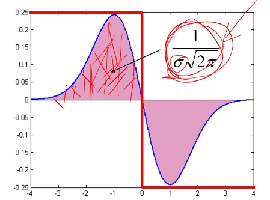

# 特征点提取

Owner: -QVQ-

目的：为了能实现视图之间的通信，通过图像能匹配点，块，边，区域

特征点的用途：

- 图像对齐
- 3D重建
- 运动跟踪
- 机器人导航
- 图像检索
- 目标识别

# 有两张图片如何合成一张图片

**局部特征点的提取过程：**

1. 检测
    
    找特征点集
    
2. 描述
    
    提取每个特征点周围的特征信息组成矩阵
    
3. 匹配
    
    计算两个特征矩阵的距离去寻找符合的

## 什么是好的特征点

- 可重复性：尽管进行了几何和光度变换，但在一些图像中可以发现相同的特征
- 独特的：每个特征都是独特的
- 紧凑和高效：比图像像素少得多的特征
- 位置特征：占据图像中相对较小的区域，抗杂波和遮挡

## 角点检测

- **角点**
    
    图像梯度在两个或多个方向上有变化，角点要有足够的可重复性和显著性，一定不会出现在直线上。

    
    平面：在各个方向都没有变换 
    
    边：在边上没有变换
    
    角点：在所有方向都有较大变换
    

基本思想：我们不确定这个图像的特征点将匹配其他哪些图像，但我们能计算一个位置相对于位置u的微小变化在外观上有多稳定。

移动[u,v]时，窗口函数w（x,y），强度I(x,y)，得到角点E（u,v)

如果对每一个点执行这样的操作，开销很大

我们想得到E对于小变换的行为，我们知道E在高峰的行为，我们能用 二次曲面去近似E（u,v)

将E(u,v)泰勒展开

忽略E(0,0)和一次部分，仅看二次部分

而M可以化简

这里的λ1、λ2代表x、y方向的强度

从左图到右图为二次矩阵的可视化

**Harris角点探测器：**

0.输入图像

### 1.计算图像的导数（再之前可以选择是否先用平滑过滤器）

### 2.用二阶导数计算M部分

### 3.使用高斯滤波器

### 4.计算角点

### 5.非最大抑制，找到具有较大角点响应的像素点（C>阔值）

### 6.找到局部最大像素点

# 尺度选择特性SIFT-拉普拉斯

对于角点平移和旋转不改变。

光照亮度也不部分不改变，部分 体现在提高亮度后一些看不见的值出现了

但缩放会改变，角点放大后会被分类成边缘

当前的任务是找到一个f()对等比例缩放依然能 正确匹配

Blob检测器是角点检测常用的，他是高斯二阶导，又叫拉普拉斯算子，其中可变参数只有б方差

当信号和二阶导匹配时一定能产生一个最大值 ，即尺度匹配

此时变信号，模板不变，可以找到和模板对齐的信号，但实际上事先不知道信号

所以预先用多个模板进行匹配，但随着б方差的变大，模板变平，直至没有信号

假如现有如图中红色线所示的信号，使用蓝色（高斯一阶偏导）的卷积核进行卷积，其中上半粉色区域的面积如图，显然随着б的增大，这个面积会越来越小，最终肯定是趋于0了呀。那么如果对其处理一下呢，自然就想到对这个响应值再乘一个б，对于拉普拉斯就是再乘б2

对比补偿前后：这样就能完成尺度的自动检测。这样就完成了一个多尺度的检测。

下图黑色为图像信号，低频处代表没有颜色，红色为拉普拉斯图像，在作卷积运算时，即黑色的值乘以红色的值，只有图一**完美匹配时得到的是最大值**，图二红色信号有一部分对应的图像信号为0，图三有图像信号的部分对应的拉普拉斯信号有一部分为负数。

基于这个理论，在进行匹配时，我们只需保留当前位置的最大值，具体做法是在相邻的两个方差生成的模板图内的9个像素和自己相邻的8个像素共26个像素点处的卷积值的最大值保留下来

并以这些点为圆心作圆，б越大，圆半径越大，这些圆代表了规模，每个圆代表具有最大尺度响应的描述符，

梳理上面的流程，图像的每个点都和不同б的拉普拉斯图作卷积运算，保留最大的尺度

对每一个点都做卷积耗时太大，可以选择只对角点处做卷积，这是一个有效的实施特征点匹配的方法（**Harris+拉普拉斯**）

## DOG（高斯差分）

前置知识：**高斯金字塔**

分为很多组，第一组第一层为初始，用б作平滑得到第二层，kб平滑第二次得到第三层，以此类推。第二组一定从第一组的倒数第三层开始，作比例因子为2的降采样得到第二组第一层，然后和对第一组一样继续作平滑。

同组内尺寸一样，只是平滑因子不同，不同组，第2组是第1组图像的一半，O组L层就构成了高斯金字塔

### 第一步：生成DOG金字塔

通过对两个相邻高斯尺度空间的图像相减，得到DOG的响应值图像

先用б的卷积核对原图卷积，再用DOG的响应值图像，依次卷积，即不用分别计算б、kб、2kб的图像，而是在б的图像上通过DOG计算Kб卷积后的图像，再在这个图像上通过DOG计算2Kб的图像

意义：高斯卷积核的宽度通常选择3倍的方差，而用DOG通常会小一些

K取【1，2】

### 第二步：空间极值点检测

同组内相邻的两个方差生成的模板图内的9个像素和自己相邻的8个像素共26个像素点处的卷积值的最大值保留下来

对于DOG金字塔每组的最上和最下面的那层，用高斯模糊多模糊出高斯金字塔的3层来凑数（3层的DOG金字塔需要多两层，对应5层的高斯金字塔需要多两层，即高斯金字塔要多三层才行）

即如果要输出的尺度为S=3，就需要计算6层高斯响应

比如要检测10个尺度，DOG有12层，高斯有13层

### 第三步：稳定关键点的精确定位

DOG值对噪声和边缘比较敏感，所以在第2步的尺度空间中检测到的局部极值点还要经过进一步的筛选，去除不稳定和错误检测出的极值点。

利用阔值的方法，即非最大抑制

### 第四步：稳定关键点的方向信息匹配

计算检测点周围16*16窗口的方向，统计每个方向出现的次数，可以做如下设定：直方图的峰值为主方向的参数，其他高于主方向百分之80的方向被判定为辅助方向。

这样做能够得到 纹理、方向信息、SIFT尺度不变特性转换

### 第五步：关键点描述

第四步得到16*16的关键点方向信息图，这一步精简信息量得到关键点描述子

对关键点周围像素分块，计算块内梯度直方图，即向量，每个向量只取前8个辅助方向，图中显示分块为2*2，但实际上分块是4*4，即每个关键点对应16个向量，则有4*4*8=128个维度。

通过上诉方式为每个关键点建立一个描述符，用一组向量将这个关键点描述出来，使其不随各种平移缩放旋转变换而改变。描述子不但包含关键点，也包含关键点周围对其有贡献的邻域点

# 特征点匹配

一到三步在做特征点的检测，四到五步是找到描述信息

就是对模板图和实时图分别做上面五个步骤建立关键点描述子集合，做匹配可以用穷举法

欧式距离：

余弦相似度：

## 方法一：暴力匹配（最小距离法）

- 计算特征空间中的欧式距离，例如128个模糊SIFT描述符之间的欧氏距离
- 取到匹配点的最小距离(最近的邻居)

## 方法二：暴力匹配（距离阈值法）

- 计算特征空间中的欧式距离，例如128个模糊SIFT描述符之间的欧氏距离
- 取到匹配点的最小距离(最近的邻居)
- 忽略任何高于阈值的

即待匹配目标与模型之间的距离小于某个阈值，则认为匹配上了，

**方法非常简单**，但是**阈值**的**确定**非常**困难**，

问题：阈值很难选择，另外非显著特征可能有很多紧密匹配，只有一个是正确的

## 方法三：最近邻近距离比率（NNDR）

比较最近邻(NN1)和次近邻(NN2)特征向量的距离

如果相似，则比率NN1/NN2≈1

如果NN1小，则比率趋于0

按这个比率排序，将匹配按置信度排序。

比率阈值取决于应用程序对假阳性和真阳性数量之间权衡的看法!

`features_imagel * features_image2T`

## 方法四：交叉匹配

进行一次匹配，反过来使用被匹配到的点进行匹配，如果匹配到的仍然是第一次匹配的点的话，就认为这是一个正确的匹配