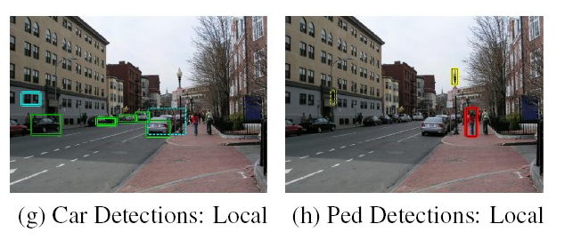

# 目标的种类检测

Owner: -QVQ-

词汇包模型 不使用于 目标检测，因为它丢掉了形状信息

# 目标种类的检测

目标：构建模板能快速的从背景中区分物体

# 一般的物体识别流程

## 1 定义物体模型

### 1.1 边界框的统计模板

物体是在图像中的(X,Y,W,H)，特征被定义成了wrt边界框坐标

### 1.2局部模型

物体是局部模型的配置，每一个部分都是可以侦测 的

### 1.3混合统计模板和局部模型

### 1.4 3Dish模型

物体是经过放射变换的3D图像的集合

### 1.5 可变形的3D模型

对象是三维对象类的形状/姿态/变形的参数化空间

### 为什么不选择最复杂的模型

复杂的模型会使 识别变的困难，需要更多参数，更难去拟合，更复杂的计算

## 生成假设

### 1 滑动窗口

对每一个比例和局部作计算（模板的比例不变）

每个窗户都是离散的被分类的

### 2 从关键点里投票

提取特征点→匹配词袋条目→概率投票

### 3 基于区域的建议

## 给假设打分

主要基于梯度特征，通常基于摘要表示和分类器

## 分辨目标

基于全集对每一个提出的目标重新打分

### 解析检测评分

方法1 非最大抑制

方法2 背景/推理

### 种类检测的基本步骤：

1 对齐

选择位置比例 方向（如何 使这个过程更方便）

2 比较

计算和一个物体代表的相似度或去总结代表（哪些不同是重要的） 

滑动窗口是一个简单的指派方法

# 人脸检测——Viola/Joines 面部检测

如果用滑动窗口将带来大量的计算：大量的图像的像素点、候选人脸的位置信息

而一个图像上的脸是较少的，因此应尽可能在不是脸的窗口上花费较少的时间以提高效率

对每一个像素点避免纳伪，降低错误率到10^-6

Viola/Joines 面部检测是一个有效的实时面部检测方法，模型训练慢，但检测很快

## 快速计算haar-like特征

人脸有一些特征，一张正脸图像中，人眼睛区域会比脸颊区域暗，嘴唇区域也会比四周的区域暗，但鼻子区域会比两边脸颊要亮。

如上图所示，Haar特征分别对白色区域和黑色区域的像素求和，然后求这两种和的差；

当子窗大小给定后，我们可以用五个参数唯一确定一个haar-like特征，即**特征种类（a/b/c/d/e），左上角x轴坐标，左上角y轴坐标，矩形的长，矩形的宽**。对应的特征值等于位于白色矩形框中像素值总和减去位于黑色矩形框中的像素值总和。

例如：快速计算haar-like特征

S1到S6是积分图像在这六个顶点上的值

该特征值 = 位于A中的像素总和 - 位于B中的像素总和

位于A中的像素总和 = S5+S1-S2-S4

位于B中的像素总和 = S6+S2-S3-S5

### **haar-like特征的优点**

**它是scale-invariant(不随图片大小而改变)的**

例如我们用24x24像素的训练样本训练获取一组haar-like特征和对应的门限值，当对图像进行扫描时，子窗大小调整为SxS像素，此时只需将特征中的矩形大小按同样比例进行缩放（门限值同样需要缩放），计算所得的特征值依然是有效的。

**是可以通过积分图像快速计算。**

**用于快速特征提取的积分图像**

积分图像在每个像素(x,y)处计算一个值，该值是(x,y)上方和左侧所有像素值的总和，包括(x,y)。

并且无论矩形多大，我们总能在固定时间内计算出特征值（6次索引操作和少量的加法乘法计算）

在算法实现时，只需保存样本的积分图像（计算一次后续可以一直使用）

## 获取图像特征

利用矩形个数对可以将haar-like特征分为三类，分别由两个，三个，和四个**大小相同**的矩形组成

24*24大小的图像可以产生约160000个矩形特征：

两个矩阵，最少需要2个像素点（12*24个）

（1*2 1*4 1*6 …… 1 *24）

（2*2 2*4 ……  …… 2*24）

……

（24*24）

三个矩阵，最少需要3个像素点（8*24个）

四个矩阵，最少需要4个像素点（12*12个）

根据图像卷积，一个W*H的图像与m*n的filter卷积，得到的图像大小为：（W-m+1）*（H-n+1）(默认stride为1)

并不是所有特征都是有用的，AdaBoost特征分类器具有特征选择的能力。

## 增强人脸检测——利用Adaboost算法训练

### 1 **AdaBoost分类器**

AdaBoost 将一系列的弱分类器通过线性组合，构成一个强分类器，如下所示：

弱分类器为一个简单的阔值函数

### 2 训练弱分类器

计算所有训练样本的特征值，并将其从小到大排序，随机选取一个特征值作为阈值，

把所有元素分为两部分，小于阈值的一部分分类为人脸（红色），大于阈值的一部分分类为非人脸（蓝色）。

假如有5个样本，前两个为人脸，后三个为非人脸，用11000表示。

如果阈值在第一个之前，通过弱分类器判定为：00000，有两个误差，

如果阈值在第一个和第二个之间，通过弱分类器判定为：10000，有1个误差，

如果阈值在第二个和第三个之间，通过弱分类器判定为：11000，有0个误差，

依次类推，这样共有6个误差，然后从中找到一个误差最小的当成阈值，这样就训练好了一个最优的弱分类器。

### 3 **训练强分类器**

每一级分类器使用的训练集中的负样本，都是上一级被错分的，使得下一级分类器更加关注那些更难的（容易被错分的）样本。

### 4 **级联分类器（cascade of classifiers）**

在正常的图像中，人脸区域只是占了很小的一部分，如果使用所有的特征进行训练的话，运算量非常大。

级为了简化任务，把若干个adaboost 分类器级联起来，一开始使用少量的特征将大部分的非人脸区域剔除掉，后面再利用更复杂的特征将更复杂的非人脸区域剔除掉。

**级联分类器的训练**

• 设定每一层最大的可接受误检率 f, 和每一层最小的检测率 d.

• 如果当前层的误检率大于目标值，则继续增加一层adaboost 分类器作进一步的判断

• 如果检测率没有达到标准则降低阔值（检测率和误检率都会增加），继续循环

在论文中，VJ分类器一共有38层，含有6060个特征

### 5 **非极大值抑制（NMS）**

在人脸识别中，一张脸会出现非常多的窗口

假设有N个窗口，根据分类器的分类概率从小到大排序，概率最大的框记为Z

- 从最大概率矩形框Z开始，分别判断其它框与X框的重叠度是否大于设定的阈值，超过了阈值就扔掉其它框
- 从剩下的矩形框中，选择概率最大的（假设为Y），再重复上述判断，直到最后一个框

### 特点

优点

将分类器与特征分类训练相结合

训练复杂度在训练样本数量上是线性的，而不是二次的

选择弱学习器上比较灵活

测试速度快

缺点

需要很多训练样例

训练是缓慢的

通常不如SVM工作得好(特别是对于多分类问题）

面部识别技术可以应用于多个领域，例如安全监控、人脸支付、人脸解锁等。在安全监控方面，面部识别技术可以帮助识别出不法分子，提高监控效率和精度。在人脸支付和解锁方面，面部识别技术可以帮助用户更方便快捷地完成支付和解锁操作，提升用户体验。此外，面部识别技术在医学领域也有应用，例如对于某些疾病的诊断需要对患者的面部进行分析。总的来说，面部识别技术是一项具有广泛应用前景的技术。