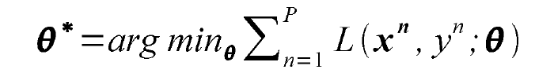

# 神经网络

Owner: -QVQ-

# 传统神经网络

## 神经元的组成：

基本的构建块是感知器：是宽度为w和偏差为b的线性分类器

## 图像的二值分类

图像的每个像素点都是一个输入 ，例对于28*28的图像，将其向量化为1*784，用X表示这个向量

w是每个像素的权重向量，b是每个感知器的标准偏差

多类

## 多类分类图像：

在二值分类的基础上，

w是每个像素点/感知器的权重矩阵，例W = 10 * 784

b是每个感知器的标准偏差，有多少个感知器就是几维数组，例1*10

尝试将复杂函数表示为较小函数的组合。一个感知器的输出被输入到另一个感知器中。

层（layers）的设置和他们之间的联系定义了网络结构

在输入和输出之间的层被称为隐藏层，因为我们要通过优化过程来学习它们的权值。

## 栈的传统结构的问题：

1 线性函数的组合可以被简化成一个函数，所以最后函数的组合仅仅是个单一函数

2 很小的输入改变能带来很大的二进制输出改变，问题源于函数的组成

# 非线性函数-MLP（Multi-layer perceptron）

## 特点

1 使用是有理论依据的——通用近似理论

2 可以表示一个NAND电路，从这个电路中任何二进制函数都可以由NAND组成

3 有了足够的参数，它可以近似任何函数

# 有监督的神经网络

## 如果单层的神经网络能学习任何函数，为什么要更深

更深的神经网络在开发中更有效，因为它能支持复用

从经验上看，深度网络在学习这种知识层次方面比浅层网络做得更好。

## 激活函数

输入的 inputs 通过加权，求和后再进过激活函数，引入激活函数是为了增加神经网络模型的非线性。没有激活函数的每层都相当于矩阵相乘。就算你叠加了若干层之后，无非还是个矩阵相乘罢了。

注意每一个部分都会经过激活函数的计算

## svm和感知机之间的关系

感知机是一个二进制分类算法，它试图通过找到输入向量的超平面来区分不同的类别。

**支持向量机svm**是感知机的改进，试图学习支持向量，使类之间的余量最大化。它可以学习非线性决策边界并处理高维数据。通过使用不同的核函数，支持向量机可以处理各种类型的数据。

即感知机+最佳稳定性+核函数=SVM

# 卷积神经网络CNN

## 动机

图像在神经网络计算中会产生大量的参数，每个像素点都会对每个隐藏单元做计算，而空间相关性是局部的

这样浪费资源，并且我们也没有足够的训练样本

假设在一张图像中，我们只关心给定神经网络层的“局部邻域”

参数共享“捆绑权重”——对神经网络中的多个感知器使用相同的权重。表示如果输入发生变化，那么输出也会发生类似的变化

## 1数据输入层

该层要做的处理主要是对原始图像数据进行预处理，其中包括：

- **去均值**：把输入数据各个维度都中心化为0，如下图所示，其目的就是把样本的中心拉回到坐标系原点上。
- **归一化**：幅度归一化到同样的范围，比如有两个维度A范围是0到10，而B范围是0到10000，即A和B的数据都变为0到1的范围。

      N(x,y) =模型像素值在窗口中的正态分布

m是平均值，б是变量

这个计算的花费代价很小

去均值与归一化效果图

- **PCA/白化**：用PCA降维；白化是对数据各个特征轴上的幅度归一化

去相关与白化效果图

## 2卷积计算层/ CONV layer

得到目标的特征

其中涉及到**填充值和步幅**

计算任意给定卷积层的输出的大小的公式是

O为输出尺寸，W是图像宽度，K 是过滤器尺寸，P 是填充，S 是步幅

注意卷积核宽度只能是单数，填充P是指单边的大小

### 卷积的计算

图像的每一层和卷积核1的每一层相层后再相加，再加上偏差b，构成输出矩阵1，再和卷积核2作计算……

### 参数的共享机制

在卷积层中每个神经元连接数据窗的权重是固定的，每个神经元只关注一个特性。比如边缘检测专用的Sobel滤波器

这些所有神经元加起来就好比就是整张图像的特征提取器集合。

一组固定的权重和不同窗口内数据做内积: 卷积

## 3**非线性层（或激活层）**/ ReLU layer

CNN采用的激活函数一般为ReLU(The Rectified Linear Unit/修正线性单元)，它的特点是收敛快，求梯度简单，但较脆弱

将数值压缩到0-1之间，决定了某个神经元是激活还是抛弃

## 4池化层 / Pooling layer

最主要作用就是压缩图像，去掉冗余的信息：

1 **特征不变性：**特征的尺度不变性，比如一张狗的图像被缩小了一倍依然能认出。图像压缩时去掉的信息只是一些无关紧要的信息，而留下的信息则是具有尺度不变性的特征，是最能表达图像的特征。

2 **特征降维**，图像有些信息对于识别没有太多用途或者有重复，可以去除，只保留最重要的特征

3 **防止过拟合**，更方便优化。

池化层用的方法有Max pooling 和 average pooling

### Max pooling

对于每个2 * 2的窗口选出最大的数作为输出矩阵的相应元素的值，

### average pooling

## 5全连接层 / FC layer

将特则空间映射到样本区间，将之前提取到的特征组合起来，

两层之间所有神经元都有权重连接，通常全连接层在卷积神经网络尾部。也就是跟传统的神经网络神经元的连接方式是一样的：

## 特点

（1）优点

•**共享卷积核**，对高维数据处理无压力

•**无需手动选取特征**，训练好权重，即得特征分类效果好

（2）缺点

•**需要调参**，需要大样本量，训练最好要**GPU**

•物理含义不明确（也就说，我们并不知道没个卷积层到底提取到的是什么特征，而且神经网络本身就是一种难以解释的“**黑箱模型**”）

**fine-tuning**

fine-tuning就是使用已用于其他目标、预训练好模型的权重或者部分权重，作为初始值开始训练。

如果有6个5*5的卷积核，将得到6个激活图像，将他们叠加起来

# 训练神经网络

## 梯度下降（最优化-最速下降法）

随意选择一个点计算它的梯度，沿下降方向移动x，再选择新的点

γ=移动的大小=学习率

当不能移动时停止

### 特点

函数优化器。

对于非凸函数，只能找到局部最优。而大多函数都不是凸函数

适用于多变量函数。需要计算偏导数矩阵(“雅可比矩阵”)

### 损失函数

损失函数是一个可以告诉我们，神经网络在某个特定的任务上表现有多好的函数

如果损失函数比较大，那么说明我们的神经网络性能并不是很好

其中损失函数L的计算：

x是想得到的，y是训练样本

### 用梯度下降法训练NN

整个训练过程就是最小化损失函数的过程

关于最小化复杂函数的参——BP反向传播

# 循环神经网络RNN（递归神经网络）

**前馈神经网络**一信息向前传递，层内结点之间并不连接，适合于处理静态数据分析，如回归、分类等任务。

**反馈神经网络—**全部或者部分神经元可以接受来自其它神经元或自身的信号的神经网络结构，其拓扑结构可以是网状的，也可以是具有一定层级的。

人们通常将反馈神经网络视为一个动态系统，主要关心其随时间变化的动态过程。

**循环网络结构—**至少包含一个反馈连接的神经网络结构。因此，网络的激励可以沿着一个loop进行流动。这种网络结构特别适合于处理**时序数据。**

**递归神经网络(RNN)**是两种人工神经网络的总称。

一种是**时间递归神经网络**(recurrent neural network)，神经元间连接构成有向图

时间递归神经网络可以描述动态时间行为，因为和前馈神经网络接受较特定结构的输入不同，RNN将状态在自身网络中循环传递，因此可以接受更广泛的时间序列结构输入

另一种是**结构递归神经网络**（recursive neural network)，利用相似的神经网络结构递归构造更为复杂的深度网络

结构递归神经网络是一类用结构递归的方式构建的网络，比如在自然语言处理的神经网络分析方法中用于解析语句

**RNN一般指代时间递归神经网络**。单纯递归神经网络因为无法处理随着递归，梯度指数级爆炸或消失的问题，难以捕捉长期时间关联；而结合不同的LSTM可以很好解决这个问题

## **功能：**

将序列信号{X1,X2,……，Xn}转为{O1,O2,……，On}

例如：

## 网络结构如下

**层次型Recurrent NN的基本结构：（普通RNN）**

其中每个圆圈可以看作是一个单元，而且每个单元做的事情也是一样的，因此可以折叠呈左半图的样子。用一句话解释RNN，就是**一个单元结构重复使用**。

其实对如上的结构展开来，就是如下结构

**参数信息：**

Xt:表示t时刻的输入，ot:表示t时刻的输出，ht:表示t时刻的记忆

U：输入值隐含层的 连接权重矩阵 

V：隐含层至输出层的连接权重矩阵

W：隐含层神经元之间的连接权重矩阵

**当前时刻的记忆ht**是由以前的记忆和当前时刻的输出决定的

 f()为激活函数，起到只记只记重要的信息，过滤不重要的信息

**当前时刻的输出Ot**

输出结果 需要和连接权重矩阵运算 

**预测的结果**是带着当前时刻的记忆ot去预测的

softmax(Ot)，softmax会得到每个时刻得到的候选词的概率，为一组向量

softmax的运算即，对于每个时期的输入O1,O2,……On,作输入运算

softmax后得到一组向量，对其求最大似然函数

按时间累加

**RNN结构一些细节：**

ht并不能捕获所有信息，

参数（U,V,W）同卷积神经网络一样，全网络共享了一组 

（U,V,W）使用BP算法，针对特定任务进行学习优化

ot在很多情况下是不存在的，很多任务只关注结果，不关注过程