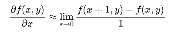

# 边缘检测

Owner: -QVQ-

# 整体流程

目的：能提取信息为识别物体

包含：表面法向不连续（朝向不同），深度不连续（物体处在不同的物平面上），表面颜色不连续，光照不连续(阴影）

**定义:  边缘是图像强度函数快速变换的地方**

边缘强度带有一定的高斯噪声，如果直接对其求一阶导，无法识别边缘

同时，一些滤波器对噪音很敏感，能让一些点远不同于周围的其他点。

因此，需要先对图像作平滑处理，f是原图，g是平滑滤波器

卷积满足交换律，因此先求积再卷积会加速运算

**基于一阶导数**：首先计算边缘强度， 通常用一阶导数表示， 例如梯度模，然后，用计算估计边缘的局部方向， 通常采用梯度的方向，并利用此方向找到局部梯度模的最大值。即：**图像一阶导数中的最大和最小值来检测边界，通常是将边界定位在梯度最大的方向**

基于二阶导数：……

**一阶导数求边缘：**

图像处理中，一阶求导

对于像素值的位置的最小单位是1px，因此

从公式上可以看出，就是右面的一个像素减去左面的一个像素，这个过程可以用卷积来代替。对卷积核来说，就是检测竖直方向的线条

平滑导数去除了噪声但也使图像模糊，因此需要选择合适的scales

**高斯一阶导数核**（derivative filters）：滤波器模板中的数值一定有负数，而且这些相加为0。

对于**梯度的幅值**，越大说明这个点附近像素值变化月剧烈，越有可能是边缘，梯度方向与边缘方向是垂直的

边缘检测的标准：

好的检测 ，能发现正确的边缘，忽略噪音和其他干扰

好的定位，返回的每一个点都是正确的点

**边缘的编码：位置、梯度大小、梯度方向、模糊度**

# Canny边缘检测

## 1.用**高斯函数的x，y对图像进行滤波处理**，

## 2.然后**计算梯度幅值和方向**

梯度幅值

**计算梯度方向**

使用阈值对其进行第二次过滤，去除一些梯度相对较小的点。

## 3.对每个点做**非最大抑制**：

对于点q如果r和p小于它则得到一个最大值，沿梯度方向做插值

原本的图案是均匀过度的，得到的边缘比较粗，非最大抑制后得到的边缘清晰

## 4.Hysteresis Thresholding

此时图像中出现的边缘出现断断续续的情况，这是因为设置的阔值太高 ，导致这部分被过滤掉了，设置的太低又会出现很多假边，所以可以使用双阔值法，设置 一个弱边，一个强边。图像大于高阔值的为强边，小于低阔值的为噪音，中间的为 弱边。

边缘从强边开始，持续跟进弱边

这里的参数取决于具体的要求，大的能检测到整体的轮廓，小的能检测到细致的边缘

MATLAB：edge（image,canny‘）