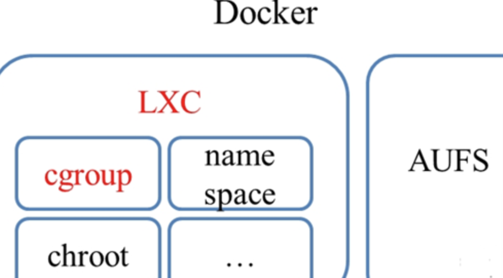
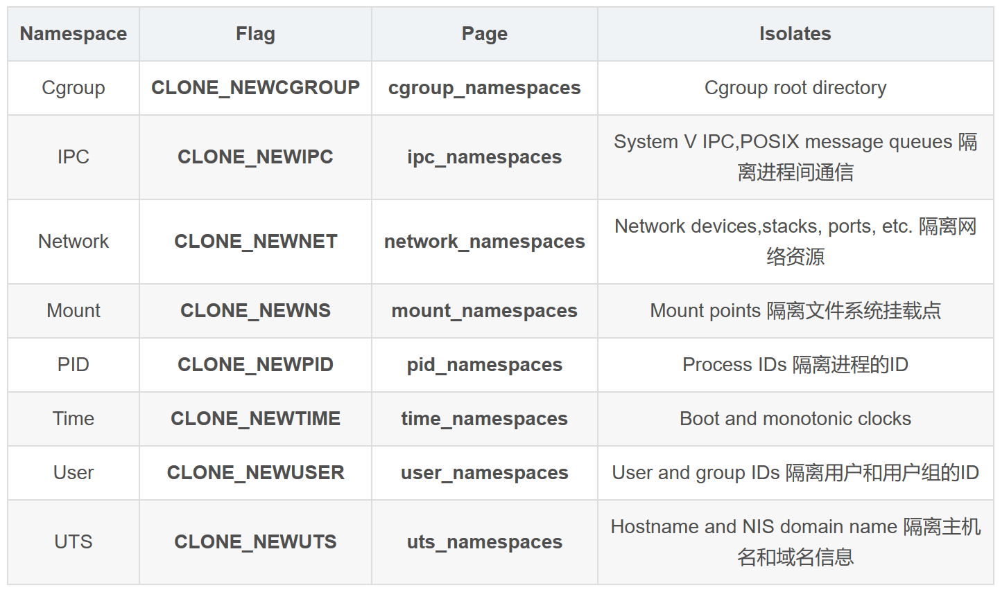
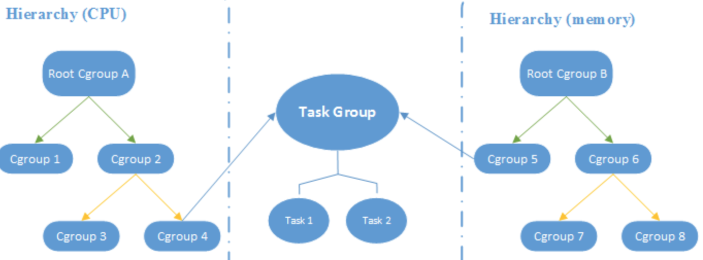
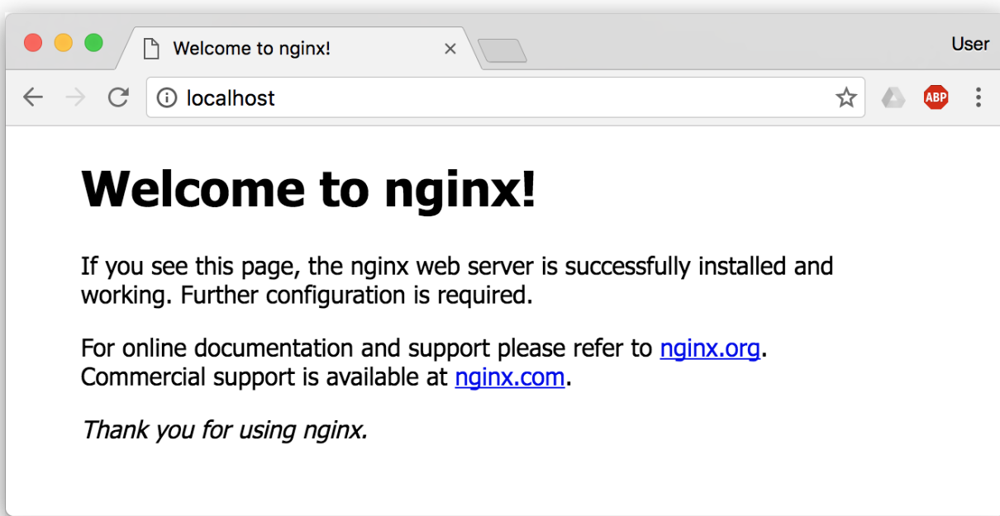

# Docker

Owner: -QVQ-

[Go 语言](https://golang.google.cn/) 进行开发实现，基于 `Linux` 内核等技术，对进程进行封装隔离，属于 [操作系统层面的虚拟化技术](https://en.wikipedia.org/wiki/Operating-system-level_virtualization)。本质是被限制了的 Namespaces，cgroup，具有逻辑上独立文件系统，网络的一个进程

Docker 可以让开发者打包他们的应用以及依赖包到一个轻量级、可移植的容器中，然后发布到任何流行的 Linux 机器上，也可以实现虚拟化。

`runc` 是一个 Linux 命令行工具，用于根据 [OCI容器运行时规范](https://github.com/opencontainers/runtime-spec) 创建和运行容器。

`containerd` 是一个守护程序，它管理容器生命周期，提供了在一个节点上执行容器和管理镜像的最小功能集。

**Docker** 在容器的基础上，进行了进一步的封装，从文件系统、网络互联到进程隔离等等，极大的简化了容器的创建和维护。使得 `Docker` 技术比虚拟机技术更为轻便、快捷。

<div style="width:100%;overflow: auto">
    <table border="1" >
    <tr>
        <th></th> <th></th> <th></th> <th></th> <th></th> <th></th>
    </tr>
    <tr>
        <td>启动</td>
        <td>通过镜像启动容器</td>
        <td><code>run [可选参数] 指定镜像名称 启动容器执行的命令</code></td>
        <td>-i 交互式操作 -t 终端方式运行 --rm 容器退出后删除 —privileged 容器内是否使用真正的root权限 -name “名字” 指定容器名字</td>
        <td></td> <td></td>
    </tr>
    <tr>
        <td></td> <td></td> <td></td>
        <td>-p 主机端口:容器端口</td>
        <td></td> <td></td>
    </tr>
    <tr>
        <td></td> <td></td> <td></td>
        <td><code>--mount source=数据卷名称,target=/data</code> 创建时挂载数据卷，去var/lib/docker/volumes路径下找数据卷（需要提前创建），映射到容器里的/data路径</td>
        <td></td> <td></td>
    </tr>
    <tr>
        <td></td> <td></td> <td></td>
        <td><code>--mount type=bind,source=/webapp,destination=/webapp2</code> 将主机的/webapp2映射到容器的/webapp</td>
        <td></td> <td></td>
    </tr>
    <tr>
        <td>运行中添加启动选项</td>
        <td></td> <td></td> <td></td> <td></td> <td></td>
    </tr>
    <tr>
        <td>容器交互</td>
        <td>打开容器终端</td>
        <td><code>docker exec  -it c6ba21d1be0c  bash</code></td>
        <td></td> <td></td> <td></td>
    </tr>
    <tr>
        <td>导入导出容器</td>
        <td>通过容器生成文件</td>
        <td><code>export [CONTAINER ID]</code></td>
        <td></td>
        <td><code>docker export 7691a814370e > ubuntu.tar</code></td>
        <td>export和import配对，更接近数据备份，不保存历史操作记录</td>
    </tr>
    <tr>
        <td></td>
        <td>通过文件恢复容器</td>
        <td><code>docker import [OPTIONS] file|URL|- [REPOSITORY[:TAG]]</code></td>
        <td><b>-c :</b> 应用docker 指令创建镜像</td>
        <td><code>docker import ubuntu.tar test/ubuntu:v1.0</code> 导入文件ubuntu.tar，生成容器名字为test/ubuntu，标签为v1.0</td>
        <td>可通过这个文件恢复多个容器</td>
    </tr>
    <tr>
        <td></td>
        <td>保存镜像到文件</td>
        <td><code>docker save [OPTIONS] IMAGE [IMAGE...]</code></td>
        <td><b>-o :</b> 输出到的文件。</td>
        <td><code>docker save -o my_ubuntu_v3.tar runoob/ubuntu:v3</code></td>
        <td>save和load配对，更接近快照</td>
    </tr>
    <tr>
        <td></td>
        <td>通过文件恢复到镜像</td>
        <td><code>docker load [OPTIONS]</code></td>
        <td><b>--input , -i :</b> 指定导入的文件 <br> --quiet , -q : 精简输出信息。</td>
        <td><code>docker image ls docker load < busybox.tar.gz</code></td>
        <td>恢复时不能指定名字，只能恢复一个对象</td>
    </tr>
    <tr>
        <td>容器和主机的数据交换</td>
        <td>主机拷贝数据到容器</td>
        <td><code>docker cp 需要拷贝的文件或者目录 容器名称:容器目录</code></td>
        <td></td> <td></td> <td></td>
    </tr>
    <tr>
        <td></td>
        <td>从容器取数据</td>
        <td><code>docker cp 容器名称:容器目录 宿主机目录</code></td>
        <td></td> <td></td> <td></td>
    </tr>
    <tr>
        <td>数据卷</td>
        <td>创建数据卷</td>
        <td><code>docker volume create 数据卷名称</code></td>
        <td></td> <td></td>
        <td>数据卷默认会放到/var/lib/docker/volumes路径下</td>
    </tr>
    <tr>
        <td></td>
        <td>挂载到已有容器</td>
        <td></td> <td></td>
        <td><code>docker run --volumes-from c6ba21d1be0c -v /home/songkuakua/gitcode:/container/gitcode -it centos bash</code>  
        将主机的路径 `/home/songkuakua/gitcode` 挂载到 ID 为 `c6ba21d1be0c` 的容器的 `/container/gitcode` 下</td>
        <td></td>
    </tr>
    <tr>
        <td></td>
        <td>查看所有数据卷</td>
        <td><code>docker volume ls</code></td>
        <td></td> <td></td> <td></td>
    </tr>
    <tr>
        <td></td>
        <td>查找指定数据卷信息</td>
        <td><code>docker volume inspect 数据卷名称</code></td>
        <td></td> <td></td> <td></td>
    </tr>
    </table>
</div>

运行时添加启动选项：

⭐方式一： 

- 关闭容器
- 特权模式下，`vim /var/lib//docker/containers/容器hash值/hostconfig.json`
- 开启容器
- `docker inspect 容器hash`   检查是否生效

方式二：容器内修改`/etc/docker/daemon.json` ，重启容器

运行时添加端口映射：

- 关闭容器
- 特权模式下，`vim /var/lib//docker/containers/容器hash值/hostconfig.json`  在`"PortBindings"` 一栏添加`"PortBindings":{"80/tcp":[{"HostIp":"","HostPort":"8080"}]}`
- 在 `config.v2.json` 里面添加一个配置项 `"ExposedPorts":{"80/tcp":{}} ,`将这个配置项添加到 `"Tty": true,` 前面
- `service docker restart`

[](https://www.jb51.net/server/315393pec.htm)

基于已有容器构建新的容器：

```bash
	docker export 容器ID > container.tar
	tar -xf container.tar -C container
	docker build -t 新镜像名称 .
	docker run 
```

docker下开启gdb

[](https://blog.csdn.net/happytree001/article/details/125696209)

# 概念

## 镜像

**Docker 镜像** 是一个特殊的文件系统，

包含**容器**运行时所需的**程序、库、资源、配置**等文件外，为运行时准备的一些**配置参数**（如匿名卷、环境变量、用户等）。

镜像 **不包含** 任何**动态数据**，其内容在构建之后也不会被改变。

因为镜像包含操作系统完整的 `root` 文件系统，采用**分层存储**的架构。

镜像构建时，会一层层构建，前一层是后一层的基础。每一层构建完就不会再发生改变，后一层上的任何改变只发生在自己这一层。对前一层文件的**删除**，实际仅在当前层**标记**为该文件已删除。

分层存储的特征还使得镜像的**复用、定制**变的更为容易。甚至可以用之前构建好的镜像作为基础层，然后进一步添加新的层，以定制自己所需的内容，构建新的镜像。

## 容器

镜像（`Image`）和容器（`Container`）的关系，就像是面向对象程序设计中的 `类` 和 `实例` 一样。容器是镜像运行时的实体，实质是进程。可以创建、启动、停止等。但容器运行在自己的命名空间，隔离的环境。

容器同镜像一样是分层存储，每个容器运行时以镜像为基础层在上创建一个当前容器的存储层，即**容器存储层**

容器存储层的生存周期和容器一样，随容器消失，并随之丢失信息

容器不向存储层写入数据，都通过用 [数据卷（Volume）](notion://www.notion.so/docker_practice/data_management/volume)、或者 [绑定宿主目录](notion://www.notion.so/docker_practice/data_management/bind-mounts)，直接对宿主或网络存储读写。

数据卷生命周期独立容器，并且容器删除数据不会丢失

## Docker Registry 公开服务

Docker Registry 公开服务是开放给用户使用、允许用户管理镜像的 Registry 服务。一般这类公开服务允许用户免费上传、下载公开的镜像，并可能提供收费服务供用户管理私有镜像

## 私有 Docker Registry

客户端（client）：Docker 客户端通过命令行或者其他工具使用 Docker SDK 与 Docker 的守护进程通信。

主机（host）：一个物理或者虚拟的机器用于执行 Docker 守护进程和容器。

## 仓库

代码控制中心，一个 **Docker Registry** 中可以包含多个 **仓库**（`Repository`）；每个仓库可以包含多个 **标签**（`Tag`）；每个标签对应一个镜像。一个集中的存储、分发镜像的服务，使得可以在其他服务器上使用这个镜像

通常一个标签包含同一个软件的不同版本的镜像，`<仓库名>:<标签>` 的格式来指定具体是这个软件哪个版本的镜像。以 `latest` 作为默认标签

仓库名，比如 `jwilder/nginx-proxy`，前者往往意味着 Docker Registry 多用户环境下的用户名，后者则往往是对应的软件名。并不绝对

## 应用场景

- Web 应用的自动化打包和发布。
- 自动化测试和持续集成、发布。
- 在服务型环境中部署和调整数据库或其他的后台应用。
- 从头编译或者扩展现有的 OpenShift 或 Cloud Foundry 平台来搭建自己的 PaaS 环境。

和VM虚拟机比起来

容器：在宿主机器、宿主机器**操作系统**上**创建Docker引擎**，在引擎的基础上再**安装应用**。

VM：在宿主机器、宿主机器**操作系统的**基础上**创建虚拟层**、虚拟化的**操作系统**、虚拟化的仓库，然后再安装应用

**优劣**：

- 快：docker容器启动和停止在秒级实现，性能优异
- 小：需要的系统资源很少，单机支持上千个容器
- 灵活：通过Dockerfile配置文件来支持灵活的自动化创建和部署机制，
- 可靠：用Linux系统上的多种防护机制实现了严格可靠的隔离

## 原理

Docker 使用客户端-服务器 (C/S) 架构模式，使用远程API来管理和创建Docker容器。

Docker守护进程运行在主机上， 然后通过Socket连接从客户端访问Docker守护进程，Docker守护进程从客户端接受命令，并按照命令，管理运行在主机上的容器

除了使用公开服务外，用户还可以在本地搭建私有 Docker Registry。Docker 官方提供了 Docker Registry 镜像，可以直接使用做为私有 Registry 服务。

- 精简
  
    Docker守护进程运行在主机上， 然后通过Socket连接从客户端通信，
    
    LXC负责资源管理
    
    cgroup资源统计隔离，
    
    进程隔离，clone传入参数，创建单独的命名空间
    
    网络隔离，为每个容器分配一个ip，维护一个iptables，通过重定向实现通信
    
    chroot挂载点
    
    Docker进程可能访问和修改宿主机器上的目录，clone 函数实现得到父进程的拷贝
    
    CGroup物理资源限制分组
    
    让系统将资源合理分配到每个容器，使得相互运行不受干扰
    
    AUFS负责镜像管理
    
    联合文件系统：把多个文件系统『联合』到同一个挂载点的文件系统服务
    
    镜像分层机制：每个步骤进行完都会生成一个随机的 ID，来标识这一 layer 中的内容，对于没有修改的内容会复用之前的结果
    

**技术底座**


LXC负责资源管理，AUFS负责镜像管理

### namespace，命名空间

容器隔离的基础，6个命名空间：User，Mnt，Network，UTS，IPC，Pid

以抽象的形似来封装系统资源，将系统资源放在不同的Namespace中，来实现资源隔离的目的。

> 服务器上启动多个服务是会相互影响的，服务之间可以看到对方，也可以访问宿主机器上的文件，因此需要隔离
> 

Linux 的命名空间机制提供了以下七种不同的命名空间，我们能在创建新的进程时, 设置新进程应该在哪些资源上与宿主机器进行隔离，包括 :


> 两个容器都有相同PID的进程，linux里PID唯一，因为用到了Namespaces，作为linux创建新进程时的一个可选参数，调用时，这个进程获得一个独立的进程空间。docker还使用其他隔离
> 

### cgroups 容器资源统计和隔离：

cgroups子系统：cpu，blkio，device，freezer，memory

**进程隔离**

clone系统调用选择参数CLONE_NEWPID，将创建出干净的进程列表，和宿主机器中的进程隔离，docker就是使用这样的技术

每次docker run或docker start时都会调用createSpec创建一个用于设置进程间隔离的Spec，调用setNamespaces设置进程相关的命名空间，传入这个Spec作为docker的创建函数create的参数，此时完成了隔离

**网络隔离**

docker通过命名空间可以创建一个隔离的网络环境，但无法联网

docker提供了四种不同的网络模式：Host、Container、None、Bridge模式（默认网桥模式）

网桥模式下，docker会为所有的容器设置IP地址，docker服务器在主机上启动后会创建新的虚拟网桥docker0，所有服务都与其相连

每一个容器在创建时都会创建一对虚拟网卡，两个虚拟网卡组成了数据的通道，其中一个会放在创建的容器中，会加入到名为 docker0 网桥中，docker0会为每个容器分配一个IP，并加入iptables。数据访问地址经过iptables重定向至容器内的IP

### unionfs 联合文件系统

典型：aufs/overlayfs，分层镜像实现的基础

一种为 Linux 操作系统设计的用于把多个文件系统『联合』到同一个挂载点的文件系统服务。

**AUFS** 即 Advanced UnionFS 其实就是 UnionFS 的升级版，它**能够将不同文件夹中的层联合（Union）到了同一个文件夹**中，这些文件夹在 AUFS 中称作分支，整个『联合』的过程被称为联合挂载

默认情况下，内核将根据从左至右的顺序将第一个目录指定为可读可写的，其余的都为只读，对可读内容做出修改的时候，其结果只会保存到可写的目录下，不影响只读的目录

branch – 就是各个要被union起来的目录。

Stack 结构 - AUFS 它会根据branch 被 Union 的顺序形成一个 Stack 的结构，从下至上，最上面的目录是可读写的，其余都是可读的。如果按照我们刚刚执行 aufs 挂载的命令来说，最左侧的目录就对应 Stack 最顶层的 branch。

**docker镜像分层机制**

最底层的 Layer 为 BaseImage（一般为一个操作系统的 ISO 镜像），然后顺序执行每一条**指令**，生成的 **Layer 按照入栈的顺序逐渐累加，最终形成一个 Image**

构建的过程就是执行 Dockerfile 文件中我们写入的命令。构建一共进行了7个步骤，每个步骤进行完都会生成一个随机的 ID，来标识这一 layer 中的内容，对于没有修改的内容会复用之前的结果

### Libnetwork容器网络模型

整个网络部分的功能都是通过Docker拆分出来的Libnetwork实现的，

主要组件包括Sandbox、Endpoint 和 Network：

在容器网络模型中，每一个容器内部都包含一个 Sandbox（使用网络命名空间实现），其中存储着当前容器的网络栈配置，包括容器的接口、路由表和 DNS 设置，一个Sandbox中可能有多个Endpoint，Sandbox 通过 Endpoint 加入到对应的网络中

### **挂载点chroot**

Docker进程可能访问和修改宿主机器上的目录，

在 clone 函数中传入 CLONE_NEWNS，子进程就能得到父进程挂载点的拷贝，如果不传入这个参数子进程对文件系统的读写都会同步回主机的文件系统

想要正常启动一个容器就需要在 rootfs 中挂载几个特定的目录，建立一些符号链接保证系统IO

通过chroot函数改变当前系统的根目录，从而限制用户的权力，从而建立了一个于原系统隔离的目录结构

### **CGroups（Control Groups）物理资源限制分组**

一个容器执行CPU密集型的任务，影响了其他容器中任务的性能。因此需要对多个容器的资源进行限制

基于文件系统的CGroup，每一个 CGroup 都是一组被相同的标准和参数限制的进程，CGroup 能够为一组进程分配资源，不同的CGroup有层级关系

`lssubsys -m` 查看当前的CGroup有哪些子系统，不同子系统代表了不同的资源

subsystem子系统，即资源控制器（cpu 子系统就是控制 cpu 时间分配的一个控制器），子系统有自己独立的层级系统，每一层可以为一组程序分配资源


启动容器时，Docker会为容器创建一个与容器标识符相同的 CGroup，每个CGroup下面都有一个tasks文件，储存着属于当前控制组的所有进程的pid，不同子系统对不同资源作限制

[docker 底层知识cgroup 原理分析_cgroup原理_张忠琳的博客-CSDN博客](https://blog.csdn.net/zhonglinzhang/article/details/64905759)

# 基本操作

## 基本操作

### 获取镜像

`docker pull [选项] [Docker Registry 地址[:端口号]/]仓库名[:标签]`

- Docker 镜像仓库地址：地址的格式一般是 `<域名/IP>[:端口号]`。默认地址是 Docker Hub(`docker.io`)。
- 仓库名：如之前所说，这里的仓库名是两段式名称，即 `<用户名>/<软件名>`。对于 Docker Hub，如果不给出用户名，则默认为 `library`，也就是官方镜像。

`docker pull ubuntu:18.04` //没有给镜像地址，默认从Docker Hub获取

### 运行

以这个镜像为基础启动并运行一个容器

`docker run -it --rm ubuntu:18.04 bash`

i是交互式操作，t是终端，rm是容器推出后将其删除，通常为了排障需求，退出的容器并不会立即删除

运行后进入容器，`cat /etc/os-release` 能查看到当前的系统版本

`exit` 退出这个容器

### 列出镜像

`docker image ls`

列表包含了 `仓库名`、`标签`、`镜像 ID`、`创建时间` 以及 `所占用的空间`

镜像ID是镜像的唯一标识

Docker Hub 中显示的体积是压缩后的体积，而 `docker image ls` 显示的是镜像下载到本地后，是展开后的各层所占空间的总和

`docker image ls` 列表中的镜像体积总和并非是所有镜像实际硬盘消耗。由于 Docker 镜像是多层存储结构，并且可以继承、复用，因此不同镜像可能会因为使用相同的基础镜像，从而拥有共同的层，因此实际占用空间会更小

`docker system df` 

命令来便捷的查看镜像、容器、数据卷所占用的空间

`docker image ls -f dangling=true`

查看**虚悬镜像(dangling image):**新镜像的发布使得旧镜像名转移到了新镜像上，旧镜像为`<none>`。

`docker pull`和`docker build`都可能导致这种情况

`docker image prune`

删除虚悬镜像

### 中间层镜像

为了加速镜像构建、重复利用资源，Docker 会利用 **中间层镜像**

默认不会显示中间层镜像

`docker image ls -a`

### 列出部分镜像

- `docker image ls ubuntu`
  
    根据仓库名列出镜像
    
- `docker image ls ubuntu:18.04`
  
    指定仓库名和标签列出特定的某个镜像
    
- `docker image ls -f since=mongo:3.2`
  
    -f（filter）过滤器参数，`since=mongo:3.2` 看到在`mongo:3.2` 之后建立的镜像，`before=mongo:3.2` 
    
- `docker image ls -f label=com.example.version=0.1`
  
    通过标签过滤
    

## 删除本地镜像

### 用ID、镜像名、摘要删除镜像

`$ docker image rm [选项] <镜像1> [<镜像2> ...]`

使用ls列出的IMAGE ID来删除镜像，一般取前3个字符以上用于区分即可

更精确的是使用 **镜像摘要** 删除镜像。

```bash
$ docker image ls --digests
REPOSITORY                  TAG                 DIGEST                                                                    IMAGE ID            CREATED             SIZE
node                        slim                sha256:b4f0e0bdeb578043c1ea6862f0d40cc4afe32a4a582f3be235a3b164422be228   6e0c4c8e3913        3 weeks ago         214 MB

$ docker image rm node@sha256:b4f0e0bdeb578043c1ea6862f0d40cc4afe32a4a582f3be235a3b164422be228
Untagged: node@sha256:b4f0e0bdeb578043c1ea6862f0d40cc4afe32a4a582f3be235a3b164422be228
```

### Untagged 和 Deleted

删除行为分为Untagged 和 Deleted，前者删除标签，后者删除文件

镜像的唯一标识是其 ID 和摘要，而一个镜像可以有多个标签。

**标签的删除：**一个镜像对应多个标签，仅删除一个的标签，不会发生 `Delete` 行为，所以有些`docker image rm` 只是取消了某个标签

**按层删除：**镜像删除的时候是从上层向基础层方向依次删除。可能某个其它镜像正依赖于当前镜像的某一层。这种情况，依旧不会删除该层。

**容器对镜像的依赖：**如果有用这个镜像启动的容器存在（即使容器没有运行）,可以删除，但会发生故障。应先删容器，再删镜像

### ls和rm的配合

`$ docker image rm $(docker image ls -q redis)`

删除所有仓库名为 `redis` 的镜像：

## 镜像构建的过程（commit）

不要使用 `docker commit` 定制镜像

以定制一个 Web 服务器为例子，来讲解镜像是如何构建的。

`$ docker run --name webserver -d -p 80:80 nginx`

用`nginx` 镜像启动一个容器，命名为 `webserver`，并且映射了 80 端口，这样我们可以用浏览器去访问这个 `nginx` 服务器。



如果要修改页面的文字

```bash
$ docker exec -it webserver bash
root@3729b97e8226:/# echo '<h1>Hello, Docker!</h1>' > /usr/share/nginx/html/index.html
root@3729b97e8226:/# exit
exit
```

此时刷新网站，页面内容改变了

因为改动了容器的存储层。我们可以通过 `docker diff [容器名]` 命令看到具体的改动。

现在修改了内容，要将其保存为一个镜像

`docker commit [选项] <容器ID或容器名> [<仓库名>[:<标签>]]`

这个命令能在原有镜像的基础上，再叠加上容器的存储层，并构成新的镜像

```bash
$ docker commit \
    --author "Tao Wang <twang2218@gmail.com>" \
    --message "修改了默认网页" \
    webserver \
    nginx:v2
sha256:07e33465974800ce65751acc279adc6ed2dc5ed4e0838f8b86f0c87aa1795214
```

`nginx:v2` 表示仓库名：标签号，最后一排是输出的内容

此时可以用`docker image ls` 中看到这个新定制的镜像

还可以用`docker history [<仓库名>[:<标签>]]`参考镜像内的历史记录

运行这个新镜像

`docker run --name web2 -d -p 81:80 nginx:v2`

这里我们命名为新的服务为 `web2`，并且映射到 `81` 端口

此时可以访问 `http://localhost:81` 看到结果

`docker commit` 命令慎用，它会加入大量无关的东西，将会导致镜像极为臃肿

# 使用Dockerfile定制镜像

镜像的定制实际上就是定制每一层所添加的配置、文件。

可以把每一层修改、安装、构建、操作的命令都写入一个脚本，即Dockerfile

## 常用命令

### FROM指定基础镜像

在 [Docker Hub](https://hub.docker.com/search?q=&type=image&image_filter=official) 上有非常多的高质量的官方镜像，有可以直接拿来使用的服务类的镜像，如 [`nginx`](https://hub.docker.com/_/nginx/)、[`redis`](https://hub.docker.com/_/redis/)、[`mongo`](https://hub.docker.com/_/mongo/)、[`mysql`](https://hub.docker.com/_/mysql/)、[`httpd`](https://hub.docker.com/_/httpd/)、[`php`](https://hub.docker.com/_/php/)、[`tomcat`](https://hub.docker.com/_/tomcat/) 等；也有一些方便开发、构建、运行各种语言应用的镜像，如 [`node`](https://hub.docker.com/_/node)、[`openjdk`](https://hub.docker.com/_/openjdk/)、[`python`](https://hub.docker.com/_/python/)、[`ruby`](https://hub.docker.com/_/ruby/)、[`golang`](https://hub.docker.com/_/golang/) 等。可以在其中寻找一个最符合我们最终目标的镜像为基础镜像进行定制。

如果没有找到对应服务的镜像，官方镜像中还提供了一些更为基础的操作系统镜像，如 [`ubuntu`](https://hub.docker.com/_/ubuntu/)、[`debian`](https://hub.docker.com/_/debian/)、[`centos`](https://hub.docker.com/_/centos/)、[`fedora`](https://hub.docker.com/_/fedora/)、[`alpine`](https://hub.docker.com/_/alpine/) 等，这些操作系统的软件库为我们提供了更广阔的扩展空间。

也可以选择空白镜像，名为 `scratch`。意味着你不以任何镜像为基础，接下来所写的指令将作为镜像第一层开始存在。

`FROM scratch`

### RUN执行命令

- *shell* 格式：`RUN <命令>`，就像直接在命令行中输入的命令一样。

`RUN echo '<h1>Hello, Docker!</h1>' > /usr/share/nginx/html/index.html`

- *exec* 格式：`RUN ["可执行文件", "参数1", "参数2"]`，这更像是函数调用中的格式。

Dockerfile中的每一个指令都会建立一层，在其上执行这些命令，执行结束后，commit这一层的修改，构成新的镜像。频繁使用RUN创建多层会产生很多运行时不需要的东西，使得代码臃肿，增加部署时间，易出错

Union FS 是有最大层数限制的，现在是不得超过127层

所以对于多个RUN应该为用&&的方式在同一层执行

```docker
FROM debian:stretch

RUN set -x; buildDeps='gcc libc6-dev make wget' \
    && apt-get update \
    && apt-get install -y $buildDeps \
    && wget -O redis.tar.gz "http://download.redis.io/releases/redis-5.0.3.tar.gz" \
    && mkdir -p /usr/src/redis \
    && tar -xzf redis.tar.gz -C /usr/src/redis --strip-components=1 \
    && make -C /usr/src/redis \
    && make -C /usr/src/redis install \
    && rm -rf /var/lib/apt/lists/* \
    && rm redis.tar.gz \
    && rm -r /usr/src/redis \
    && apt-get purge -y --auto-remove $buildDeps
		# 这里添加了清理工作的命令，删除为了编译构建所需要的软件
		# 每一层的东西不会被下一层删除，会一直跟着镜像，所以删除很必要
```

Dockerfile 支持 Shell 类的行尾添加 `\` 的命令换行方式，以及行首 `#` 进行注释的格式

### 构建镜像

在Dockerfile文件所在目录执行

```bash
$ docker build -t nginx:v3 .
Sending build context to Docker daemon 2.048 kB # 发送上下文路径里的内容
Step 1 : FROM nginx
 ---> e43d811ce2f4
Step 2 : RUN echo '<h1>Hello, Docker!</h1>' > /usr/share/nginx/html/index.html
 ---> Running in 9cdc27646c7b
 ---> 44aa4490ce2c
Removing intermediate container 9cdc27646c7b
Successfully built 44aa4490ce2c
```

`docker build [选项] <上下文路径/URL/- >`

### 镜像构建上下文

Docker 在运行时分为 Docker 引擎（也就是服务端守护进程）和客户端工具

`docker` 命令这样的客户端工具，则是通过这组 API 与 Docker 引擎交互，从而完成各种功能

`docker build`实际都是使用远程调用形式在服务端（Docker 引擎）完成

为了让服务端获得本地文件，当构建的时候，用户会指定构建镜像上下文的路径，`docker build` 命令得知这个路径后，会将路径下的所有内容打包，然后上传给 Docker 引擎

`COPY ./package.json /app/`

复制上下文路径下的`package.json`

因此，这就是`COPY ../package.json /app` 或者 `COPY /opt/xxxx /app` 无法工作的原因，如果真的需要那些文件，应该把它复制到上下文目录中去

## 其他命令

### 复制COPY

- `COPY [--chown=<user>:<group>] <源路径>... <目标路径>`
- `COPY [--chown=<user>:<group>] ["<源路径1>",... "<目标路径>"]`

命令行，函数调用两种调用方式

用于讲构建上下文目录中<源路径>的文件/目录复制到新的一层的镜像内的<目标路径>位置

<目标路径>可以是容器内的绝对路径，也可以是相对于工作目录的相对路径，不存在的路径会在复制文件前先行创建

`COPY package.json /usr/src/app/`

<源路径>可以是多个或通配符

`COPY hom* /mydir/`

`COPY hom?.txt /mydir/`

使用copy时源文件的各种元数据都会保留，比如读、写、执行权限、文件变更时间等。这个特性对于镜像定制很有用。特别是构建相关文件都在使用 Git 进行管理的时候。

加上 `--chown=<user>:<group>` 选项来改变文件的所属用户及所属组。

```bash
COPY --chown=55:mygroup files* /mydir/
COPY --chown=bin files* /mydir/
COPY --chown=1 files* /mydir/
COPY --chown=10:11 files* /mydir/
```

如果源路径是文件夹，则不是复制文件夹，而是将文件夹的内容复制到目标路径

### ADD复制命令

`<源路径>` 为一个 `tar` 压缩文件的话，压缩格式为 `gzip`, `bzip2` 以及 `xz` 的情况下，`ADD` 指令将会自动解压缩这个压缩文件到 `<目标路径>` 去。

```bash
FROM scratch
ADD ubuntu-xenial-core-cloudimg-amd64-root.tar.gz /
```

### CMD启动命令

- `shell` 格式：`CMD <命令>`
- `exec` 格式：`CMD ["可执行文件", "参数1", "参数2"...]` （推荐）
- 参数列表格式：`CMD ["参数1", "参数2"...]`。在指定了 `ENTRYPOINT` 指令后，用 `CMD` 指定具体的参数。

CMD用于启动容器进程时指定所运行的程序及参数

在运行时可以指定新的命令来代替镜像设置中的默认命令：

直接 `docker run -it ubuntu` 的话，会直接进入 `bash`。可以在运行时指定命令，如 `docker run -it ubuntu cat /etc/os-release`。这就是用 `cat /etc/os-release` 命令替换了默认的 `/bin/bash` 命令了，输出了系统版本信息

Docker不是虚拟机，没有后台服务，都是前台执行

**exec格式和shell格式比较**

使用shell格式，实际的命令会被包装为 `sh -c` 的参数的形式进行执行

`CMD service nginx start`实际上变为如下命令

`CMD [ "sh", "-c", "service nginx start"]`

因此主进程是sh，当`service nginx start` 命令结束后，`sh` 也就结束了，令容器退出。

正确的做法是执行可执行文件的方式以前台形式运行

`CMD ["nginx", "-g", "daemon off;"]`

`exec` 格式，这类格式在解析时会被解析为 JSON 数组，因此一定要使用双引号 `"`，而不要使用单引号。

# 操作容器

## 启动

启动容器有两种方式，一种是基于镜像新建一个容器并启动，另外一个是将在终止状态（`exited`）的容器重新启动。

### 新建并启动

`docker run -ti ubuntu:18.04 /bin/bash`

这个命令中，Docker在后台运行的标准操作包括

- 检查本地是否存在指定的镜像，不存在就从 registry 下载
- 利用镜像创建并启动一个容器
- 分配一个文件系统，并在只读的镜像层外面挂载一层可读写层
- 从宿主主机配置的网桥接口中桥接一个虚拟接口到容器中去
- 从地址池配置一个 ip 地址给容器
- 执行用户指定的应用程序
- 执行完毕后容器被终止

`docker run -it -d --name centos-latest -p 5000:22 --privileged=true centos /sbin/init`

### 启动已终止容器

- `docker container start`

直接将一个已经终止（`exited`）的容器启动运行。

容器的核心为所执行的应用程序，所需要的资源都是应用程序运行所必需的，其他

在伪终端中利用 `ps` 或 `top` 来查看进程信息可见仅运行了指定的bash应用，

## 守护态运行

让Docker在后台运行，通过加`-d`来实现

```bash
$ docker run -d ubuntu:18.04 /bin/sh -c "while true; do echo hello world; sleep 1; done"
77b2dc01fe0f3f1265df143181e7b9af5e05279a884f4776ee75350ea9d8017a
# 返回的唯一id
# 并不会输出信息
```

**注：** 容器是否会长久运行，是和 `docker run` 指定的命令有关，和 `-d` 参数无关。

- `docker container ls`
  
    查看容器信息。
    
- `docker container logs [容器名字]`
  
    获取容器的输出信息
    

## 终止

- `docker container stop [容器名字]`

来终止一个运行中的容器。

- `docker container ls -a`

查看终止状态的容器

- `docker container restart`

终止应该运行态的容器，再重新启动

## 进入容器

进入后台的容器，需要转为前台操作

### attach命令

- `docker attach [CONTAINER ID]` # 通过ls查看ID

如果从这里的命令行中exit会导致容器的停止

### exec命令

- `docker exec -i 69d1 bash`

`-i`参数，命令结果可以返回，但不能交互

`-it`参数，可以用命令提示符

如果从这里的命令行中exit不会导致容器的停止

因此更推荐使用exec

## 导出和导入

### 导出

- `docker export [CONTAINER ID]`

导出本地的某个容器，并不会终止该容器

`docker export 7691a814370e > ubuntu.tar`

### 导入容器快照

- `cat ubuntu.tar | docker import - test/ubuntu:v1.0`

从`ubuntu.tar`文件中读取容器快照，导入名为`test/ubuntu` 标签为`v1.0`

- `docker load`的本地镜像

导入镜像存储文件到本地镜像库

两者的区别在于快照的方式不保存历史记录和元数据信息，镜像存储文件更完整

## 删除

- `docker container rm`
  
    删除一个处于终止状态的容器
    
    添加 `-f` 参数，删除一个运行中的容器
    
- `docker container prune`
  
    删除所有处于终止状态的容器
    

# 访问仓库

仓库（`Repository`）是集中存放镜像的地方。可被认为是一个具体的项目或目录

注册服务器是管理仓库的具体服务器，每个服务器上可以有多个仓库，而每个仓库下面有多个镜像。

## Docker Hub公共仓库

## 私有仓库

### 容器运行

使用官方的 `registry` 镜像来启动私有仓库

```bash
$ docker run -d \
    -p 5000:5000 \ # 指定端口
    -v /opt/data/registry:/var/lib/registry \ # 指定路径，默认在/var/lib/registry
    registry
```

### **在私有仓库上传、搜索、下载镜像**

创建好私有仓库之后，就可以使用 `docker tag` 来**标记一个镜像**，然后推送它到仓库

- `docker tag IMAGE[:TAG] [REGISTRY_HOST[:REGISTRY_PORT]/]REPOSITORY[:TAG]`

将`IMAGE[:TAG]` 这个镜像标记为`[REGISTRY_HOST[:REGISTRY_PORT]/]REPOSITORY[:TAG]` 

`REGISTRY_HOST[:REGISTRY_PORT]` 是私有仓库地址

例子：`docker tag ubuntu:latest 127.0.0.1:5000/ubuntu:latest`

使用docker push**上传标记的镜像**

例子：`docker push 127.0.0.1:5000/ubuntu:latest`

用curl**查看仓库中的镜像**

`curl 127.0.0.1:5000/v2/_catalog`

**下载镜像**

`docker pull 127.0.0.1:5000/ubuntu:latest`

### 配置非https仓库地址

Docker 默认不允许非 `HTTPS` 方式推送镜像，可以通过Docker的配置选项来取消这个限制

对于使用`systemd` 的系统，在 `/etc/docker/daemon.json` 中写入如下内容（文件不存在则新建该文件）

```bash
{
  "registry-mirrors": [
    "https://hub-mirror.c.163.com",
    "https://mirror.baidubce.com"
  ],
  "insecure-registries": [
    "192.168.199.100:5000"
  ]
}
```