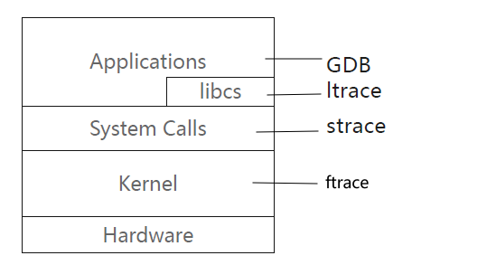
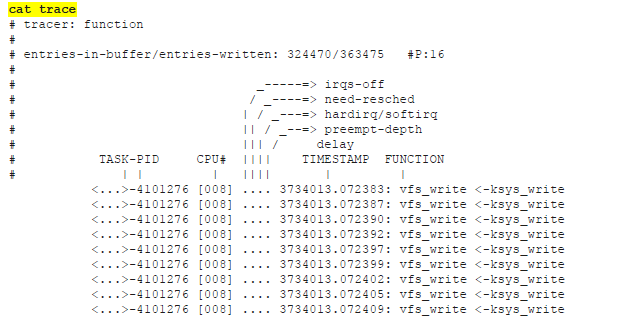
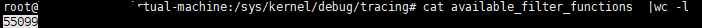
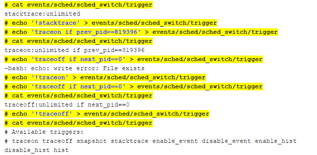
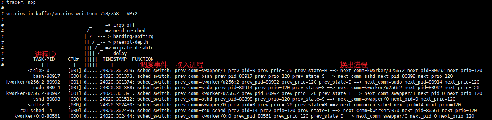

# ftrace跟踪技术

Owner: -QVQ-


ftrace 前端工具: trace cmd 

以下所有代码和文件均在/sys/kernel/debug/tracing/路径下进行

多实例跟踪：在不同路径下可以进行不同的跟踪

工具安装：

`apt install trace-cmd`

## 开启和设置跟踪

```bash
//跟踪内核态函数调用
cd /sys/kernel/debug/tracing/           // 进入 ftrace 工作目录
echo 0 > tracing_on                     // 关闭 trace（每次设置之前都先关一下）
echo function > current_tracer          // 设置 trace 类型
echo > trace                            // 清空历史 trace 信息
echo 1 > tracing_on                     // 打开 trace
echo 0 > tracing_on                     // 关闭 trace
head n 50 trace                         // 显示 trace 的前 50 行信息
```

设置trace类型，取决对current_trace这个文件的写入

current_tracer可写入的类型包括（cat available_tracers可查看支持哪些类型）

- `function`：跟踪内核态函数调用，只在函数入口探测，打印函数调用
- `function_graph`：跟踪内核态函数耗时与调用，在函数入口和出口探测，打印函数调用图
- `wakeup`、`wakeup_rt`、`waktup_dl` ：调试从系统被唤醒到被调度到的延时
- `mmiotrace`：跟踪内核中的 memory mapped I/O （外设映射为内存）的访问，比如 GPU ，磁盘等
- `blk`、`blocktrace` ：block 层的一些延时
- `nop`：关闭所有 trace ，但是 event 仍有显示

## 特定函数跟踪

对set_ftrace_filter这个文件的写入

```bash
//只跟踪vfs write 函数

1.进入 ftrace 工作目录：
cd /sys/kernel/debug/tracing
2.查看系统支持的 tracer 类型：
cat available_tracers
hwlat blk mmiotrace function_graph wakeup_dl wakeup_rt wakeup function nop
3.关闭 tracer
echo 0 > tracing_on
4.设置 tracer 类型为 function
echo function > current_tracer
5.set_ftrace_filter 表示要跟踪的函数
只跟踪vfs write 函数 不设置会跟踪所有内核函数
echo vfs_write > set_ftrace_filter
6.使能 tracer
echo 1 > tracing_on
7.关闭 tracer
echo 0 > tracing_on
8.提取 trace 结果：
cat trace
```


## 动态函数跟踪

主要包含对以下几个文件的修改：

- set_ftrace_filter：只跟踪这些函数
- set_ftrace_notrace：不追踪这些函数（优先级高于set_ftrace_filter）
- set_graph_function：设置要清晰显示调用关系的函数（在使用 function_graph 跟踪器时使用）
- set_ftrace_pid：指定跟踪的进程ID

可通过查看available_filter_functions这个文件查看支持对哪些函数可作上面的操作

用 cat available_filter_functions |wc -l 可看到支持约50000个函数


## Function Triggers 详细配置

Format: `<function>:<trigger>[:count]`（count可选，默认一直跟踪）

trigger:

 traceon , traceoff
enable_event:`<system>:<event>`
disable_event:`<system>:<event>`
stacktrace
snapshot
dump
cpudump

例:  

开启跟踪： echo'vfs_write:stacktrace:10' > set_ftrace_filter

当跟踪到函数vfs_write时执行stacktrace，跟踪10次

关闭跟踪： # echo‘!vfs_write:stacktrace:10’ > set_ftrace_filter（如果上面写了【count】关闭跟踪也要有）

trigger的输入支持使用通配符



## events跟踪

trace event 就是利用 ftrace 框架，实现低性能损耗，对执行流无影响的一种信息输出机制。相比 printk trace event
•不开启没有性能损耗
•开启后不影响代码流程
•不需要重新编译内核即可获取 debug 信息

系统支持的所有trace event 都位于 /sys/kernel/debug/tracing/events

```bash
1.关闭 tracer ，清空 trace
 echo 0 > tracing_on
 echo > trace
2.设置 tracer 类型为 function
 echo nop > current_tracer
3.跟踪任务切换事件 /sys/kernel/debug/tracing/events/sched/sched_switch
 echo 1 > /sys/kernel/debug/tracing/events/sched/sched_switch/enable
4.使能 tracer
 echo 1 > tracing_on
 。。。
 echo 0 > tracing_on
5.提取 trace 结果
 cat trace
```

trace结果：


## 动态函数和事件 跟踪

```bash
#函数和事迹跟踪结合，跟踪中断调度过程
1.关闭 tracer ，清空 trace
 echo 0 > tracing_on
 echo > trace
2.设置跟踪器类型
 echo function_graph > current_tracer
3.设置 函数过滤类型：
 echo '_common_interrupt' > set_ftrace_filter
4.设置中断跟踪
echo 1 > events/irq/irq_handler_entry/enable
5.使能 tracer
 echo 1 > tracing_on
 。。。
 echo 0 > tracing_on
6.提取 trace 结果
 cat trace
```

## ftrace 前端工具: trace cmd

安装：apt install trace-cmd

trace-cmd command [options] ……

### command:

`start -p function`:启用函数追踪器

`start -p function_graph`：启用函数事件追踪器

`start -p function_graph --max-graph-depth 5`调整追踪以增加深度

`record -l ext4_* -p function_graph`追踪特定函数

`show` ：查看输出trace

`stop`:停止追踪

`clear：`清除缓存

`list -t`：列出可用的追踪器

`list -f`了解可被追踪的函数