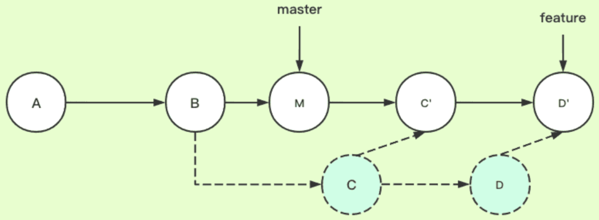

# git

Owner: -QVQ-

**`git init` 创建git仓库**

**`git push origin <branch>` 将分支推送到远程**

`git config —list` 查看当前仓库的信息

免密码配置git pull

`git config --global credential.helper store`

git show 展示最近一次commit的内容

# 拉代码

`git clone 路径 --recurse-submodules -b 指定分支`

`git pull --rebase`

通常，当你拉取远程分支中的更改时，Git 会在本地创建一个新的合并提交来合并本地分支和远程分支的更改。但是，如果你使用 `git pull --rebase` 命令，Git 会将本地分支的更改暂时存储起来，然后将本地分支设置为与远程分支的最新更改相同。然后，Git 会将你之前暂存的更改应用到最新更改之上，以创建一个新的提交，这样就避免了创建一个合并提交。这有助于保持提交历史更加干净整洁，也可以减少合并冲突。

`git clone --depth 1` 

`--depth` 选项指定要包含的最近提交数，而 `1` 表示只包含最近的一次提交。这对于克隆有着长时间历史的大型仓库非常有用，因为它可以大大减少克隆仓库所需的时间和带宽。但是，这也意味着克隆的副本中将不包含完整的仓库历史记录。

# 分支管理

`git branch 分支名` 创建分支

`git branch -d (branchname)` 删除分支

**`git checkout master` 切换分支**

`git branch` 查看本地分支

`git branch -r` 查看远程分支

`git checkout -b 分支名` 创建分支并切换过去

对本地修改时多个分支都能看到修改，但是在一个分支提交了修改的内容后，切换分支时，提交了的修改的内容只在那个分支可见，没有提交的修改的内容多个分支都可见

`git checkout -b local_branch_name origin/remote_branch_name` 绑定本地分支和远程分支

`git merge 需要合并的分支` 将分支的内容合并到当前分支，并不会删除分支

`git push origin --delete <分支名>` 删除远程分支

`git fetch origin 远程分支名:本地分支名` 获取远程分支

`git merge a分支 b分支` 将a分支的内容合并到b分支，并不会删除a分支。

## 合并冲突

git merge时出现当前分支和合并分支修改不一致

`git diff` 查看冲突位置

修改冲突的文件内容

`git add .`

`git commit` 提交

`git diff` 是一个命令，它可以显示工作目录和暂存区之间的差异，或者显示暂存区和指定提交之间的差异。它可以用于查看提交之前对文件所做的更改，或者比较文件的不同版本。该命令可以与各种选项一起使用，以自定义输出格式或限制比较范围。

`git status` 是一个命令，用于显示工作目录和暂存区的状态。它显示哪些文件已被修改，哪些文件已经被暂存，以及哪些文件没有被 Git 追踪。它还显示当前的分支以及该分支是否与远程仓库保持同步。

# 提交

`git add .`

`git commit -m “提交文本”`

`git log -n` 查看前n条commit提交

`git push <远程主机名> <本地分支名>:<远程分支名>` 分支名相同可以省略：和后面的的内容

要修改最近一次提交的信息，可以使用 `git commit --amend -m "新的提交信息"` 命令。

`git show` 命令可以显示某个提交的详细信息

如果要查看某个特定提交的信息，可以在命令后面加上该提交的哈希值

# 管理远程仓库

- `git remote`：列出当前仓库中已配置的远程仓库。
- `git remote -v`：列出当前仓库中已配置的远程仓库，并显示它们的 URL。
- `git remote add <remote_name> <remote_url>`：添加一个新的远程仓库。指定一个远程仓库的名称和 URL，将其添加到当前仓库中。
- `git remote rename <old_name> <new_name>`：将已配置的远程仓库重命名。
- `git remote remove <remote_name>`：从当前仓库中删除指定的远程仓库。
- `git remote set-url <remote_name> <new_url>`：修改指定远程仓库的 URL。
- `git remote show <remote_name>`：显示指定远程仓库的详细信息，包括 URL 和跟踪分支。

# rebase变基

`git log --all --retty=oneline --abbrev-commit --graph` 以可视化的方式显示分支版本信息

从两个分支的共同祖先开始提取待变基分支上的修改，然后将待变基分支指向基分支的最新提交，最后将刚才提取的修改应用到基分支的最新提交的后面。


- feature：待变基分支、当前分支
- master：基分支、目标分支

结合例子解释：当在feature分支上执行git rebase master时，git会从master和featuer的共同祖先B开始提取feature分支上的修改，也就是C和D两个提交，先提取到。然后将feature分支指向master分支的最新提交上，也就是M。最后把提取的C和D接到M后面，实际是会依次拿M和C、D内容分别比较，处理冲突后生成新的C’和D’。这里新C’、D’和之前的C、D已经不一样了，是我们处理冲突后的新内容，feature指针自然最后也是指向D’

在当前分支执行`git rebase 其他分支` 将其他分支rebase到当前分支，如果有冲突，解决冲突后`git add .` 再`git rebase --continue`

rebase的问题：**往公共分支上合代码**如果使用rebase，那么其他开发人员想看主分支的历史，就不是原来的历史了。（举个例子解释下，比如张三和李四从共同的节点拉出来开发，张三先开发完提交了两次然后merge上去了，李四后来开发完如果rebase上去（注意，李四需要切换到自己本地的主分支，假设先pull了张三的最新改动下来，然后执行<git rebase 李四的开发分支>，然后再git push到远端），则李四的新提交变成了张三的新提交的新基底，本来李四的提交是最新的，结果最新的提交显示反而是张三的，就乱套了，以后有问题就不好追溯了）因此用merge好于用rebase

pthread_ 和篇pthread_rwlock

thread

# 版本回退

`git reset --hard 版本号` 

`git push -f` 如果不加-f会报错认为本地版本比远程版本老，加-f强制更新

mixed(默认模式)，`get reset <commit-id>` 清除add的内容，不回退代码

`get reset --soft <commit-id>`清除commit的内容，不回退代码

`get reset --hard <commit-id>`回退到这个版本，包括代码

mixed 模式在回到 `d855a71d5` 之后，之前修改的记录在工作区soft 模式在回到 `d855a71d5` 之后，之前修改的记录还在暂存区，可以直接 `commit` 到版本库中hard 模式最彻底，彻底恢复 `d855a71d5` ，之前修改的记录全部丢失

# 建立追踪关系

`git branch --set-upstream-to=<远程主机名>/<远程分支名> <本地分支名>` 本地分支追踪远程分支

`git push -u <远程主机名> <本地分支名>` 将当前分支追踪到远程分支

`git checkout -b <本地分支名> <远程主机名>/<远程分支名>`

`git branch -vv` 查看追踪关系

# git文件结构

`.gitignore`文件

有些文件不应该提交到Git仓库中，例如：

- 包含敏感信息的文件，例如密码、API密钥和私钥
- 编译后的二进制文件和目标文件
- 日志文件和备份文件
- 不必要的大型媒体文件

为了避免将这些文件提交到仓库中，你可以将它们添加到中，该文件列出了应从仓库中排除的文件和目录。

`.gitattributes`：该文件可以配置文件的属性，例如文本文件的换行符或二进制文件的diff算法。

`.gitconfig`：该文件包含全局git配置，例如用户信息和别名。（/root路径下有个用户名和邮箱的配置，.git路径下也有一个关于仓库信息的）

`.gitmodules`：该文件可以配置一个项目中的子模块，以便它们可以与主项目分开管理。

在`.git`目录下，你可能会找到以下一些文件和目录，它们的作用如下：

- `HEAD`: 指向你正在工作的当前分支或提交
- `objects/`: 存储存储库中所有对象（提交、树、Blob）
- `refs/`: 存储对提交的所有引用，包括分支和标签
- `config`: 存储存储库特定的配置设置
- `description`: GitWeb描述文件，用于描述存储库
- `hooks/`: 包含客户端或服务器端挂钩脚本的目录
- `info/`: 包含有关存储库的信息，例如Gitignore和属性文件的排除模式
- `logs/`: 存储各种日志，包括reflog和提交日志的目录
- `index`: 存储下一次提交的树对象的内容的二进制文件
- `packed-refs`: 存储所有已打包（压缩）的引用的文件
- `refs/heads/`: 存储对存储库中所有分支的头的引用的目录
- `refs/tags/`: 存储对存储库中所有标签的引用的目录
- `config`: 存储Git目录根目录下的配置文件
- `.gitignore`: 列出提交到存储库时要忽略的文件和目录的文件。
- `.gitattributes`: 为路径和文件设置属性的文件。
- `.gitmodules`: 定义存储库的子模块的文件。

**撤销推送：**`git push -f <remote> <branch>`命令将旧的提交强制推送到分支中，从而撤销推送。通常最好使用`git revert <commit>`来撤销推送所做的更改，创建一个新的提交来撤销推送所做的更改。

# 子模块

更新子模块

```sql
进入子模块
git pull 子模块所在路径
再提交即可
```