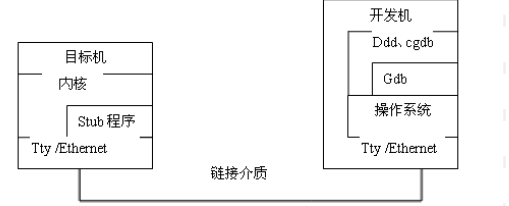
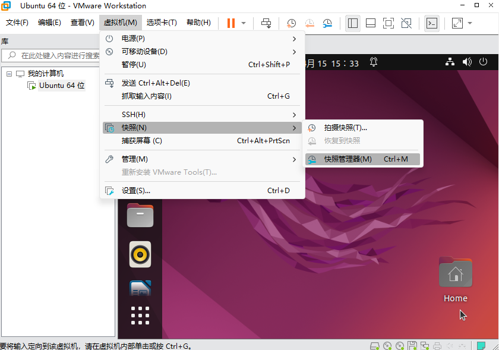
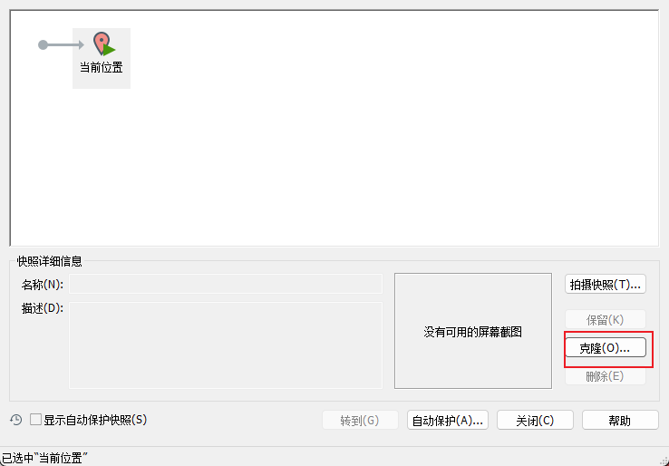

# kgdb

Owner: -QVQ-

提供了一种在开发机上使用gdb调试以源码级目标机

需要使用两台linux

**目标机**或称target、服务器，运行**kgdb**

**开发机**，或称host、客户端，运行**gdb**

两台机器使用串口相连，也可以使用网络相连

被调试的内核运行在目标机上，需要调试时启动kgdb，将控制权交给kgdb，等待开发机来连接，因此是一个服务器

开发机使用gdb连接目标机的kgdb，发送调试命令，因此是客户端

**环境搭建**

第一步：编译内核，要尽量去优化编译

makefile中-O2变成-O1，

不设置CONFIG_CC_OPTIMIZE_FOR_SIZE,否则使用-Os

设置CONFIG_DEBUG_SECTION_MISMATCH。相当于-fno-inline-functions-called-once避免inline优化

- 第二步：利用VMWare clone虚拟机
  
    需要先关闭虚拟机

    
- 第三步：为两个系统配置串口