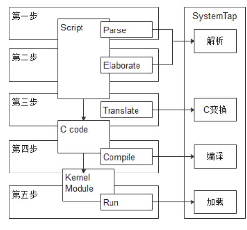
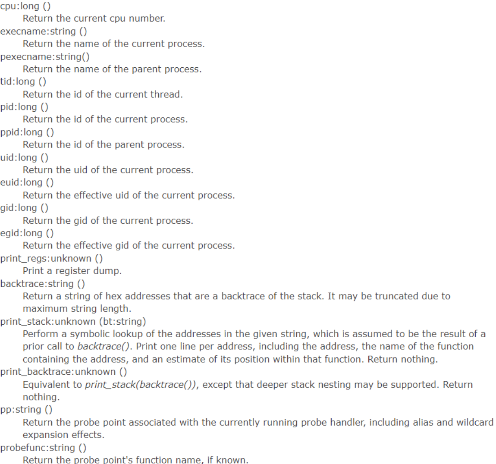
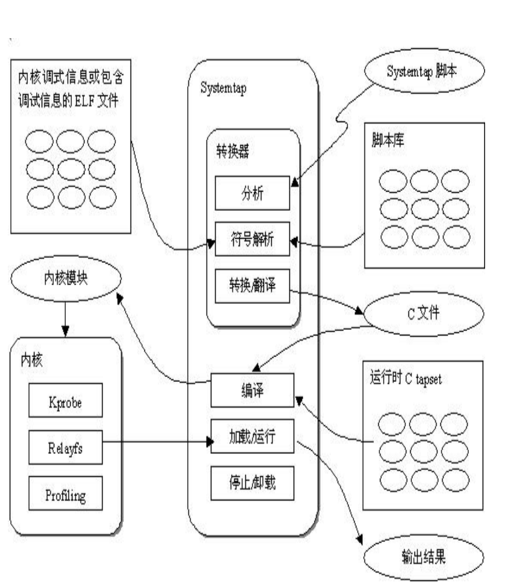

# systemtap

Owner: -QVQ-

systemtap 脚本文件是 .stp 后缀的文件

Systemtap 的处理流程有5个步骤：
• 解析 script 文件(Parse)
• 细化（Elaborate）//结合语义作优化+链接
• Script 文件翻译成 C 语言代码（Translate）
• 编译 C 语言代码（生成内核模块）（Compile）
• 加载内核模块（Run


### **命令行指令：**

stap [参数] ‘表达式’      (支持通配符)

参数：

- -e 以脚本运行后面的指令
- -v 显示调试信息（-vvv 显示更多）
- -l PROBE List matching probes.
- -L PROBE List matching probesand local variables.
- -g Guru mode
- -D NM=VAL emit macro definition into generated C code
- -o【文件名】： 讲命令行输出的内容写入到指定文件内
- -x 【PID】 ：将进程ID发给target函数内

### **脚本语法：**

执行脚本：stap  文件路径/文件名

**probe probe-point { statement }**

**probe:：**探测，是 systemtap 进行具体地收集数据的关键字。

**“probe point”：**是 probe 动作的时机，也称探测点，是 probe 程序监视的某事件点，一旦侦测的事件触发了，则 probe 将从此处插入内核或者用户进程中。

**“probe handler”：**是当 probe 插入内核或者用户进程后所做的具体动作。

- 内核态函数
kernel.function(PATTERN)
kernel.function(PATTERN).call//调用时触发
kernel.function(PATTERN).return//返回时
kernel.function(PATTERN).return.maxactive(VALUE)//限定返回VALUE次时
kernel.function(PATTERN).inline
kernel.function(PATTERN).label(LPATTERN)//出现goto语句时

**probe point：**

- //内核态模块
module(MPATTERN).function(PATTERN)
`module(“ext3”).function(“*”)` //表示对 ext3 内核模块的所有函数进行探测
module(MPATTERN).function(PATTERN).call
module(MPATTERN).function(PATTERN).return.maxactive(VALUE)
module(MPATTERN).function(PATTERN).inline
- //内核态事件
  kernel.statement(PATTERN)
  
    `kernel.statement("cmdline_proc_show@fs/proc/cmdline.c:9")` //表示对 cmdline_proc_show 函数中的 //fs/proc/cmdline.c 文件的第9行进行探测
  
    kernel.statement(ADDRESS).absolute
    module(MPATTERN).statement(PATTERN)
  
- //用户态进程
process(PROCESSPATH).function(PATTERN)
`process("/home/tianyu/chmod").function("GetUidGid")` //表示对用户态程序 /home/tianyu/chmod 的函数 GetUidGid 进行探测
process(PROCESSPATH).function(PATTERN).call
process(PROCESSPATH).function(PATTERN).return
process(PROCESSPATH).function(PATTERN).inline
process(PROCESSPATH).statement(PATTERN)

```c
#!/usr/bin/stap
probe begin
{
log("begin probe")
}
probe kernel.function("vfs_write").call 
{
printf("%s(%d) vfs_write (%s)\n",execname(),pid(),print_regs())
print_backtrace()
}
probe timer.ms(5000)#5s later
{
log("probe exit")
exit()
}
probe end
{
log("end probe")
}
```

### **脚本控制语句：**

if/else、while、for/foreach、
break/continue、return、next、delete、
try/catch

### **内置函数：**


target()：在调用这个脚本文件时可通过-c 【命令|pid】传入参数给target

```c
//文件：test.stp
probe syscall.* {
 if (pid() == target())
 printf("%s\n", name)
}
//使用：stap test.stp -c 8323
//功能：当有进程id为8323时输出name
```

### **跟踪调用栈和入参：**

用户态：
• print_ubacktrace()//直接输出
• sprint_ubacktrace()//返回堆栈字符串
内核态：
• print_backtrace()
• sprint_backtrace()

### **跟踪数据结构：**

目标变量：

语法：probe probe-point $局部变量名1：变量类型 1 $局部变量名2：变量类型 2 ……  {}

如果里面有结构体嵌套就要加两个$$（几次嵌套几个$）

例：`kernel.function("vfs_read@fs/read_write.c:277") $file:struct file* $buf:char* $count:size_t$pos:loff_t*`

可以对内核中`vfs_read@fs/read_write.c`文件内第277行代码里的变量进行监控

```c
probe kernel.function("do_filp_open")
{
	printf("\r\n#TRACE#pathname = %s.\r\n",$pathname$)
	print_backtrace()
}
```

如果这变量不是函数内的局部变量（全局变量或其他文件定义的），则

“@var("varname@src/file.c")”

```c
probe kernel.function("vfs_read") {
 printf ("current files_stat max_files: %d\n",
			 @var("files_stat@fs/file_table.c")->max_files);
 exit(); }
//输出跟踪vfs_read函数里的结构体变量files_stat（在./file_table.c里）里的max_files参数
//注意结构体和指针 都用->访问，而不是.访问
```

systemtap 基本思想是命名事件，并为它们提供处理程序。
每当发生指定的事件时，内核都会将处理程序视为子例程运行，
然后继续运行。处理程序是一系列脚本语言语句，用于指定事
件发生时要完成的工作。
systemtap 基本原理是将脚本翻译成 C 语言，执行 C 编译
器创建一个内核模块。当模块被加载后，通过挂载到内核来激
活所有的探测事件。然后，当事件发生在任何处理器上时，编译后的处理程序就会运行。最终，systemtap 会话停止，hook 取消，内核模块被移除，整个过程由命令行程序 stap 驱动。


用户手册
[https://sourceware.org/systemtap/documentation.html](https://sourceware.org/systemtap/documentation.html)

典型应用场景库 193个
[https://sourceware.org/systemtap/examples/](https://sourceware.org/systemtap/examples/)

```
#!/usr/bin/stap

# 这里核心的想法就是通过systemtap 找到malloc, realloc 返回的地址, 可以通过systemtap 里面的$return 来获得, 并记录, 然后再记录free 的时候是否对这些地址进行过free. 可以通过 $ptr 来获得. 具体的systemtap 用法可以看官网

probe begin
{
  log("begin to probe\n")
}

# 对某一个地址调用的malloc, free的次数. 
# 如果 = 0, 说明正常free掉, 
# 如果 = 1, 说明malloc, 但是还没被free
# 如果 > 1, 说明这个地址被多次给malloc返回给用户, 肯定不正常
# 如果 < 1, 说明这个地址被多次free 也就是我们常说的double free 问题
global g_cnt
# 用来记录前一次调用的时候的 ubacktrace 信息
global g_stack
# 用来记录上次操作的时间
global g_time

# 每一次malloc, realloc 最后都会调到glic 里面的__libc_malloc, __libc_calloc
probe process("/usr/local/pika22/lib/libtcmalloc.so.4").function("__libc_malloc").return, process("/usr/local/pika22/lib/libtcmalloc.so.4").function("__libc_calloc").return

{
    if (tid() == 11808) {
            g_cnt[$return]++
            g_stack[$return] = sprint_ubacktrace()
            g_time[$return] = gettimeofday_s()
    }
}

probe process("/usr/local/pika22/lib/libtcmalloc.so.4").function("__libc_free") {
    if (tid() == 11808 && g_time[$ptr] != 0) {
    # 这里对于之前没有进行过处理的节点忽略
    g_cnt[$ptr]--
    # 正常的malloc free 分支
        if (g_cnt[$ptr] == 0) {
            if ($ptr != 0) {
                printf("A normal malloc and free\n")
                g_stack[$ptr] = sprint_ubacktrace()
            }
      # 可能出现的double free 分支
        } else if (g_cnt[$ptr] < 0 && $ptr != 0) {
                printf("double free problem address %d cnt %d\n", $ptr, g_cnt[$ptr])
                printf("%s\n", g_stack[$ptr])
                printf("the destructure \n")
                print_ubacktrace() 
      # 多次malloc 返回同一个地址的分支, 这种情况很少见
        } else if (g_cnt[$ptr] > 1 && $ptr != 0) {
            printf("malloc large than 0\n")
            print_ubacktrace()
        }
    }
}

## probe timer.s(5) { foreach (mem in g_cnt) { # 这里可以根据定义来调整这个10 的大小, 也就是说这里想打印出 10s 之前申请过内存 # 但是 10s 之内没有被free 的情况, 这里因为 pika 在短连接的时候都是10之内申请 然后就释放 # 如果10s 之内没有释放, 那肯定就是内存出现了问题 if (g_cnt[mem] > 0 && gettimeofday_s() - g_time[mem] > 10) { printf("\n\n%s\n\n", g_stack[mem]) } }
}
```
[https://blog.51cto.com/u_15057819/2647629](https://blog.51cto.com/u_15057819/2647629)