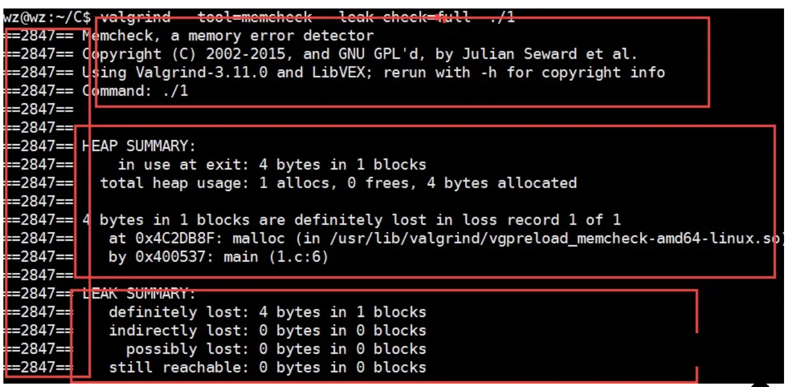

# valgrind

Owner: -QVQ-

由内核及基于内核的其他调试工具组成，它模拟了一个CPU环境，并提供服务给其他工具。其他工具类似于插件，利用内核提供的服务完成特定的内存调试任务

工具包含：

1. Memcheck 重量级的内存检查器
2. Callgrind 检查函数调用
3. Cachegrind 检查程序缓存
4. Helgrind 检查多线程的竞争
5. Massif 检查堆栈使用
6. Extension 自己编写特定内存调试工具

内存检查原理

其建立了两个全局表

Valid-Value 表：

对于进程的整个地址空间中的每一个字节(byte)，都有与之对应的 8 个 bits；

对于 CPU 的每个寄存器，也有一个与之对应的 bit 向量。

这些 bits 负责记录该字节或者寄存器值是否具有有效的、已初始化的值。

Valid-Address 表

对于进程整个地址空间中的每一个字节(byte)，还有与之对应的 1 个 bit，负责记录该地址是否能够被读写。

检测原理

当要读内存的某个字节，先检测其对应的Abit，显示该位置无效，则报读写错

memcheck 会检查对应的V bits，如果该值尚未初始化，则会报告使用未初始化内存错误。

使用

`valgrind [valgrind-options] your-prog [your-prog-options]`

gcc时加上-O0 -g

Valgrind 默认的工具就是 memcheck，也可以通过“`--tool=tool name`”指定其他的工具

执行命令：`valgrind --tool=memcheck --leak-check=full ./1`


得到的输出：

1.左边显示类似行号的数字（2847）表示的是 Process ID

2.最上面的红色方框表示的是 valgrind 的版本信息

3.中间的红色方框表示 valgrind 通过运行被测试程序

4.最下面的红色方框是对发现的内存问题和内存泄露问题的总结

对于其中的警告信息：

```cpp
==7069== Invalid write of size 4
==7069==    at 0x401144: f (membase.c:5)
==7069==    by 0x401155: main (membase.c:9)
```

表示越界访问

```cpp
==7069== 40 bytes in 1 blocks are definitely lost in loss record 1 of 1
```

表示堆空间申请了没有释放

```cpp
==7274== Conditional jump or move depends on uninitialised value(s)
==7274== at 0x40110E: main (memuninitvar.c:7)
```

表示使用了未初始化的变量

竞争条件检测

1. 错误使用POSIX pthreads API
2. 潜在的死锁问题
3. 数据竞争：在没有获得锁的情况下访问数据

`valgrind --tool=helgrind ./helbase`

```cpp
==7507== Possible data race during read of size 4 at 0x404030 by thread #1
==7507== Locks held: none
==7507==    at 0x401177: main (helbase.c:13)
==7507==
==7507== This conflicts with a previous write of size 4 by thread #2
```

表示在没有加锁的情况下，两个线程同时读写了同一变量