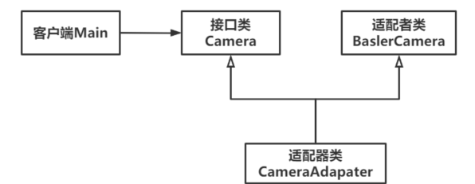

# Adapter（适配器模式、包装模式）

Owner: -QVQ-

结构性

将相对复杂的功能（可能用到多个类）封装起来，提供一个使用者想要的接口，使用者只需要调用接口，不需要知道接口里封装的内容是如何实现的。

个人工作中经常能用到适配器模式，比如在面对一些第三方库或者SDK开发时，它们的接口往往与我们自己想要的接口不一致，此时适配器模式可以很好地扮演一个接口转换器的角色，将别人的接口与我们的接口对应上。

**优点：**

- 良好封装性。接口内的内容对使用者而言是透明的，即看不见，这确保了内部功能具备较好的封装性，不易被改动。
- 解耦。不匹配的两方在适配器的作用下可以做到解耦，不需要修改任何一方原有代码逻辑。
- 良好复用性。适配的两方不需要做任何修改，业务的实现可以通过适配器来完成，不同的业务可以使用不同的适配器。
- 良好扩展性。若要增加业务场景，只需要增加适配器类，来满足业务即可。

**缺点：**

1. **不利于维护**。因为业务的实现基于适配器完成，适配器中代码的复杂程度会越来越高，不熟悉业务或者底层逻辑的人难以短时间内接手维护。
2. **系统结构易混乱**。当业务量快速增加时，适配器类的数量也会快速增加，没有良好的系统架构布局，最终会使得整个系统臃肿且危险。

**类适配器模式：**适配器类通过继承适配者类（多重继承），达到适配目的，部分语言可能不支持多重继承（如C#）。

**对象适配器模式：**适配器类中存放适配者类的实例对象，调用它来达到适配目的，该模式较常用。


代码：

相机类（适配者）：

```cpp
//相机类（适配者）
class BaslerCamera
{
public:
	// 打开相机
	void openBaslerCamera() {
		cout << "巴斯勒相机：打开相机。" << endl;
	}
	// 关闭相机
	void closeBaslerCamera() {
		cout << "巴斯勒相机：关闭相机。" << endl;
	}
	// 打开曝光设置
	void openExposureSettings() {
		cout << "巴斯勒相机：打开曝光设置。" << endl;
	}
	// 更改相机帧率
	void changeCameraFrame() {
		cout << "巴斯勒相机：更改相机帧率。" << endl;
	}
```

相机接口类：

```cpp
//相机接口类
class Camera
{
public:
	// 构造函数
	Camera() {};
	// 析构函数
	virtual ~Camera() {};
	// 打开相机
	virtual void openCamera() = 0;
	// 关闭相机
	virtual void closeCamera() = 0;
	// 配置属性
	virtual void setConfig() = 0;
};
 
// 相机适配器类
class CameraAdapter :public Camera, public BaslerCamera
{
public:
	// 打开相机
	virtual void openCamera() {
		openBaslerCamera();
	}
	// 关闭相机
	virtual void closeCamera() {
		closeBaslerCamera();
	}
	// 配置属性
	virtual void setConfig() {
		// 打开曝光设置
		openExposureSettings();
		// 更改相机帧率
		changeCameraFrame();
	}
};
```

```cpp
int main(){
	Camera *m_camera = new CameraAdapter();
	// 打开相机
	m_camera->openCamera();
	// 配置相机
	m_camera->setConfig();
	// 关闭相机
	m_camera->closeCamera();
	delete m_camera;
	return 0;
}
```