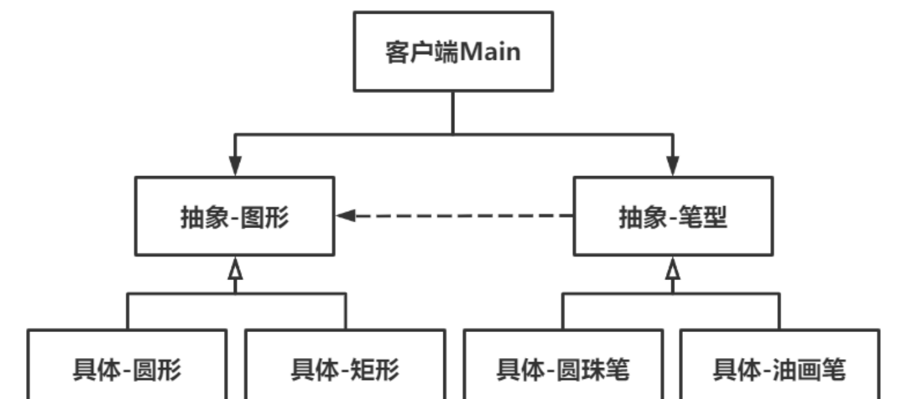

# Bridge桥接模式

Owner: -QVQ-

结构性的设计模式

将抽象部分和实现部分分离，使他们可以独立的变化

对一个笔，10个颜色和10个类型，比起全匹配的100个实例，通过组合的形式获取目标

**优点：**

1. **扩展性好**。抽象与实现分离，扩展起来更便捷，可以获得更多样式的目标。
2. **解耦**。不同抽象间的耦合程度低。
3. **满足设计模式要求的合成复用原则和开闭原则**。
4. **封装性好**。具体实现细节对客户而言是透明不可见的。

桥接模式的缺点：

1. **使用场景有限制**。只有系统有两个以上独立变化维度时才适用。


代码：

```cpp
// 抽象类-图形
class Figure
// 具体实现类-圆形
class Circle :public Figure
// 具体实现类-矩形
class Rectangle :public Figure
```

```cpp
// 抽象类-笔
class Pen
{
public:
	// 构造函数
	Pen(Figure *figure){
		m_figure = figure;
	}
	string getColor() 
	draw()
}
// 具体实现类-圆珠笔
class BallPen :public Pen
// 具体实现类-油画笔
class OilPen :public Pen
```

main函数

```cpp
Figure *figure1 = new Circle();
	figure1->setSize(20);
	Pen *pen1 = new BallPen(figure1);
	pen1->setColor("黑色");
	pen1->draw();
```