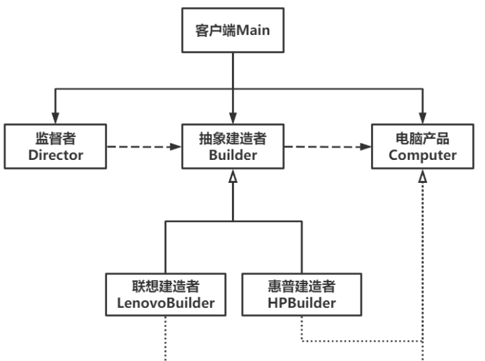

# Builder建造者模式

Owner: -QVQ-

创建型

建造者模式可以将复杂对象的构建与它的表示分离，使得相同的构建过程可以得到不同的表示。

如果说[工厂模式](https://so.csdn.net/so/search?q=%E5%B7%A5%E5%8E%82%E6%A8%A1%E5%BC%8F&spm=1001.2101.3001.7020)和抽象工厂模式更注重产品整体，那建造者模式则更在乎产品的组成和细节。

优点：

- 封装性好。有效地**封装了建造过程**（主要业务逻辑），使得系统整体的稳定性得到了一定保证。
- 解耦。**产品本身和建造过程解耦**，相同的建造过程可以创建出不同的产品。
- 产品建造**过程精细化**。该模式注重产品创建的整个过程，将复杂的步骤拆解得到多个相对简单的步骤，使得系统流程更清晰，且对细节的把控更精准。
- **易于扩展**。如果有新产品需求，只需要添加一个建造者类即可，不需要改动之前的代码，符合开闭原则。

缺点：

- 产品的组成部分和构建过程要一致，限制了产品的**多样性**。
- 若产品内部有**结构上的变化**，则整个系统都要进行大改，增加了后期维护成本。


产品类：

```cpp
class Computer
{
public:
	// 获取电脑信息
	void getComputer() {
		cout << "电脑产品配置为：" << endl;
		cout << " 处理器：" << getCPU() << endl;
		cout << " 显  卡：" << getGPU() << endl;
	}
	// 设置处理器
	void setCPU(string cpu){
		CPU = cpu;
	}
	// 设置显卡
	void setGPU(string gpu) {
		GPU = gpu;
	}
		// 获取处理器
	string getCPU() {
		return CPU;
	}
	// 获取显卡
	string getGPU() {
		return GPU;
	
 
private:
	string CPU;                             // 处理器
	string GPU;                             // 显卡
};
```

建造者：

```cpp
class Builder
{
public:
	// 装配CPU
	virtual void addCPU() = 0;
	// 装配GPU
	virtual void addGPU() = 0;
	// 获取电脑产品
	Computer getComputer() {
		return m_computer;
	}
 
protected:
	Computer m_computer;                         // 电脑产品
};
 
// 联想-建造者
class LenovoBuilder : public Builder
{
public:
	// 装配CPU
	virtual void addCPU() {
		m_computer.setCPU("Intel 酷睿i7-8700K");
	}
	// 装配GPU
	virtual void addGPU() {
		m_computer.setGPU("RTX 4050");
	}
};
 
// 惠普-建造者
class HPBuilder : public Builder
{
public:
	// 装配CPU
	virtual void addCPU() {
		m_computer.setCPU("Intel 酷睿i5-6300HQ");
	}
	// 装配GPU
	virtual void addGPU() {
		m_computer.setGPU("GTX 1060");
	}
};
```

监督者：

```cpp
class Director
{
public:
	// 构造函数
	Director(Builder* builder) {
		m_builder = builder;
	}
	// 析构函数
	~Director() {
		if (m_builder != nullptr)
			delete m_builder;
	}
	// 替换建造者
	void setBuilder(Builder *builder) {
		m_builder = builder;
	}
	// 建造
	Computer construct() {
		m_builder->addCPU();
		m_builder->addGPU();
		return m_builder->getComputer();
	}
private:
	Builder *m_builder;                     // 建造者
};
```

主函数：

```cpp
int main()
{
	// 一号建造者-联想
	Builder *builder1 = new LenovoBuilder();
	cout << "联想建造者等待就业。" << endl;
	// 由监督者监督项目启动
	Director *director = new Director(builder1);
	cout << "监督者（项目经理）开始招人做项目。" << endl;
	// 联想项目完毕，获取联想电脑产品
	Computer computer1 = director->construct();
	cout << "联想项目结束。" << endl;
	computer1.getComputer();

	// 二号建造者-惠普
	Builder *builder2 = new HPBuilder();
	cout << "惠普建造者等待就业。" << endl;
	// 替换建造者
	director->setBuilder(builder2);
	cout << "监督者（项目经理）替换建造者，做新项目。" << endl;
	Computer computer2 = director->construct();
	cout << "惠普项目结束。" << endl;
	computer2.getComputer();
	return 0;
}
```

流程：创建一个监督者，传入具体的电脑制造商，监督者调用制造商的接口执行电脑制作的主流程，最后返回电脑的实值。