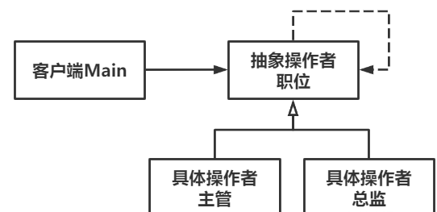

# Chain of Resposibility责任链模式

Owner: -QVQ-

行为型的软件设计模式，对象内存在对下家的引用，层层连接形成了一条责任链，请求的信息在链上传递直到某个对象决定处理该信息

优点：

1. **请求者和接收者松耦合**。请求者只需要发送请求，不关心由谁处理怎么处理；接收者只需要处理自己该处理的，剩下的交给责任链上的其他职责处理。
2. **比较灵活**。责任链上各个职责对象，可以灵活排序或组合，以应对不同场景。

缺点：

1. **性能易受影响**。当责任链过长时，对请求的处理效率不够高。
2. **不一定确保请求完整处理**。每个职责只对自身部分负责，有可能请求走完整个责任链，也没有完全处理。


```cpp
// 抽象操作者-职位
class Job 
{
public:
	// 批准假期
	virtual void approveLeave(int time) = 0;
 
	// 设置领导
	void setLeader(Job* handler) {
		m_leader = handler;
	}
 
protected:
	Job* m_leader = nullptr;
};
 
// 具体操作者-主管
class Manager : public Job 
{
public:
	// 批准假期
	virtual void approveLeave(int time) {
		if (time <= 3) {
			cout << "主管正在处理批假申请。" << endl;
		}
		else if (m_leader != nullptr) {
			m_leader->approveLeave(time);
		}
		else {
			cout << "未有合适领导批准该时长的假期申请。" << endl;
		}
	}
 
};
 
// 具体操作者-总监
class Director : public Job 
{
public:
	// 批准假期
	virtual void approveLeave(int time) {
		if (time <= 7) {
			cout << "总监正在处理批假申请。" << endl;
		}
		else if (m_leader != nullptr) {
			m_leader->approveLeave(time);
		}
		else {
			cout << "未有合适领导批准该时长的假期申请。" << endl;
		}
	}
};
```

抽象操作者有相同的操作接口，对于每一个具体操作者同时保有下一个具体操作者的指针，请求发给第一级具体操作者，根据规则调用第二级操作者，以此对着条线上的所有操作者都通过才行

```cpp
	Job* job1 = new Manager();
	Job* job2 = new Director();
 
	// 设置领导
	job1->setLeader(job2);
 
	// 收到了三份批假申请，分别3、7、10天
	job1->approveLeave(3);
	job1->approveLeave(7);
	job1->approveLeave(10);
```