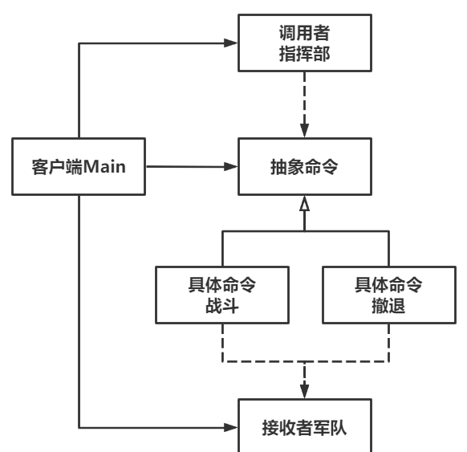

# Command命令模式

Owner: -QVQ-

一种行为型的软件设计模式，行为请求者通过发起命令，使得行为实现者执行命令要求的行为。通常行为请求者和行为实现者之间是强耦合的，而命令模式能很好地将其解耦。

优点：

1. **解耦**。行为请求者和实现者之间的强耦合关系解除。
2. **良好扩展性**。扩展命令只需要添加一个子类即可，满足开闭原则。
3. **有效管理命令**。如记录、撤销、组合等。

缺点：

1. **命令增加，子类数量也增多**。


代码：

```cpp
// 定义接收者-军队
class Army
{
public:
	// 构造函数
	Army(string name) : m_name(name) {
 
	}
 
	// 获取部队名
	string getName() {
		return m_name;
	}
 
	// 行动
	void fight() {
		cout << m_name << "发起冲锋！" << endl;
	}
 
	// 撤退
	void retreat() {
		cout << m_name << "战略撤退！" << endl;
	}
 
private:
	string m_name;
};
```

```cpp
// 定义命令接口
class Command 
{
public:
	// 执行
	virtual void execute() = 0;
};
 
// 定义具体命令-战斗
class FightCommand : public Command
{
public:
	// 构造函数
	FightCommand(Army* army) : m_army(army) {
		cout << "战斗命令部署：" << army->getName() << endl;
	}
 
	// 设置命令执行部队
	void setArmy(Army* army) {
		cout << "战斗命令部署：" << army->getName() << endl;
		m_army = army;
	}
 
	// 执行
	virtual void execute() {
		cout << "战斗执行！" << endl;
		m_army->fight();
	}
 
private:
	Army* m_army;
};
 
// 定义具体命令-撤退
class RetreatCommand : public Command
{
public:
	// 构造函数
	RetreatCommand(Army* army) : m_army(army) {
		cout << "撤退命令部署：" << army->getName() << endl;
	}
 
	// 设置命令执行部队
	void setArmy(Army* army) {
		cout << "撤退命令部署：" << army->getName() << endl;
		m_army = army;
	}
 
	// 执行
	virtual void execute() {
		cout << "撤退执行！" << endl;
		m_army->retreat();
	}
 
private:
	Army* m_army;
};
```

```cpp
// 定义调用者-指挥部
class Headquarters
{
public:
	// 设置命令
	void setCommand(Command* command) {
		m_command = command;
	}
 
	// 执行命令
	void execute_command() {
		m_command->execute();
	}
 
private:
	Command* m_command;
}
```

主函数

```cpp
// 给两支部队分别部署两条命令
	Army* army1 = new Army("独立团");
	Command* command1 = new FightCommand(army1);
	Army* army2 = new Army("钢七连");
	Command* command2 = new RetreatCommand(army2);
 
	// 指挥部发出命令：独立团冲锋、钢七连撤退
	Headquarters* headquarters = new Headquarters();
	headquarters->setCommand(command1);
	headquarters->execute_command();
	headquarters->setCommand(command2);
	headquarters->execute_command();
```

不再通过枚举的方式传入命令，而是通过传入具体类的方式传入 命令，具体类封装了命令的使用调用命令类