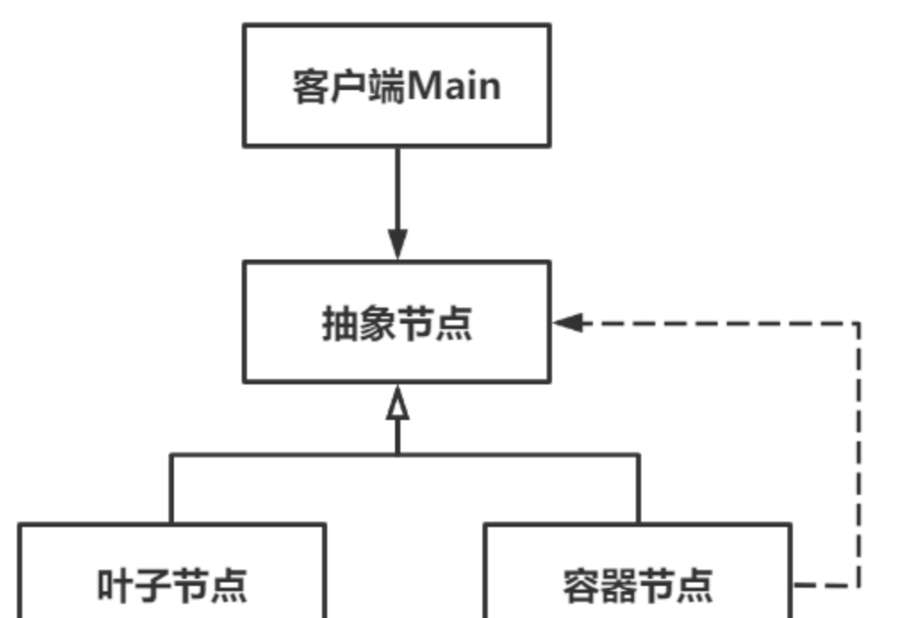
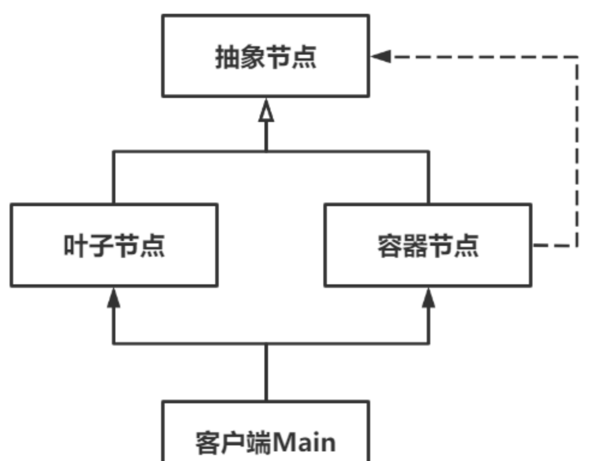

# Composite组合模式

Owner: -QVQ-

结构性软件设计模式

将对象组合成树形结构，以凸显“部分-整体”的层次结构，使客户端对单个对象和组合对象的操作具备一致性。

桥接模式侧重于同级别间的组合，如多个属性的组合，避免了类爆炸；组合模式侧重于部分和整体的组合，避免了单对象和组合对象的区别对待

**优点：**

1. **层次鲜明**。凸显“部分-整体”的层次结构。
2. **一致性**。对叶子对象（单）和容器对象（组合）的操作具备良好一致性。
3. **节点自由度高**。在结构中按需自由添加节点。

**缺点：**

1. **设计更抽象**。
2. **应用场景限制**。

举例：文件系统

## 透明式组合模式

将公共接口封装到抽象节点中，所有节点具备一致行为。


对于外界，容器节点和叶子节点的使用并没有区别，但叶子节点和容器节点不可能有完全一致的行为，需要在实现中做异常判断

违背了接口隔离原则（不需要的接口没有屏蔽）

```cpp
// 抽象类-节点
class Node
{
public:
	// 构造函数
	explicit Node(string name) :m_name(name) {};
 
	// 析构函数
	virtual ~Node() {};
 
	// 添加
	virtual void add(Node *node) {};
 
	// 删除
	virtual void remove(Node *node) {};
 
	// 显示
	virtual void show(int space) {
		for (int i = 0; i < space; i++) {
			cout << "  ";
		}
		cout << m_name << endl;
	}
 
protected:
	string m_name;                                       // 名字
};
 
// 具体类-Word文件
class WordFile :public Node
{
public:
	// 构造函数
	explicit WordFile(string name) :Node(name) {};
 
	// 析构函数
	virtual ~WordFile() {};
 
};
 
// 具体类-文件夹
class Folder :public Node
{
public:
	// 构造函数
	explicit Folder(string name) :Node(name) {};
 
	// 析构函数
	virtual ~Folder() {
		nodeList.clear();
	}
 
	// 添加
	virtual void add(Node *node) {
		nodeList.emplace_back(node);
	}
 
	// 删除
	virtual void remove(Node *node) {
		nodeList.remove(node);
	}
 
	// 显示
	virtual void show(int space) {
		Node::show(space);
		space++;
		for (auto node : nodeList) {
			node->show(space);
		}
	}
 
private:
	list<Node*> nodeList;                                // 节点列表
};
```

## 安全式组合模式

各层次差异较大，使用不同操作时建议采用该模式。

抽象类中只规定基础操作，而叶子和容器各自独有的操作将放在自身中完成


```cpp
// 抽象类-节点
class Node
{
public:
	// 构造函数
	explicit Node(string name) :m_name(name) {};
 
	// 析构函数
	virtual ~Node() {};
 
	// 显示
	virtual void show(int space) = 0;
 
protected:
	string m_name;                                       // 名字
};
 
// 具体类-Word文件
class WordFile :public Node
{
public:
	// 构造函数
	explicit WordFile(string name) :Node(name) {};
 
	// 析构函数
	virtual ~WordFile() {};
 
	// 显示
	virtual void show(int space) {
		for (int i = 0; i < space; i++) {
			cout << "  ";
		}
		cout << m_name << endl;
	}
};
 
// 具体类-文件夹
class Folder :public Node
{
public:
	// 构造函数
	explicit Folder(string name) :Node(name) {};
 
	// 析构函数
	virtual ~Folder() {
		nodeList.clear();
	}
 
	// 添加
	void add(Node *node) {
		nodeList.emplace_back(node);
	}
 
	// 删除
	void remove(Node *node) {
		nodeList.remove(node);
	}
 
	// 显示
	virtual void show(int space) {
		for (int i = 0; i < space; i++) {
			cout << "  ";
		}
		cout << m_name << endl;
		space++;
		for (auto node : nodeList) {
			node->show(space);
		}
	}
 
private:
	list<Node*> nodeList;                                // 节点列表
};
```

在上述示例中，客户端无法直接使用抽象节点了，因为抽象节点中没有add和remove的操作，但这样更安全了，叶子和容器不会调用对方的功能进而触发异常。

该模式违背了**依赖倒置原则**（程序设计要依赖于抽象接口，不要依赖于具体实现）