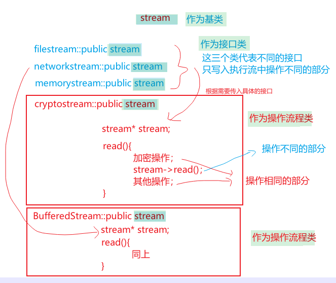
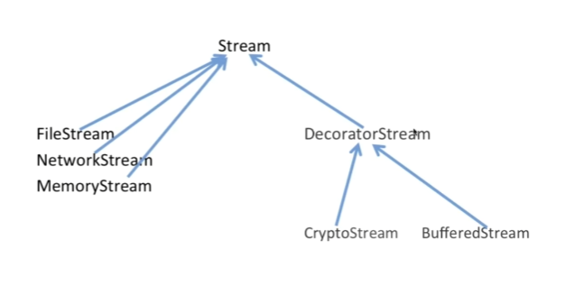
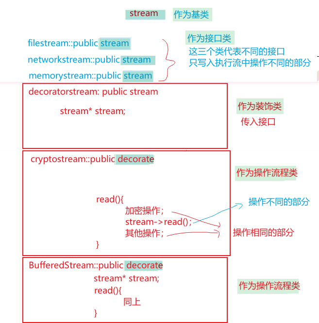
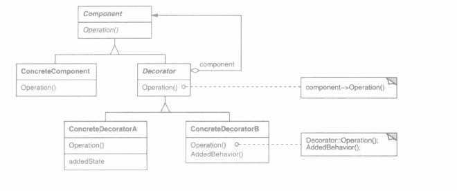

# Decorator装饰者

Owner: -QVQ-

结构型

允许向一个现有的对象添加新的功能，同时又不改变其结构

这种模式创建了一个装饰类，用来包装原有的类，并在保持类方法签名完整性的前提下，提供了额外的功能。

有时我们希望给某个对象而不是整个类添加一些功能。例如，一个图形用户界面工具箱允许你对任意一个用户界面组件添加一些特性（例如边框），或是一些行为（例如窗口滚动）。

继承是一个方法，但不够灵活，因为边框的选择是静态的，用户不能控制对组件加边框的方式和时机

**问题**：


这其中产生了大量的继承类，在第三排中的类其中只有放入缓存是不相同的，加密是相同的，过度地使用继承来扩展对象的功能”。

实际上，加密并不是对文件类的继承，而是对其在不同方向上的拓展

**目的**：动态（组合）地给一个对象增加一些额外的职责

我们可以将组件嵌入到另一个对象中，由这个对象添加边框，即装饰

**改进**：将继承变为组合


此时由上面的1+3+9个类，变成了只需要4个类。将前面图中第三行的类全部封装成一个装饰类，加密变成函数，放入缓存由外部传入接口，运行时动态链接

上面的操作流程类中stream*stream和传入stream是相同的，所以可以单独提出来，作为一个修饰类DecoratorSream



这里的stream传入的是继承了父类stream的一个具体的类。

**该模式的特定，一个类继承装饰类，装饰类既继承父类，又组合了这个父类，继承的装饰类中执行相同的部分，组合的父类执行操作中不同的部分**


**适用性：**

·1.在不影响其他对象的情况下，以动态、透明的方式给单个对象添加职责。
·2.处理那些可以撤销的职责。
·3.当不能采用生成子类的方法进行扩充时。一种情况是，子类太多。另一种情况可能是，
类定义被隐藏，或类定义不能用于生成子类。

**优点：**

1. **灵活性好**。相比较继承，装饰模式扩展对象功能更加灵活。
2. **扩展性好**。不同装饰组合，可以创造出各式各样的对象，且避免了类爆炸。
3. **满足设计模式要求的开闭原则和合成复用原则**。
4. **透明性好**。客户端针对抽象操作，对具体实现的内容不可见。

代码 ：

component:

```cpp
class Food
{
public:
	virtual void Cooking() = 0;//烹饪

protected:
	Food(){};
	virtual ~Food(){};

};
```

ConcreteComponent:

```cpp
class Fish :public Food
{
public:
	Fish(){};
	~Fish(){};

	void Cooking()
	{
		cout << "Cooking Fish" << endl;
	}

private:

};

class Meat :public Food
{
public:
	Meat(){};
	~Meat(){};

	void Cooking()
	{
		cout << "Cooking Meat" << endl;
	}

private:

};
```

decorate:

```cpp
class Decorator : public Food
{
public:
	virtual ~Decorator(){};

protected:
	Decorator(Food* food) :m_food(food){};
	Food* m_food;
};
```

ConcreteDecorate:

```cpp
class SweetDecorator :public Decorator
{
public:
	SweetDecorator(Food* food) :Decorator(food){};//调用基类的构造器
	~SweetDecorator(){};

	void AddSweet()
	{
		cout << "Add Sweet" << endl;
	}

	void Cooking()
	{
		AddSweet();
		m_food->Cooking();
	}

private:

};

class SpicyDecorator :public Decorator
{
public:
	SpicyDecorator(Food* food) :Decorator(food){};//调用基类的构造器
	~SpicyDecorator(){};

	void AddSpicy()
	{
		cout << "Add Spicy" << endl;
	}

	void Cooking()
	{
		AddSpicy();
		m_food->Cooking();
	}

private:

};
```

主函数：

```cpp
int main()
{
	//创建鱼、肉
	Food* fish = new Fish();
	Food* meat = new Meat();

	//创建装饰器 甜味、辣味
	Decorator* sweetDecorator1 = new SweetDecorator(fish);
	Decorator* spicyDecorator1 = new SpicyDecorator(fish);

	//甜的鱼
	sweetDecorator1->Cooking();
	cout << "*********************" << endl;

	//辣的鱼
	spicyDecorator1->Cooking();
	cout << "*********************" << endl;

	Decorator* sweetDecorator2 = new SweetDecorator(meat);
	Decorator* spicyDecorator2 = new SpicyDecorator(sweetDecorator2);

	//又甜右辣的肉
	spicyDecorator2->Cooking();

	while (1);
	return 0;
}
```