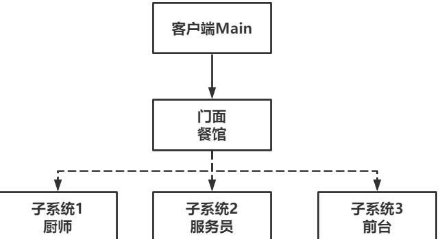

# Façade门面模式(外观模式)

Owner: -QVQ-

结构型的软件设计模式，它提供了统一的接口去访问多个子系统的接口

> 举个例子，一个餐馆里有许多角色，每个角色就是一个子系统，餐馆就是总系统，客人来餐馆只需要按要求点餐，不需要管餐馆是怎么运作的。
> 

例如：socket函数

优点：

- **简洁易使用**。为复杂的模块和系统提供了一个简单的接口，简易化操作。
- 保证了子**系统独立性**。子系统间独立性良好，彼此间一般不受影响，如何使用由门面决定。
- 保证了**系统稳定性**。当直接使用子系统，可能会出现无法预知的异常时，门面模式可通过高层接口规范子系统接口的调用，且有效阻隔子系统和客户端间的交互，进而增强系统鲁棒性。
- **隐秘性好**。门面将子系统的具体细节都封装了起来。

缺点：

1. **不符合开闭原则**。添加新系统要对门面进行修改。
2. **对开发者要求高**。开发者需要了解子系统间的业务逻辑关系，这样才能确保封装的高层接口是有效且稳定的。



代码：

```cpp
//Facade.h
/****************************************************/
#pragma once
#include <iostream>
#include <list>
#include <vector>
#include <string>
 
using namespace std;
 
// 厨师
class Cook
{
public:
	// 炒菜
	void cookMeal(vector<string> menu) {
		for (int i = 0; i < menu.size(); ++i) {
			cout << "正在炒：" << menu[i] << endl;
		}
	}
};
 
// 服务员
class Waiter
{
public:
	// 点菜
	void orderDishes(vector<string> menu) {
		for (int i = 0; i < menu.size(); ++i) {
			cout << "点菜：" << menu[i] << endl;
		}
	}
 
	// 收拾
	void clear() {
		cout << "打扫卫生。" << endl;
	}
 
};
 
// 前台
class Reception
{
public:
	// 欢迎
	void welcome() {
		cout << "欢迎光临！" << endl;
	}
 
	// 买单
	void bill() {
		cout << "买单完成，欢迎下次再来！" << endl;
	}
 
};
 
```

门面就像操作系统一样封装了对用户的使用

```cpp

// 门面
class Facade
{
public:
	// 构造函数
	Facade() {
		m_cook = new Cook();
		m_waiter = new Waiter();
		m_reception = new Reception();
	}
 
	// 析构函数
	~Facade() {
		if (m_cook != nullptr) {
			delete m_cook;
			m_cook = nullptr;
		}
		if (m_waiter != nullptr) {
			delete m_waiter;
			m_waiter = nullptr;
		}
		if (m_reception != nullptr) {
			delete m_reception;
			m_reception = nullptr;
		}
	}
 
	// 经营
	void manage(vector<string> menu) {
		// 欢迎
		m_reception->welcome();
 
		// 服务员点菜
		m_waiter->orderDishes(menu);
 
		// 厨师炒菜
		m_cook->cookMeal(menu);
 
		// 客人用餐
		cout << "客人用餐中。" << endl;
 
		// 买单
		m_reception->bill();
 
		// 打扫卫生
		m_waiter->clear();
	}
 
private:
	Cook *m_cook;
	Waiter *m_waiter;
	Reception *m_reception;
};
```

用户：

```cpp
Facade *facade = new Facade();
	// 餐馆运营
	vector<string> menu = { "红烧肉","土豆丝","酸菜鱼" };
	facade->manage(menu);
```