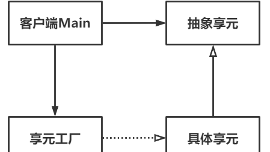

# Flyweight享元模式

Owner: -QVQ-

结构型的软件设计模式，通过共享对象的方式，尽可能减少内存占用

> 打麻将，同时有10桌在玩，每桌都有4个"八筒"，如果建立40个"八筒"对象，那就非常冗余，但如果用享元模式建立一套麻将牌，每桌打出"八筒"时，就调用享元中的"八筒"，相当于只用了1个对象，
桌号和牌号就是享元模式的外蕴状态，如A1八筒，就是A桌的第一个"八筒"，A和1是外蕴状态；而卡牌"八筒"本身就是内蕴状态，内蕴是可以共享的
> 

享元模式的优点：

1. **减少资源浪费**。共享资源极大程度降低了系统的资源消耗。
2. **提高系统运行效率**。当资源过度使用时，系统效率会大受影响。

享元模式的缺点：

1. **维护共享对象，需要额外开销**。
2. **系统复杂度提高**。运行享元，除了内外状态，还有线程方面都要充分考虑


代码

```cpp
// 抽象享元
class Flyweight{
	virtual void operation() {
		cout << "打出" << m_name << endl;
	}
	string m_name;
}
// 具体享元
class ConcreteFlyweight : public Flyweight{
	virtual void operation() {
		cout << "打出" << m_name << endl;
	}
}

```

享元工厂存放所有的具体享元，并对相同内容的具体享元只分配一个空间

```cpp
// 享元工厂
class FlyweightFactory 
{
// 获取享元
	Flyweight* getFlyweight(string name) {
		// 若没有，则创建
		if (flyweights.find(name) == flyweights.end()) {
			cout << "创建" << name << "牌" << endl;
			flyweights[name] = new ConcreteFlyweight(name);
		}
		else {
			cout << "已有" << name << "牌" << endl;
		}
		return flyweights[name];
	}
	std::unordered_map<string, Flyweight*> flyweights;
}

```

客户

```cpp
FlyweightFactory *factory = new FlyweightFactory();
	Flyweight* f1 = factory->getFlyweight("乾");
	Flyweight* f2 = factory->getFlyweight("坤");
	Flyweight* f3 = factory->getFlyweight("坎");
	Flyweight* f9 = factory->getFlyweight("坤");
//这里"坤"不会再申请空间，而是返回上一个坤的空间，从而复用了内存
```