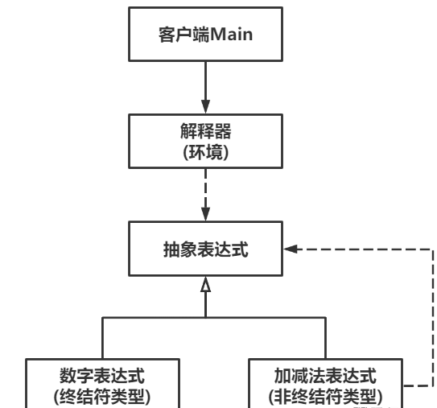

# Interpreter解释器模式

Owner: -QVQ-

行为型的软件设计模式，定义了一个解释器，来解释给定语言和文法的句子

优点:

1. **良好扩展性**。语法的翻译通过类来实现，扩展类可以扩展其解释能力。
2. **易实现**。语法树中每个表达式节点类具备一定相似性，实现起来相对容易。

缺点：

1. **执行效率低**。解释器中通常有大量循环和递归语句，当被解释句子较复杂时，程序的性能受到较大影响。
2. **类膨胀**。规则较多时，类数量也膨胀。


代码：

```cpp
// 抽象表达式类
class Expression 
{
public:
	// 解释
	virtual int interpret() = 0;
 
};
 
// 数字表达式类
class NumberExpression : public Expression 
{
public:
	// 构造函数
	NumberExpression(int num) : number(num) {}
 
	// 解释
	virtual int interpret() { return number; }
 
private:
	int number;
};
 
// 加法表达式类
class AddExpression : public Expression 
{
public:
	// 构造函数
	AddExpression(Expression* left, Expression* right) : left(left), right(right) {}
 
	// 解释
	virtual int interpret() { return left->interpret() + right->interpret(); }
 
private:
	Expression* left;
	Expression* right;
};
 
// 减法表达式类
class SubExpression : public Expression 
{
public:
	// 构造函数
	SubExpression(Expression* left, Expression* right) : left(left), right(right) {}
 
	// 解释
	virtual int interpret() { return left->interpret() - right->interpret(); }
 
private:
	Expression* left;
	Expression* right;
};
```

```cpp
// 解释器类
class Interpreter 
{
public:
	// 构造函数
	Interpreter(string exp) : expression(exp) {}
 
	// 解释
	int interpret() {
		stack<Expression*> s;
		// 遍历表达式字符
		for (int i = 0; i < expression.length(); i++) {
			if (isdigit(expression[i])) {
				// 识别数字
				int j = i;
				while (j < expression.length() && isdigit(expression[j])) {
					j++;
				}
				int num = stoi(expression.substr(i, j - i));//将输入的字符串生成数字
				s.push(new NumberExpression(num));//用数字解释器放入
				i = j - 1;
			}
			else if (expression[i] == '+') {
				// 把左数提取出来
				Expression* left = s.top();
				s.pop();
				// 识别右数
				int j = i + 1;
				while (j < expression.length() && isdigit(expression[j])) {
					j++;
				}
				Expression* right = new NumberExpression(stoi(expression.substr(i + 1, j - (i + 1))));
				// 左数+右数的表达式放入栈中
				s.push(new AddExpression(left, right));
				i = j - 1;
			}
			else if (expression[i] == '-') {
				// 把左数提取出来
				Expression* left = s.top();
				s.pop();
				// 识别右数
				int j = i + 1;
				while (j < expression.length() && isdigit(expression[j])) {
					j++;
				}
				Expression* right = new NumberExpression(stoi(expression.substr(i + 1, j - (i + 1))));
				// 左数-右数的表达式放入栈中
				s.push(new SubExpression(left, right));
				i = j - 1;
			}
		}
		return s.top()->interpret();
	}
 
private:
	string expression;
}
```

解释类里维持所有的具体表达式类，通过调用具体表达式类和一定的规则来解释传入的参数